# CIVITAS/CORE Integration — Architecture

This document describes how CiviDash is deployed and operated as an **add-on** of
a [CIVITAS/CORE](https://gitlab.opencode.de/civitas-connect/civitas-core) urban data
platform. CiviDash also runs standalone; see the deployment docs for that setup.

> Diagram labels are in German to match the CIVITAS/CORE reference diagram.

## Operating context

In the add-on setup, CiviDash runs **inside the CIVITAS/CORE
Kubernetes cluster** operated by the platform operator, behind the platform's shared
infrastructure. This means the dashboard reuses CORE's gateway, identity
management and context broker rather than shipping its own.

| CORE platform component | Role for the dashboard |
|-------------------------|------------------------|
| **APISIX Web Gateway** | Single entry point. Routes public, read-only traffic from anonymous users to the dashboard's public frontend. |
| **Keycloak / IDM** | Identity provider. Authenticates editorial and admin users before they reach the Filament admin UI, and issues the OAuth2 tokens the backend uses for the NGSI-LD pull. |
| **Stellio Context Broker** | The platform's [ETSI NGSI-LD](https://www.etsi.org/technologies/internet-of-things) data store. Holds the sustainability indicators the dashboard ingests. |

## The dashboard add-on

The add-on itself is the headless Laravel + Vue application described in
[`../headless-architecture.md`](../headless-architecture.md). Within the CORE
cluster it consists of four parts:

- **Public Frontend (Vue SPA)** — the citizen-facing dashboard. Served to
  anonymous users through APISIX. All routing is client-side; data is fetched
  from the backend via REST.
- **Admin UI (Filament)** — the editorial back office. Reachable only after a
  Keycloak login.
- **Backend API (Laravel)** — serves the REST API to both frontends and runs the
  scheduled NGSI-LD pull synchronisation against Stellio.
- **Database (Postgres schema in the CORE cluster)**: the dashboard's own relational
  store for tiles, categories, metric definitions, time periods and metric values. It
  is the read source for the public API; the NGSI-LD broker is never queried on the
  provides only PostgreSQL (no extra DBMS), the add-on uses a Postgres schema in the
  cluster.

## Roles and access paths

There are two distinct access paths, both entering through APISIX:

1. **Anonymous users (public)** reach the **public frontend** read-only. They
   never authenticate and never see the admin UI. Their requests resolve against
   the dashboard's own database, not the broker.
2. **Editorial / admin users** authenticate against **Keycloak** and then use the
   **Filament admin UI**. (Keycloak SSO for the dashboard is optional and
   togglable per tenant; see `config/integrations.php`.)

## External data source

Sustainability indicators originate **outside** the dashboard. An *initial data
import* writes `NachhaltigkeitsIndikator` entities into the Stellio context
broker (`POST /entities`). The dashboard's backend then **pulls** those entities
on a schedule, maps them to its own data model and stores the result in its
database. The scheduled synchronisation is **read-only (pull)** — the backend
issues `GET` requests against Stellio.

A **write-back** path (the admin UI pushing indicators back into Stellio) is
**implemented**: an admin-only Filament action publishes a tile as a
`NachhaltigkeitsIndikator` entity via `POST /entities`, falling back to
`PATCH /entities/{id}/attrs` when the entity already exists (`409`). Like the
pull, it is idempotent via `source_hash` and respects provenance, so it never
overwrites entities from other sources. It is drawn dashed in the diagram because
it is an optional, admin-triggered path. The client's
token handling (TTL derived from the token response's `expires_in`, automatic
re-authentication on `401`) is generic; in the CIVITAS/CORE add-on deployment,
the client_id/secret of the shared `api-access` OAuth2 client are injected as
its credentials, and write access depends on that client being authorized with
write scopes.

## Related documents

- [Data flow](data-flow.md) — step-by-step pull synchronisation, including OAuth2
  authentication and `source_hash` idempotency.
- [NGSI-LD data model](ngsi-ld-data-model.md) — the formal `NachhaltigkeitsIndikator`
  entity schema and its mapping to the dashboard's models.
