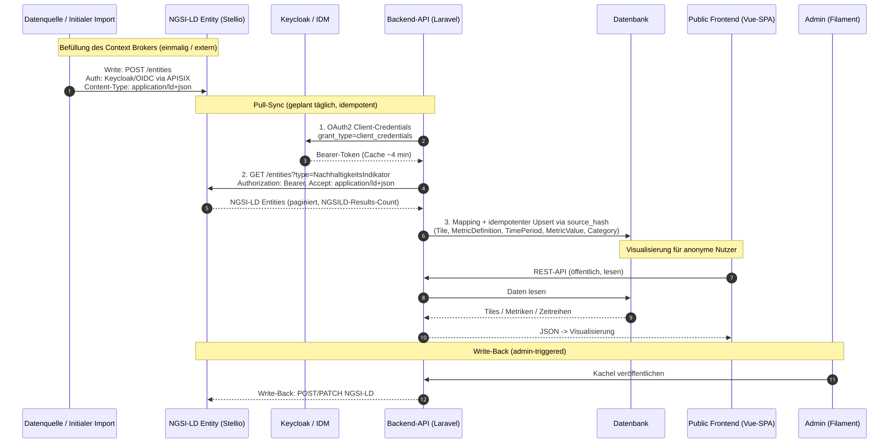

# CIVITAS/CORE Integration — Data Flow

This document traces how sustainability data moves from the CIVITAS/CORE context
broker into the dashboard, step by step. It complements the
[architecture overview](architecture.md) and the
[NGSI-LD data model](ngsi-ld-data-model.md).

> Diagram labels are in German to match the CIVITAS/CORE reference diagram.



## Overview

The scheduled synchronisation is a one-directional **pull**: an external import fills the
Stellio context broker, and the dashboard's backend periodically pulls those
entities, maps them and persists them locally. The public frontend then reads
exclusively from the dashboard's own database — it never touches the broker on
the request path.

## Step 1 — External import fills the broker

The data does not originate in the dashboard. An *initial data import* writes
`NachhaltigkeitsIndikator` entities into Stellio:

```
POST /entities
Content-Type: application/ld+json
```

Write access to the broker is protected; in CIVITAS/CORE, writes are fronted by
Keycloak/OIDC via APISIX.

## Step 2 — Backend authenticates (OAuth2 Client Credentials)

Before pulling, the backend obtains an access token from Keycloak using the
**OAuth2 Client Credentials** grant — there is no interactive user in a
scheduled/console run:

```
POST <oauth.token_url>
Content-Type: application/x-www-form-urlencoded

grant_type=client_credentials&client_id=…&client_secret=…&scope=…
```

The token is cached with a TTL derived from the token response's `expires_in`
(minus a 30s safety buffer; falls back to 240s if `expires_in` is absent), so
a sync run does not request a new token per request regardless of the actual
Keycloak-configured lifetime. If the broker responds `401`
(expired or rotated token), the client discards the cached token, re-authenticates
once, and retries the request exactly once before surfacing the error. The
credentials come from `config/integrations.php` (`civitas.oauth.*`) or, tenant-aware,
from stored integration settings.

> When the broker runs without authentication (e.g. the local Stellio dev stack
> with `CIVITAS_OAUTH_*` empty), the client skips token acquisition entirely.

## Step 3 — Backend pulls entities

With the bearer token, the backend queries the indicator entities:

```
GET /entities?type=NachhaltigkeitsIndikator&limit=100&offset=0&count=true
Authorization: Bearer <token>
Accept: application/ld+json
```

The entity type is fixed to `NachhaltigkeitsIndikator`. When a JSON-LD `@context`
URL is configured, it is advertised via the `Link` header so the broker expands
terms against it. Responses are **paginated**: the backend reads the total from
the `NGSILD-Results-Count` header and keeps fetching pages (incrementing
`offset` by the batch size) until all entities are retrieved. The broker page
size is capped at 1000 per request.

## Step 4 — Mapping and idempotent upsert (`source_hash`)

Each fetched entity is mapped to the dashboard's data model and upserted inside a
database transaction. The mapping (one NGSI-LD entity →
`Tile` + `MetricDefinition` + time-series `TimePeriod`/`MetricValue` + `Category`)
is detailed in the [NGSI-LD data model](ngsi-ld-data-model.md).

Synchronisation is **idempotent** via a `source_hash`:

1. The mapper computes an `md5` hash over the entity, **excluding volatile keys**
   (`@context`, `observedAt`, `modifiedAt`, `createdAt`, `instanceId`) and after
   normalising/sorting nested structures, so the hash reflects content only.
2. If a tile already exists for this `external_id` and its stored `source_hash`
   equals the freshly computed one, the entity is **skipped** (unless `--force`).
3. Otherwise the tile and its children are created or updated, and the new hash,
   `external_source = civitas-core` and `last_synced_at` are written.

Every record carries its provenance (`external_source`, `external_id`) so synced
data is distinguishable from manually authored data.

### Pruning

On a full sync, when `sync.prune_removed` is enabled, tiles previously synced from
this source whose `external_id` no longer appears upstream are deleted (children
cascade via foreign keys). A guard ensures pruning **never runs when the source
returned no entities** (e.g. after a transient or auth error), so a failed fetch
cannot wipe all synced tiles.

## Step 5 — Public visualisation

The **public frontend (Vue SPA)** requests data from the backend over the public,
read-only REST API. The backend reads the synced tiles, metrics and time series
from its **own database** and returns JSON for visualisation. The context broker
is not involved in this path.

## Write-back (admin-triggered)

A write-back from the **admin UI (Filament)** into Stellio is **implemented**.
An admin-only action maps a tile to a `NachhaltigkeitsIndikator`
entity and publishes it via `POST /entities`, falling back to
`PATCH /entities/{id}/attrs` when the entity already exists (`409`). Like the
pull, it is idempotent via `source_hash` and respects provenance (it does not
overwrite entities originating from other sources). It is drawn dashed in the
diagram because it is an optional, admin-triggered path.
Token acquisition itself (TTL derived from `expires_in`, 401 re-authentication)
is generic client behaviour; in the CIVITAS/CORE add-on deployment, the
client_id/secret of the shared `api-access` OAuth2 client are injected as its
credentials, and write access depends on that client being authorized with
write scopes. The scheduled synchronisation
itself remains pull-only.

A bulk variant of the same action publishes a selection of tiles from the
tile table in one run, sending the requests sequentially and capping the
selection at 25 tiles per run. Partial success (some tiles published, some
skipped, refused or failed) is reported back as counts in a single
notification.

## Running a sync

```bash
ddev exec php artisan integration:sync-civitas --tenant=<slug> --dry-run   # preview
ddev exec php artisan integration:sync-civitas --tenant=<slug>             # persist
```
