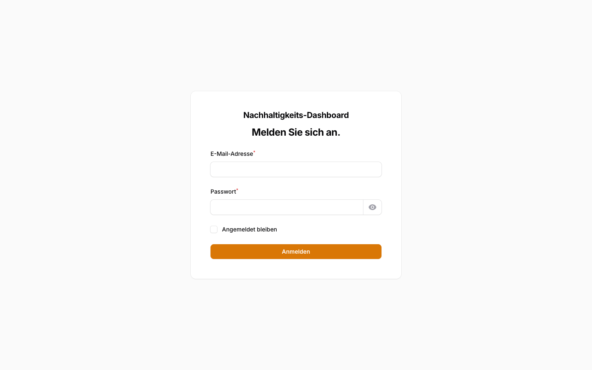
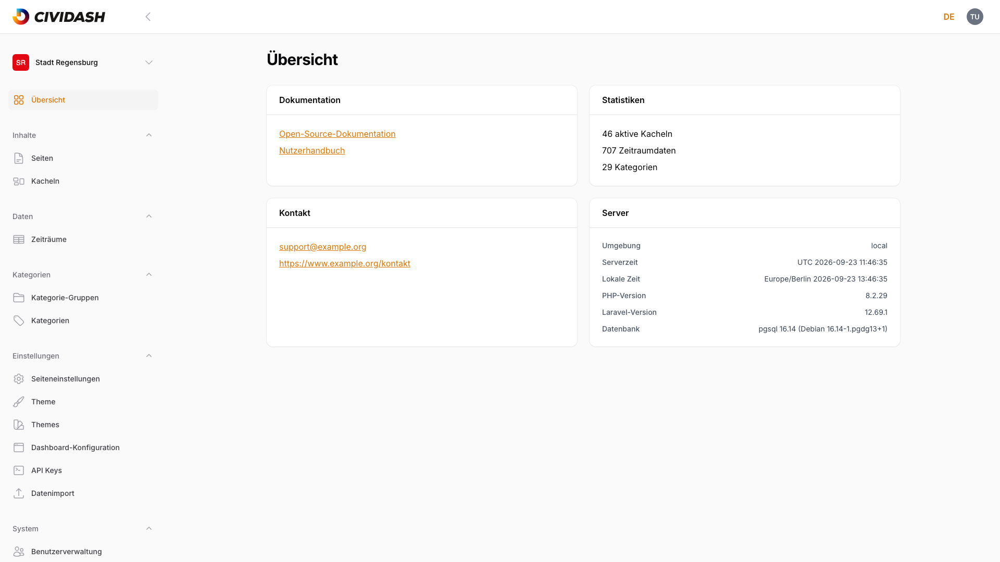
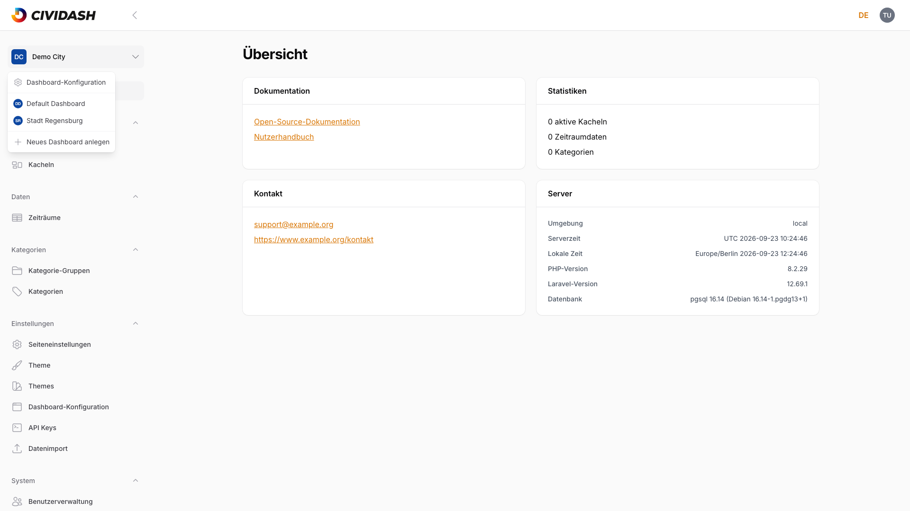
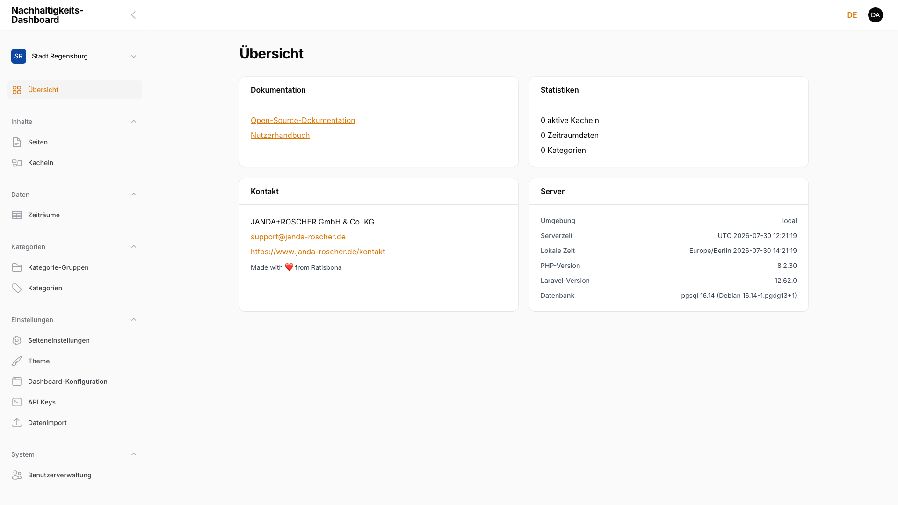
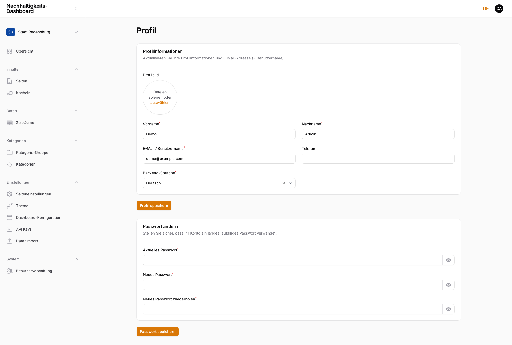

# 1. Erste Schritte

Einstieg — einmalig lesen.

## 1.1 Anmeldung und Oberfläche

### Login

Der Adminbereich ist unter `/admin` erreichbar. Auf der Anmeldeseite folgende Felder ausfüllen:

| Feld | Beschreibung |
|------|-------------|
| **E-Mail-Adresse** | Die hinterlegte E-Mail des Benutzerkontos |
| **Passwort** | Das zugehörige Passwort |
| **Angemeldet bleiben** | Checkbox — hält die Sitzung über das Schließen des Browsers hinaus aktiv |

Mit **Anmelden** bestätigen.

<!-- Screenshot: Login-Seite mit E-Mail-, Passwort-Feld und „Angemeldet bleiben"-Checkbox -->

> **Hinweis:** Nach fünf fehlgeschlagenen Anmeldeversuchen wird der Zugang vorübergehend gesperrt. Eine Minute warten und erneut versuchen.

### Aufbau der Oberfläche

Nach der Anmeldung öffnet sich der Adminbereich. Die Oberfläche gliedert sich in drei Bereiche:

<!-- Screenshot: Adminbereich nach Login mit markierten Bereichen (Sidebar, Header, Inhaltsbereich) -->

| Bereich | Position | Funktion |
|---------|----------|----------|
| **Seitenleiste** | Links | Navigation zu allen Verwaltungsbereichen, gruppiert nach Themen; am oberen Rand die **Dashboard-Auswahl** zum Wechsel des aktiven Dashboards |
| **Header** | Oben | **Sprachenwechsler** (die Oberfläche ist in Deutsch und Englisch verfügbar) und **Profilmenü** |
| **Inhaltsbereich** | Mitte | Zeigt die jeweils gewählte Seite oder Ressource |

Die Seitenleiste lässt sich auf Desktop-Geräten über das Pfeil-Symbol oben einklappen, um mehr Platz für den Inhaltsbereich zu schaffen.

### Navigationsgruppen in der Seitenleiste

Über der Gruppenliste steht der Eintrag **Übersicht** — die Startseite des Adminbereichs (siehe [Kapitel 1.2, Dashboard-Übersicht](01-erste-schritte.md#12-dashboard-übersicht-startseite-nach-login)). Darunter ist die Seitenleiste in Gruppen unterteilt:

| Gruppe | Enthält | Zugriff |
|--------|---------|---------|
| **Inhalte** | Seiten, Kacheln | Alle |
| **Daten** | Zeiträume | Alle |
| **Kategorien** | Kategorie-Gruppen, Kategorien | Alle |
| **Einstellungen** | Seiteneinstellungen, Theme, Dashboard-Konfiguration, API-Schlüssel, Datenimport | Nur Admin |
| **System** | Benutzerverwaltung | Nur Admin |

Bereiche, die eine Admin-Rolle erfordern, sind für Redaktions-Accounts nicht sichtbar (siehe [Kapitel 7, Rollen und Berechtigungen](07-rollen-und-berechtigungen.md)).

### Dashboard wechseln

Am oberen Rand der Seitenleiste wird das aktive Dashboard angezeigt (im Beispiel „Stadt Regensburg"). Bei Zugriff auf mehrere Dashboards öffnet ein Klick darauf ein Auswahlmenü zum Wechsel zwischen den verfügbaren Dashboards; darin stehen zusätzlich die **Dashboard-Konfiguration** und — nur für Admins — **Neues Dashboard anlegen**. Alle Inhalte — Seiten, Kacheln, Kategorien — werden immer im Kontext des gewählten Dashboards angezeigt und bearbeitet.

<!-- Screenshot: Dashboard-Auswahl-Menü am oberen Rand der Seitenleiste -->

> **Hinweis:** Ein Dashboard ist ein eigenständiger Mandant mit eigenen Seiten, Kacheln, Kategorien und eigenem Branding. Details zu diesem Begriff im Glossar (siehe [Kapitel 8, Glossar](08-glossar.md)).

## 1.2 Dashboard-Übersicht (Startseite nach Login)

Nach der Anmeldung öffnet sich die **Übersicht** — die Startseite des Adminbereichs. Sie fasst den Zustand des aktiven Dashboards zusammen und dient als Ausgangspunkt für alle weiteren Aufgaben.

<!-- Screenshot: Übersicht-Startseite mit den vier Info-Karten -->

Die Übersicht besteht aus vier Info-Karten:

| Karte | Inhalt |
|-------|--------|
| **Dokumentation** | Links zur Open-Source-Dokumentation und zum Nutzerhandbuch |
| **Statistiken** | Anzahl der aktiven Kacheln, der erfassten Zeitraumdaten und der Kategorien im aktuellen Dashboard |
| **Kontakt** | Ansprechpartner und Support-Adresse |
| **Server** | Technische Eckdaten der Installation (Umgebung, Server- und lokale Zeit, Versionsstände) |

Die Übersicht ist jederzeit über den Eintrag **Übersicht** ganz oben in der Seitenleiste erreichbar.

> **Hinweis:** Die angezeigten Zahlen beziehen sich immer auf das aktuell gewählte Dashboard. Nach einem Wechsel des Dashboards (siehe [Kapitel 1.1, Anmeldung und Oberfläche](01-erste-schritte.md#dashboard-wechseln)) aktualisieren sich die Werte entsprechend.

## 1.3 Navigation im Adminbereich (Seitenleiste, Gruppen, Suche)

Die Navigation läuft vollständig über die **Seitenleiste** links. Jeder Verwaltungsbereich ist einer thematischen Gruppe zugeordnet; ein Klick auf einen Eintrag öffnet den zugehörigen Bereich im Inhaltsbereich.

<!-- Screenshot: Seitenleiste mit den Navigationsgruppen und dem aktiven Eintrag „Übersicht" -->

- **Gruppen** bündeln zusammengehörige Bereiche (Inhalte, Daten, Kategorien, Einstellungen, System — siehe die Tabelle in [Kapitel 1.1, Anmeldung und Oberfläche](01-erste-schritte.md#navigationsgruppen-in-der-seitenleiste)). Jede Gruppe lässt sich über das Pfeil-Symbol ein- und ausklappen.
- **Dashboard-Auswahl** am oberen Rand der Seitenleiste wechselt das aktive Dashboard.
- Die gesamte Seitenleiste lässt sich über das Pfeil-Symbol im Header einklappen.

### Suche

Eine übergreifende Suche über alle Bereiche gibt es nicht. Stattdessen besitzt jede Übersichtstabelle — etwa die Seiten- oder Kachelübersicht — ein eigenes **Suchfeld** oberhalb der Tabelle sowie Filter, mit denen sich die jeweilige Liste durchsuchen und eingrenzen lässt (siehe [Kapitel 2.1, Seitenübersicht und Status](02-seiten-verwalten.md)).

## 1.4 Profil bearbeiten (Name, Avatar, Sprache, Passwort)

Das eigene Profil ist über das **Profilmenü** oben rechts im Header erreichbar (Eintrag **Profil**). Die Seite gliedert sich in zwei Abschnitte.

<!-- Screenshot: Profilseite mit den Abschnitten „Profilinformationen" und „Passwort ändern" -->

**Profilinformationen:**

| Feld | Beschreibung |
|------|-------------|
| **Profilbild** | Optionales Bild. Beim Hochladen wird es automatisch auf ein quadratisches Format zugeschnitten (256×256 Pixel), siehe [Kapitel 5.1, Bilder hochladen und zuschneiden](05-bilder-und-dateien.md) |
| **Vorname** / **Nachname** | Pflichtfelder, bilden den angezeigten Namen |
| **E-Mail / Benutzername** | Pflichtfeld — dient zugleich als Benutzername für die Anmeldung |
| **Telefon** | Optionale Telefonnummer |
| **Backend-Sprache** | Sprache der Oberfläche (Deutsch/Englisch); bestimmt Menüs, Buttons und Labels des Adminbereichs |

Mit **Profil speichern** bestätigen.

> **Hinweis:** Die **Backend-Sprache** steuert nur die Oberfläche des Adminbereichs. Welche Sprachversion eines Inhalts gerade bearbeitet wird, wird davon getrennt gewählt (siehe [Kapitel 1.5, Sprache umschalten](01-erste-schritte.md#15-sprache-umschalten-deen-inhalte-bearbeiten)).

**Passwort ändern:**

| Feld | Beschreibung |
|------|-------------|
| **Aktuelles Passwort** | Das derzeit gültige Passwort zur Bestätigung |
| **Neues Passwort** | Mindestens 12, höchstens 64 Zeichen |
| **Neues Passwort wiederholen** | Wiederholung zur Kontrolle — muss mit dem neuen Passwort übereinstimmen |

Mit **Passwort speichern** bestätigen. Über das Augen-Symbol lässt sich jedes Passwortfeld zur Kontrolle einblenden.

## 1.5 Sprache umschalten (DE/EN-Inhalte bearbeiten)

Der Begriff „Sprache" hat im Adminbereich zwei getrennte Bedeutungen. Beide sind unabhängig voneinander einstellbar.

### Oberflächensprache

Die Sprache der Oberfläche (Menüs, Buttons, Labels) lässt sich jederzeit über den **Sprachenwechsler** oben rechts im Header umstellen — ein Klick auf das Kürzel (**DE**/**EN**) öffnet die Auswahl.

<!-- Screenshot: Sprachenwechsler im Header mit geöffneter DE/EN-Auswahl -->

Die Auswahl wird zugleich als **Backend-Sprache** im Profil gespeichert (siehe [Kapitel 1.4, Profil bearbeiten](01-erste-schritte.md#14-profil-bearbeiten-name-avatar-sprache-passwort)) und bleibt so bei der nächsten Anmeldung erhalten.

### Inhaltssprache

Davon zu unterscheiden ist die **Inhaltssprache**: Seiten, Kacheln und Einstellungen lassen sich in Deutsch und Englisch getrennt pflegen. Welche Sprachversion gerade bearbeitet wird, steuert ein **Sprache-Umschalter** direkt im jeweiligen Formular. Titel, Texte, Blöcke und Metadaten sind pro Sprache vollständig getrennt.

Die Bedienung dieses Inhalts-Umschalters ist ausführlich beschrieben in [Kapitel 2.7, Mehrsprachige Inhalte](02-seiten-verwalten.md).

> **Hinweis:** Das Umstellen der Oberflächensprache verändert **nicht** die Inhalte. Umgekehrt verändert das Bearbeiten einer Inhaltssprache **nicht** die Sprache der Oberfläche.
