# 2. Seiten verwalten

Kernaufgabe: öffentliche Webseiten pflegen.

## 2.1 Seitenübersicht und Status (Entwurf / Veröffentlicht)

Die Seitenübersicht ist über **Inhalte → Seiten** erreichbar. Sie zeigt alle Seiten des aktuellen Dashboards als Tabelle mit den Spalten **Titel**, **Layout** und **Aktiv**.

<!-- Screenshot: Seitenübersicht mit einer Seite, Spalten Titel/Layout/Aktiv, Aktionen Bearbeiten/Anzeigen/Löschen -->
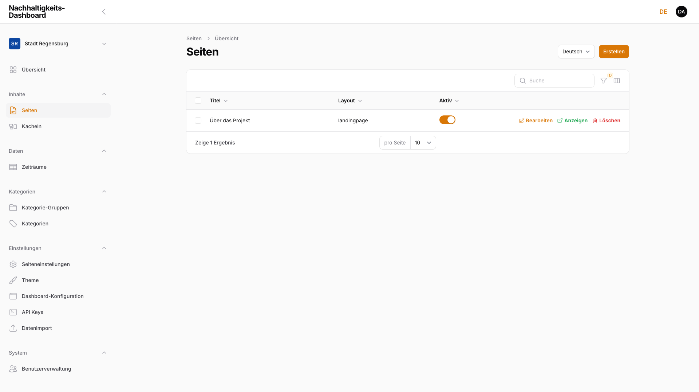

| Spalte | Beschreibung |
|--------|-------------|
| **Titel** | Name der Seite in der aktuell gewählten Sprache |
| **Layout** | `Landingpage`, `Subpage` oder `default` — bestimmt die URL-Struktur (siehe [Kapitel 2.2, Neue Seite anlegen](02-seiten-verwalten.md#22-neue-seite-anlegen)) |
| **Aktiv** | Schalter — steuert, ob die Seite im Frontend sichtbar ist |

> **Hinweis:** Der Status einer Seite wird über den **Aktiv**-Schalter gesteuert (Ja/Nein), nicht über einen separaten Entwurfs-Workflow. Eine inaktive Seite bleibt im Adminbereich vollständig bearbeitbar, ist im Frontend aber nicht erreichbar — das entspricht funktional einem Entwurfszustand.

Über die Zeilenaktionen **Bearbeiten**, **Anzeigen** und **Löschen** rechts in jeder Zeile lässt sich jede Seite direkt öffnen, im Frontend ansehen oder entfernen. Über der Tabelle stehen Suche, Filter (nach Layout und Aktiv-Status) und eine Spaltenauswahl zur Verfügung.

## 2.2 Neue Seite anlegen

Mit **Erstellen** oben rechts eine neue Seite anlegen. Das Formular gliedert sich in den Inhaltsbereich (Titel, Blöcke) links und die **Seiteneigenschaften** rechts.

<!-- Screenshot: Formular "Seite erstellen" mit Titel-Feld, leerem Blöcke-Bereich und Seiteneigenschaften-Sidebar -->
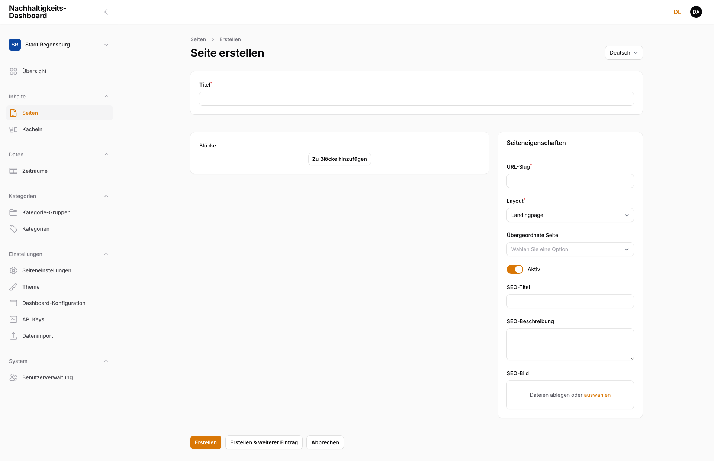

| Feld | Beschreibung |
|------|-------------|
| **Titel** | Name der Seite, erscheint auch im Frontend |
| **URL-Slug** | Adressteil der Seite, wird beim Tippen des Titels automatisch vorgeschlagen |
| **Layout** | `Landingpage`, `Subpage` oder `default` |
| **Übergeordnete Seite** | Optionale Elternseite für eine hierarchische URL-Struktur |
| **Aktiv** | Schalter für die Sichtbarkeit im Frontend |
| **SEO-Titel** / **SEO-Beschreibung** / **SEO-Bild** | Metadaten für Suchmaschinen und das Teilen in sozialen Netzwerken (siehe [Kapitel 2.6, Metadaten pflegen](02-seiten-verwalten.md#26-metadaten-pflegen-seo-titel-beschreibung-vorschaubild)) |

> **Hinweis:** Beim Layout `Landingpage` wird die Seite automatisch zur Startseite des Dashboards (URL-Slug `/`) — pro Dashboard ist nur eine Landingpage sinnvoll. Für alle weiteren Seiten `Subpage` wählen und einen eigenen URL-Slug vergeben.

Mit **Erstellen** speichern oder **Erstellen & weiterer Eintrag** direkt eine weitere Seite anlegen.

## 2.3 Seite bearbeiten

Über **Bearbeiten** in der Seitenübersicht öffnet sich dieselbe Maske wie beim Anlegen, jetzt mit den gespeicherten Werten. Zusätzlich stehen oben rechts **Löschen**, **Anzeigen** (öffnet die Seite im Frontend in einem neuen Tab) und **Speichern** zur Verfügung.

<!-- Screenshot: Bearbeiten-Ansicht einer bestehenden Seite mit Blöcke-Liste und Seiteneigenschaften -->
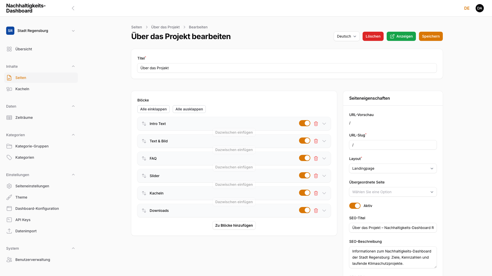

Änderungen werden erst mit **Speichern** übernommen. Ohne Speichern gehen Änderungen beim Verlassen der Seite verloren.

## 2.4 Inhaltsblöcke verwenden

Der Inhalt einer Seite besteht aus **Blöcken** — einzelnen Inhaltselementen, die sich beliebig kombinieren und anordnen lassen. Über **Zu Blöcke hinzufügen** öffnet sich die Blockauswahl:

<!-- Screenshot: Blockauswahl-Dialog mit den 6 verfügbaren Blocktypen -->
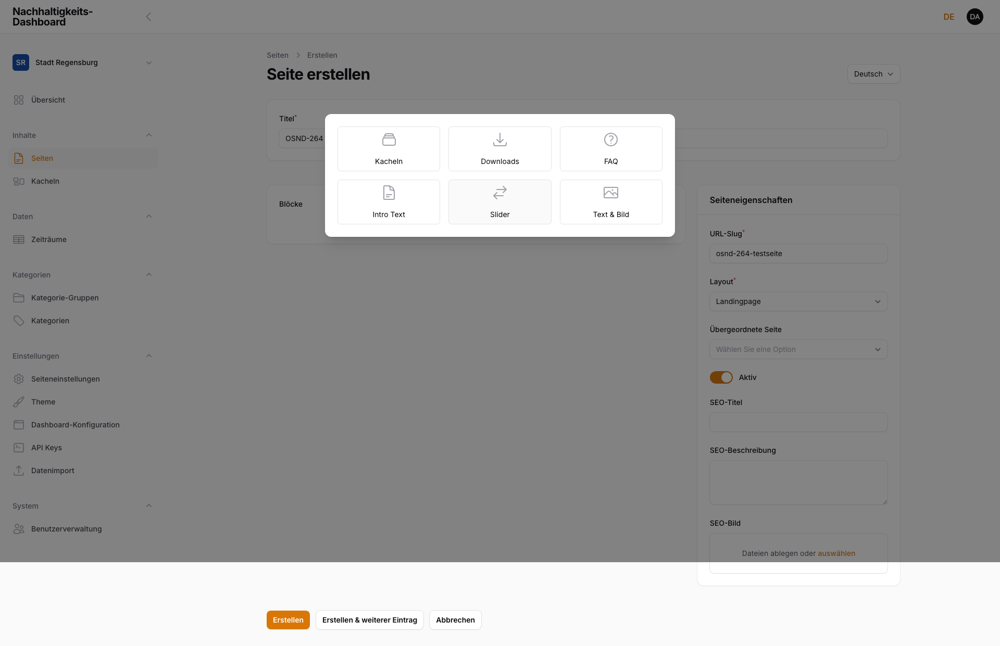

Folgende Blocktypen stehen zur Verfügung: **Kacheln**, **Downloads**, **FAQ**, **Intro-Text**, **Slider** und **Text & Bild**.

### 2.4.1 Intro-Text (Überschrift, Text, Bild)

Einleitender Textblock mit **Überschrift**, optionaler **Unterüberschrift**, formatierbarem **Text** (Fett, Kursiv, Listen, Links) sowie einem **Bild** und optional einem **zweiten Bild** — jeweils mit eigenem Alt-Text für die Barrierefreiheit.

<!-- Screenshot: Intro-Text-Block vollständig ausgefüllt mit Überschrift, Text und Bildfeldern -->
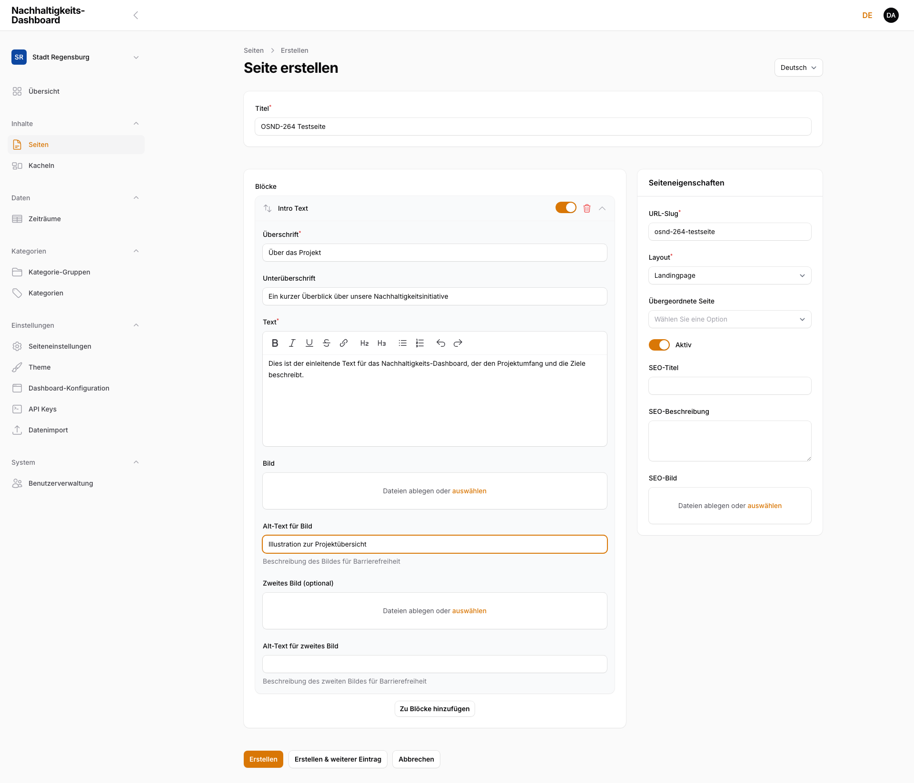

**Wirkung im Frontend:** Überschrift, Unterüberschrift und Text erscheinen als Kopfbereich der Seite. Wird kein Bild hochgeladen, bleibt der Bildbereich leer, der restliche Inhalt wird trotzdem angezeigt.

### 2.4.2 Text-Bild-Block (Text mit positioniertem Bild)

Kombiniert eine **Überschrift**, formatierbaren **Text** und ein **Bild** mit wählbarer **Bildposition** (Links/Rechts).

<!-- Screenshot: Text-Bild-Block mit Überschrift, Text, Bild-Upload und Bildposition-Auswahl -->
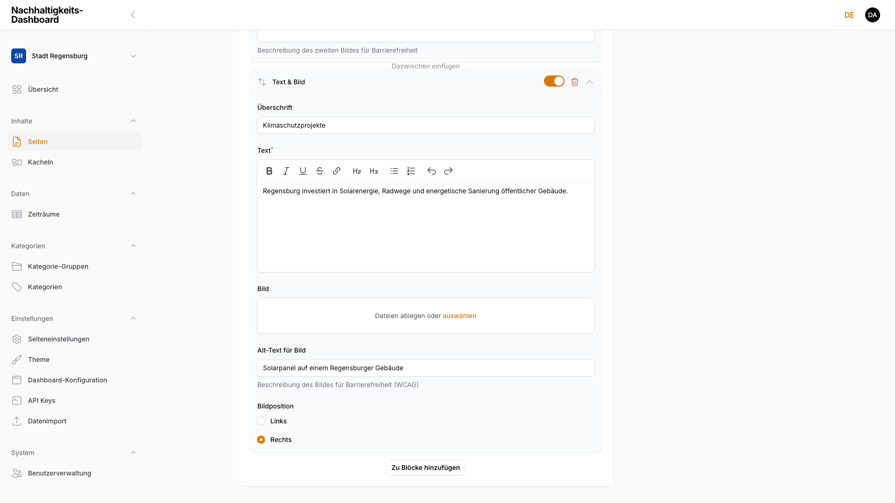

**Wirkung im Frontend:** Das Bild erscheint je nach gewählter Position links oder rechts neben dem Text. Details zum Bild-Upload: siehe [Kapitel 5, Bilder und Dateien](05-bilder-und-dateien.md).

### 2.4.3 Slider (Bildkarussell mit Links)

Ein Slider besteht aus einer optionalen **Überschrift** und beliebig vielen **Slider-Elementen**. Jedes Element hat **Titel**, **Beschreibung**, **Bild**, **Link URL** und **Link Text**.

<!-- Screenshot: Slider-Block mit einem ausgefüllten Slider-Element (Titel, Beschreibung, Link) -->
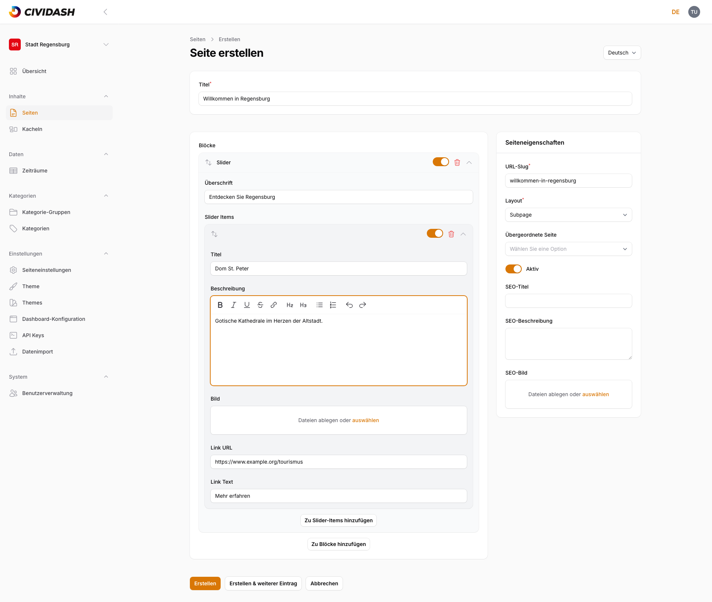

**Wirkung im Frontend:** Jedes Slider-Element erscheint als eigene Karte mit Bild, Titel, Beschreibung und einem Link-Button (Beschriftung aus **Link Text**).

### 2.4.4 FAQ-Block (Frage-Antwort-Paare)

Sammlung von **FAQ-Einträgen**, jeweils mit **Frage** und formatierbarer **Antwort**. Über **Zu FAQ-Einträgen hinzufügen** weitere Einträge ergänzen.

<!-- Screenshot: FAQ-Block mit einem ausgefüllten Eintrag (Frage und Antwort) -->
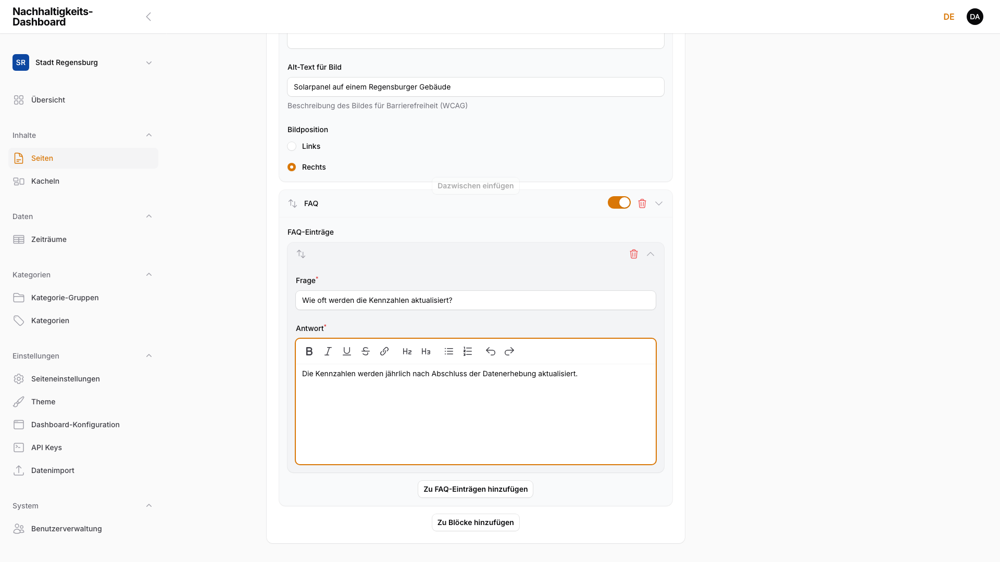

**Wirkung im Frontend:** Jeder Eintrag erscheint als aufklappbares Element (Akkordeon) — die Antwort ist erst nach Klick auf die Frage sichtbar.

### 2.4.5 Kacheln (Dashboard-Kacheln einbetten)

Bettet Dashboard-Kacheln (siehe [Kapitel 3, Kacheln verwalten](03-kacheln-verwalten.md)) direkt in eine Seite ein. Eine optionale **Überschrift** erscheint über dem Raster. Über das Feld **Kacheln** lassen sich gezielt einzelne Kacheln auswählen.

<!-- Screenshot: Kacheln-Block mit Überschrift-Feld und leerer Kacheln-Auswahl -->
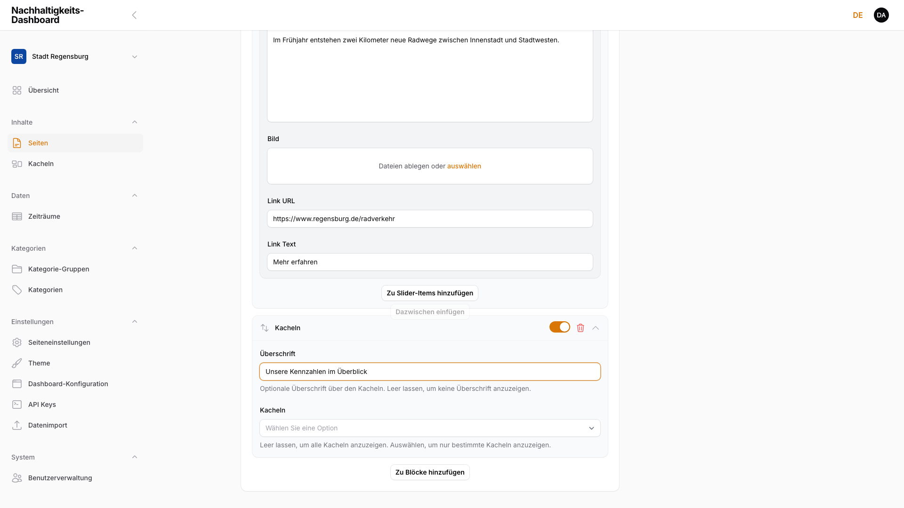

> **Hinweis:** Bleibt die Auswahl im Feld **Kacheln** leer, zeigt der Block automatisch **alle** aktiven Kacheln des Dashboards.

**Wirkung im Frontend:** Der Block rendert ein durchsuchbares Kachel-Raster mit Suchfeld. Ohne angelegte Kacheln bleibt das Raster leer, das Suchfeld wird trotzdem angezeigt.

### 2.4.6 Downloads (Dateien zum Download anbieten)

Stellt Dateien zum Download bereit. Ein Downloads-Block hat eine optionale **Überschrift**, einen formatierbaren **Text** und beliebig viele **Dateien**-Einträge mit optionalem **Titel** (wenn leer, wird der Dateiname angezeigt) und einer Pflicht-**Datei**.

<!-- Screenshot: Downloads-Block mit Überschrift, Text und einem ausgefüllten Datei-Eintrag -->
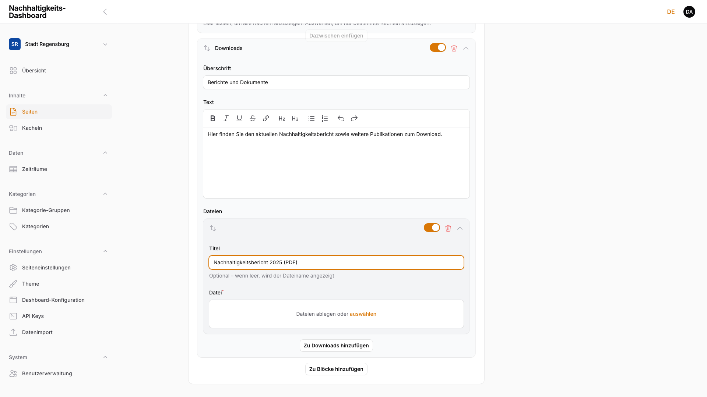

**Wirkung im Frontend:** Jede Datei erscheint als klickbarer Download-Link mit Dateityp-Kennzeichnung (z. B. „PDF").

Kombiniert ergeben mehrere Blöcke eine vollständige Seite:

<!-- Screenshot: Live-Frontend einer Seite mit Intro-Text, Text-Bild, FAQ, Slider, Kacheln und Downloads kombiniert -->
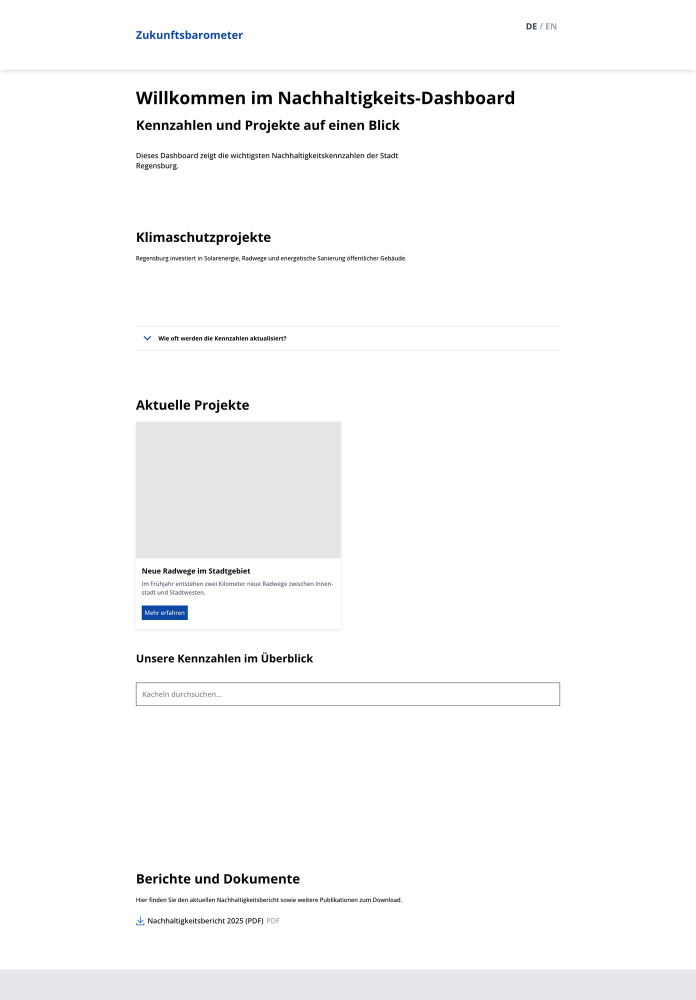

## 2.5 Blöcke sortieren, aktivieren und deaktivieren

Jeder Block in der Liste hat eine eigene Kopfzeile mit vier Bedienelementen:

<!-- Screenshot: Blöcke-Liste mit allen 6 Blocktypen eingeklappt, ein Block deaktiviert zum Vergleich -->
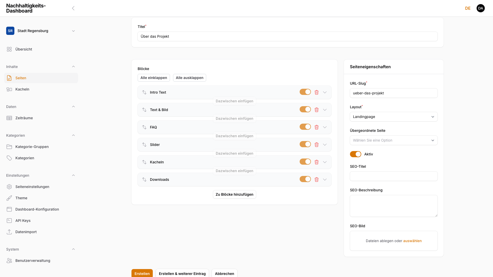

| Element | Funktion |
|---------|----------|
| **Verschieben** | Zieht den Block per Drag & Drop an eine andere Position |
| **Aktiv-Schalter** | Blendet den Block im Frontend ein oder aus, ohne ihn zu löschen |
| **Löschen** | Entfernt den Block dauerhaft aus der Seite |
| **Ein-/Ausklappen** | Zeigt oder verbirgt die Felder des Blocks in der Bearbeitungsmaske |

Über **Alle einklappen** / **Alle ausklappen** oberhalb der Blockliste lassen sich alle Blöcke gleichzeitig ein- oder ausklappen — nützlich bei Seiten mit vielen Blöcken.

> **Hinweis:** Ein deaktivierter Block bleibt mit allen Inhalten erhalten, erscheint aber nicht im Frontend. So lassen sich Inhalte vorbereiten, ohne sie sofort zu veröffentlichen.

## 2.6 Metadaten pflegen (SEO-Titel, Beschreibung, Vorschaubild)

Im Bereich **Seiteneigenschaften** rechts im Formular:

<!-- Screenshot: Seiteneigenschaften-Sidebar mit ausgefüllten SEO-Feldern -->
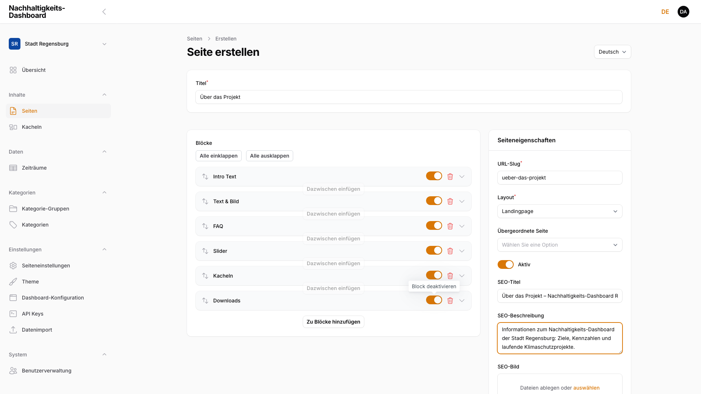

| Feld | Beschreibung |
|------|-------------|
| **SEO-Titel** | Titel, der in Suchmaschinen-Ergebnissen und im Browser-Tab erscheint |
| **SEO-Beschreibung** | Kurzbeschreibung für Suchmaschinen-Snippets |
| **SEO-Bild** | Vorschaubild, das beim Teilen der Seite in sozialen Netzwerken angezeigt wird; erscheint nicht in den Suchergebnissen selbst |

Bleiben die Felder leer, greifen sinnvolle Standardwerte (z. B. der Seitentitel).

## 2.7 Mehrsprachige Inhalte (Locale-Switcher)

Oben rechts im Formular wählt der **Sprache**-Umschalter (Deutsch/Englisch), für welche Sprachversion der Inhalt gerade bearbeitet wird.

> **Hinweis:** Titel, Blöcke, URL-Slug und Metadaten sind pro Sprache vollständig getrennt. Beim Wechsel auf eine neue Sprache ist der Inhaltsbereich zunächst leer — Titel und Blöcke müssen für jede Sprache eigenständig angelegt werden.

<!-- Screenshot: Leerer Inhaltsbereich direkt nach dem Wechsel auf eine noch nicht übersetzte Sprache -->
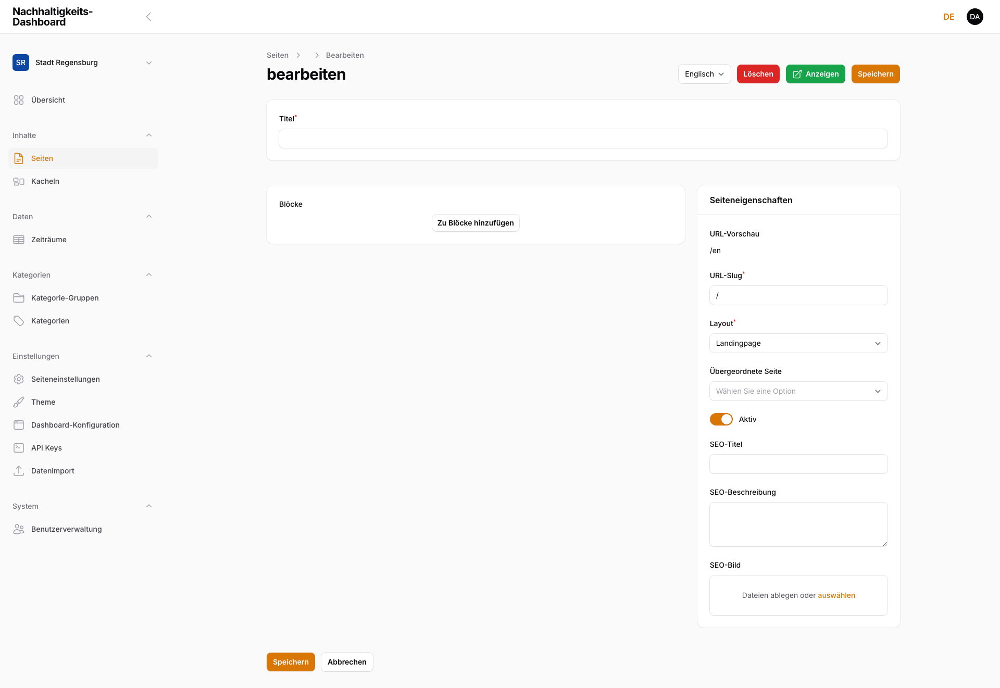

Eine Seite ist im Frontend nur in den Sprachen erreichbar, für die tatsächlich Inhalt angelegt wurde. Die Umschaltung wirkt sich nicht auf bereits gespeicherte Inhalte anderer Sprachen aus — jede Sprachversion lässt sich unabhängig speichern.

## 2.8 Seite löschen

In der Seitenübersicht und in der Bearbeiten-Ansicht gibt es rot markiert den Löschen-Button. Nach Klick öffnet sich eine Sicherheitsabfrage:

<!-- Screenshot: Löschen-Bestätigungsdialog mit Seitentitel und Abbrechen/Löschen-Buttons -->
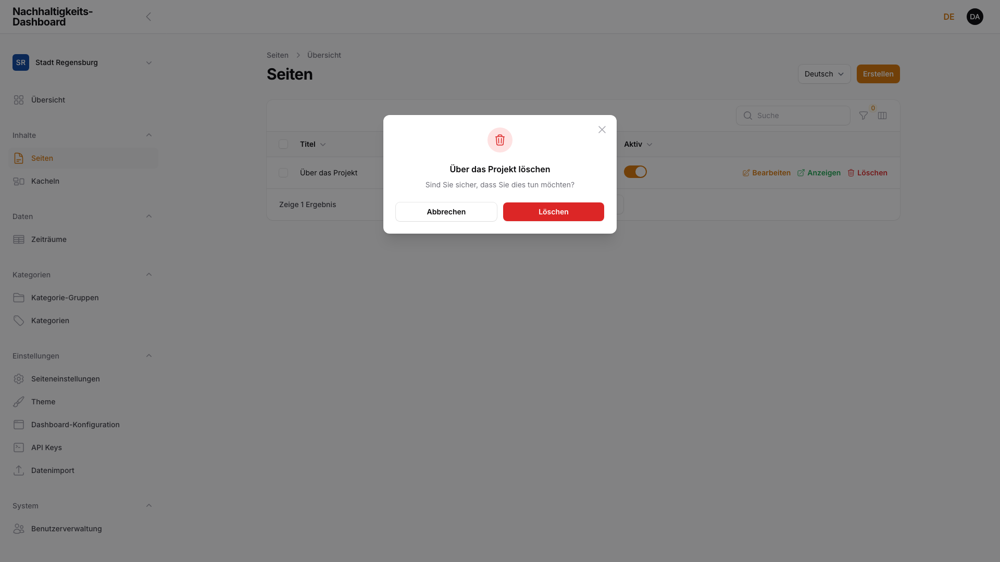

Erst nach Bestätigung mit **Löschen** wird die Seite inklusive aller Sprachversionen, Blöcke und Metadaten endgültig entfernt. Mit **Abbrechen** bricht der Vorgang ohne Änderungen ab.

> **Hinweis:** Das Löschen lässt sich nicht rückgängig machen. Bei Unsicherheit den Block über den **Aktiv**-Schalter (siehe [Kapitel 2.5, Blöcke sortieren, aktivieren und deaktivieren](02-seiten-verwalten.md#25-blöcke-sortieren-aktivieren-und-deaktivieren)) deaktivieren, statt die ganze Seite zu löschen.
