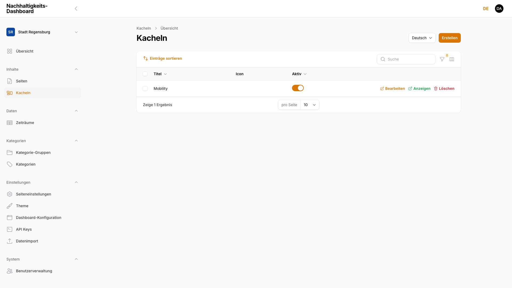
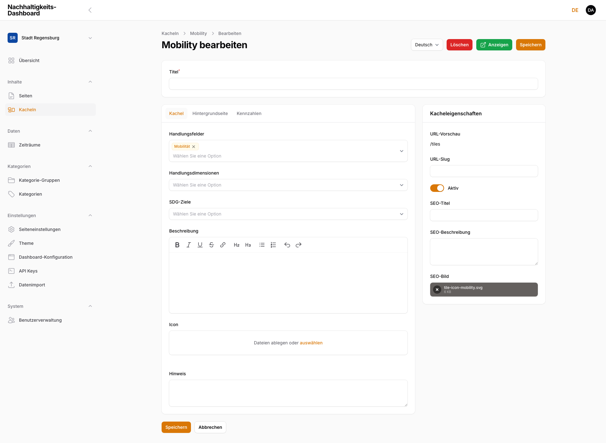
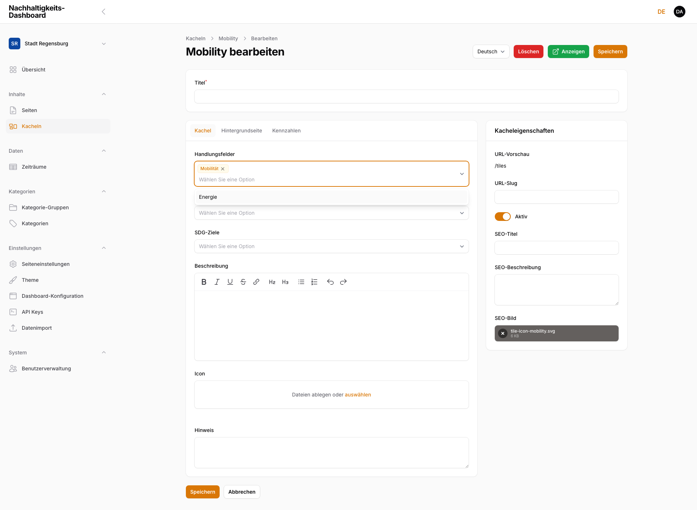
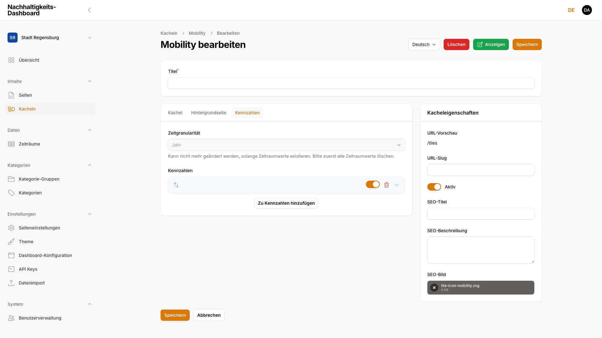
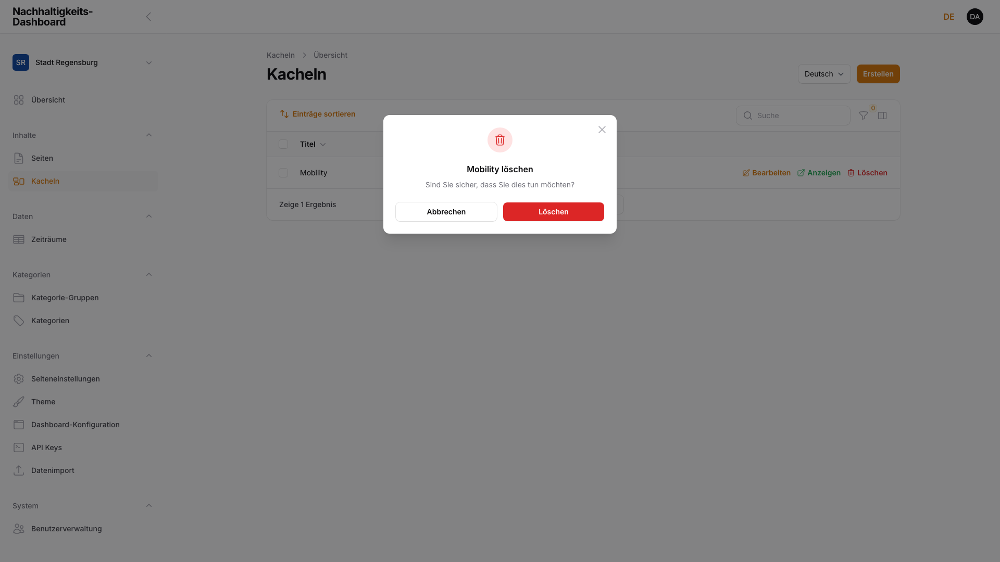

# 3. Kacheln verwalten

Dashboard-Inhalte mit Kennzahlen.

## 3.1 Kachelübersicht

Die Kachelübersicht ist über **Inhalte → Kacheln** erreichbar. Sie zeigt alle Kacheln (Tiles) des aktuellen Dashboards als Tabelle mit den Spalten **Titel**, **Icon** und **Aktiv**.

Eine Kachel (Tile) ist ein Inhaltselement der Dashboard-Übersicht: ein anklickbarer Kasten mit Titel, Icon und Kennzahlen, der zu einer eigenen Detailseite (Hintergrundseite) führt.

<!-- Screenshot: Kachelübersicht mit einer Kachel, Spalten Titel/Icon/Aktiv, Aktionen Bearbeiten/Anzeigen/Löschen -->

| Spalte | Beschreibung |
|--------|-------------|
| **Titel** | Name der Kachel in der aktuell gewählten Sprache |
| **Icon** | Vorschau des hinterlegten Icons (Bild oder Lottie-Animation) |
| **Aktiv** | Schalter — steuert, ob die Kachel im Frontend sichtbar ist |

Über die Zeilenaktionen **Bearbeiten**, **Anzeigen** und **Löschen** rechts in jeder Zeile lässt sich jede Kachel direkt öffnen, im Frontend ansehen oder entfernen. Über der Tabelle stehen Suche, Filter (nach Kategorie und Aktiv-Status) und eine Spaltenauswahl zur Verfügung. Über **Einträge sortieren** oberhalb der Tabelle lässt sich die Anzeigereihenfolge der Kacheln per Drag & Drop ändern (siehe [Kapitel 3.5, Kachel-Reihenfolge und Status](03-kacheln-verwalten.md#35-kachel-reihenfolge-und-status)).

> **Hinweis:** Der Status einer Kachel wird wie bei Seiten über den **Aktiv**-Schalter gesteuert, nicht über einen separaten Entwurfs-Workflow. Eine inaktive Kachel bleibt im Adminbereich vollständig bearbeitbar, ist im Frontend aber nicht erreichbar.

**Wirkung im Frontend:** Aktive Kacheln erscheinen im durchsuchbaren Kachel-Raster der Dashboard-Übersicht (siehe auch [Kapitel 2.4.5, Kacheln](02-seiten-verwalten.md)).

## 3.2 Neue Kachel anlegen

Mit **Erstellen** oben rechts eine neue Kachel anlegen. Das Formular gliedert sich in den Inhaltsbereich links (drei Reiter: **Kachel**, **Hintergrundseite**, **Kennzahlen**) und die **Kacheleigenschaften** rechts. Der **Titel** steht als eigenes Feld oberhalb der Reiter.

<!-- Screenshot: Formular "Kachel bearbeiten" mit Reiter Kachel, Handlungsfelder-Kategorieauswahl, Beschreibung, Icon, Hinweis, Kacheleigenschaften-Sidebar -->

Der Reiter **Kachel** enthält folgende Felder:

| Feld | Beschreibung |
|------|-------------|
| **Titel** | Name der Kachel, erscheint auch im Frontend (oberhalb der Reiter) |
| **Kategorie-Auswahl** (je Kategoriegruppe) | Eine Mehrfachauswahl pro angelegter Kategoriegruppe (z. B. „Handlungsfelder", „Handlungsdimensionen", „SDG-Ziele" — siehe [Kapitel 4, Kategorien](04-kategorien.md)) |
| **Beschreibung** | Formatierbarer Text (Fett, Kursiv, Listen, Links) |
| **Icon** | Bild- oder Lottie-Animations-Upload für die Kachel-Darstellung |
| **Hinweis** | Freitext, intern für die Redaktion (kein Pflichtfeld) |

Für jede angelegte Kategoriegruppe erscheint ein eigenes Auswahlfeld mit den zugehörigen Kategorien als Mehrfachauswahl:

<!-- Screenshot: Kategorie-Auswahl geöffnet mit ausgewählter Kategorie und weiterer Option in der Dropdown-Liste -->

> **Hinweis:** Kategorie-Auswahlfelder erscheinen nur, wenn mindestens eine Kategoriegruppe mit zugeordneten Kategorien existiert. Ist keine Kategorie angelegt, bleibt der Reiter **Kachel** ohne Kategoriefelder — direkt bei **Beschreibung** beginnend. Kategorien selbst werden in [Kapitel 4, Kategorien](04-kategorien.md) gepflegt.

Rechts in den **Kacheleigenschaften**:

| Feld | Beschreibung |
|------|-------------|
| **URL-Vorschau** | Berechnete Frontend-Adresse der Kachel (nur bei bestehenden Kacheln sichtbar) |
| **URL-Slug** | Adressteil der Kachel, wird beim Tippen des Titels automatisch vorgeschlagen |
| **Aktiv** | Schalter für die Sichtbarkeit im Frontend |
| **SEO-Titel** / **SEO-Beschreibung** / **SEO-Bild** | Metadaten für Suchmaschinen und das Teilen in sozialen Netzwerken (siehe [Kapitel 3.6, SEO-Metadaten der Kachel](03-kacheln-verwalten.md#36-seo-metadaten-der-kachel)) |

Mit **Erstellen** speichern oder **Erstellen & weiterer Eintrag** direkt eine weitere Kachel anlegen.

**Wirkung im Frontend:** Eine neu angelegte, aktive Kachel erscheint im Kachel-Raster der Dashboard-Übersicht und ist über ihre Hintergrundseite (siehe [Kapitel 3.3, Hintergrundseite bearbeiten](03-kacheln-verwalten.md#33-hintergrundseite-bearbeiten)) erreichbar.

## 3.3 Hintergrundseite bearbeiten

Der Reiter **Hintergrundseite** enthält die Inhaltsblöcke der Detailansicht, die beim Klick auf die Kachel im Frontend geöffnet wird. Über **Zu Hintergrund-Blöcken hinzufügen** öffnet sich die Blockauswahl:

<!-- Screenshot: Blockauswahl-Dialog für Hintergrund-Blöcke mit den 5 verfügbaren Blocktypen -->

Folgende Blocktypen stehen zur Verfügung: **Downloads**, **FAQ**, **Intro-Text**, **Slider** und **Text & Bild** — dieselben Blocktypen wie bei Seiten (siehe [Kapitel 2.4, Inhaltsblöcke verwenden](02-seiten-verwalten.md)), mit denselben Feldern und derselben Wirkung im Frontend.

> **Hinweis:** Der **Kacheln**-Block (Kachel-Raster, siehe [Kapitel 2.4.5, Kacheln](02-seiten-verwalten.md)) steht auf der Hintergrundseite einer Kachel **nicht** zur Verfügung — eine Kachel kann keine weiteren Kacheln einbetten.

Jeder Block hat zusätzlich ein Feld **Jump Mark Label**: Nur wenn ausgefüllt, erscheint der Block als Sprungmarke in der Navigation der Hintergrundseite.

Jeder Blocktyp bringt dieselben Felder und dieselbe Wirkung mit wie auf einer Seite (siehe [Kapitel 2.4, Inhaltsblöcke verwenden](02-seiten-verwalten.md)) — je nach Typ etwa Überschrift, formatierbarer Text, Bilder oder Datei-Einträge. Nach dem Hinzufügen die Felder des jeweiligen Blocks ausfüllen:

<!-- Screenshot: Befüllte Hintergrundseite einer Kachel mit einem Inhaltsblock (Überschrift, Text, Inhalt) -->

Blöcke sortieren, aktivieren und deaktivieren funktioniert identisch zu Seiten (siehe [Kapitel 2.5, Blöcke sortieren, aktivieren und deaktivieren](02-seiten-verwalten.md)): Verschieben per Drag & Drop, Aktiv-Schalter pro Block, Löschen, Ein-/Ausklappen sowie **Alle einklappen** / **Alle ausklappen** oberhalb der Blockliste.

**Wirkung im Frontend:** Die Hintergrundseite öffnet sich beim Klick auf die Kachel im Kachel-Raster und zeigt die konfigurierten Blöcke in der festgelegten Reihenfolge.

## 3.4 Kennzahlen definieren

Der Reiter **Kennzahlen** legt fest, welche Messwerte auf der Kachel und ihrer Hintergrundseite angezeigt werden.

### Zeitgranularität

Zuerst die **Zeitgranularität** wählen: `Jahr`, `Quartal`, `Monat`, `Woche` oder `Tag`. Sie bestimmt das Eingabeformat für Zeiträume bei allen Kennzahlen dieser Kachel.

> **Hinweis:** Die Zeitgranularität lässt sich **nicht mehr ändern**, sobald mindestens ein Zeitraumwert existiert. Zuerst müssten dazu alle Zeitraumwerte gelöscht werden. Vor der ersten Werteingabe sorgfältig wählen.

### Kennzahlen (Metriken)

Über **Zu Kennzahlen hinzufügen** eine neue Kennzahl anlegen:

| Feld | Beschreibung |
|------|-------------|
| **Label** | Bezeichnung der Kennzahl, erscheint im Frontend |
| **Metric Key** | Technischer Schlüssel, wird aus dem Label automatisch abgeleitet (schreibgeschützt) |
| **Einheit** | Freitext, z. B. „km", „t CO₂", „%" |
| **Indikatortyp** | `Klein` oder `Groß` — steuert die Darstellungsgröße der Kennzahl auf der Kachel |
| **Icon** | Optionaler Bild-Upload für die Kennzahl |

Innerhalb jeder Kennzahl folgt eine zweite Ebene **Zeitraumwerte**: die eigentlichen Messwerte je Zeitraum. Über **Zu Zeitraumwerten hinzufügen** einen Wert ergänzen:

| Feld | Beschreibung |
|------|-------------|
| **Zeitraum** | Eingabe passend zur gewählten Zeitgranularität (z. B. „2023", „2024" bei Jahres-Granularität) |
| **Wert** | Numerischer Messwert für diesen Zeitraum |

<!-- Screenshot: Kennzahlen-Reiter mit Zeitgranularität, einer Kennzahl und einem Zeitraumwert-Eintrag -->

> **Hinweis:** Pro Kennzahl darf jeder Zeitraum nur einmal vorkommen — ein doppelter Zeitraum (z. B. zweimal „2024") wird bei der Eingabe abgewiesen.

**Wirkung im Frontend:** Die aktuellste bzw. ausgewählte Kennzahl erscheint direkt auf der Kachel im Kachel-Raster; der zeitliche Verlauf aller Zeiträume steht auf der Hintergrundseite zur Verfügung.

## 3.5 Kachel-Reihenfolge und Status

Die Reihenfolge der Kacheln im Frontend-Raster lässt sich in der Kachelübersicht über **Einträge sortieren** per Drag & Drop ändern — identisch zur Sortierung bei Seiten. Der **Aktiv**-Schalter in der Übersichtstabelle (Spalte „Aktiv") blendet eine Kachel im Frontend ein oder aus, ohne sie zu löschen.

> **Hinweis:** Eine deaktivierte Kachel bleibt mit allen Inhalten, Kennzahlen und Blöcken erhalten. So lassen sich neue Kacheln vorbereiten, ohne sie sofort zu veröffentlichen.

## 3.6 SEO-Metadaten der Kachel

Im Bereich **Kacheleigenschaften** rechts im Formular, unterhalb von URL-Slug und Aktiv-Schalter:

| Feld | Beschreibung |
|------|-------------|
| **SEO-Titel** | Titel, der in Suchmaschinen-Ergebnissen und im Browser-Tab erscheint |
| **SEO-Beschreibung** | Kurzbeschreibung für Suchmaschinen-Snippets |
| **SEO-Bild** | Vorschaubild, das beim Teilen der Kachel in sozialen Netzwerken angezeigt wird; erscheint nicht in den Suchergebnissen selbst |

Bleiben die Felder leer, greifen sinnvolle Standardwerte (z. B. der Kachel-Titel) — identisch zum Verhalten bei Seiten (siehe [Kapitel 2.6, Metadaten pflegen](02-seiten-verwalten.md#26-metadaten-pflegen-seo-titel-beschreibung-vorschaubild)).

## 3.7 Mehrsprachige Inhalte

Wie bei Seiten (siehe [Kapitel 2.7, Mehrsprachige Inhalte](02-seiten-verwalten.md#27-mehrsprachige-inhalte-locale-switcher)) wählt der **Sprache**-Umschalter oben rechts im Formular, für welche Sprachversion Titel, Beschreibung, Hinweis, Hintergrundblöcke und Metadaten gerade bearbeitet werden. Kategorie-Zuordnung, Icon, Aktiv-Schalter und Kennzahlen-Werte sind **nicht** sprachabhängig — sie gelten für alle Sprachversionen der Kachel gleichermaßen.

## 3.8 Kachel löschen

In der Kachelübersicht steht rechts in jeder Zeile die rot markierte Aktion **Löschen**. Nach Klick öffnet sich eine Sicherheitsabfrage:

<!-- Screenshot: Löschen-Bestätigungsdialog mit Kachel-Titel und Abbrechen/Löschen-Buttons -->

Erst nach Bestätigung mit **Löschen** wird die Kachel inklusive aller Sprachversionen, Kategorie-Zuordnungen, Blöcke und Kennzahlen endgültig entfernt. Mit **Abbrechen** bricht der Vorgang ohne Änderungen ab.

> **Hinweis:** Das Löschen lässt sich nicht rückgängig machen. Bei Unsicherheit die Kachel über den **Aktiv**-Schalter (siehe [Kapitel 3.5, Kachel-Reihenfolge und Status](03-kacheln-verwalten.md#35-kachel-reihenfolge-und-status)) deaktivieren, statt sie zu löschen.
