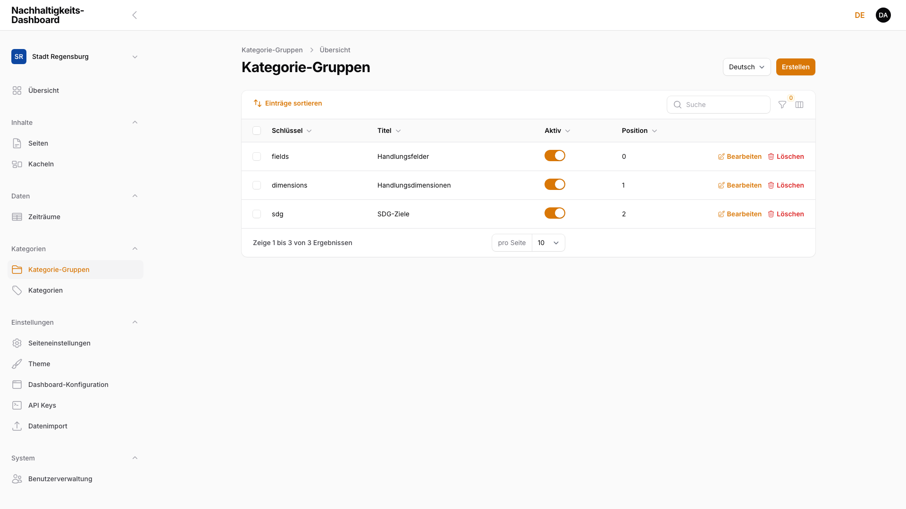
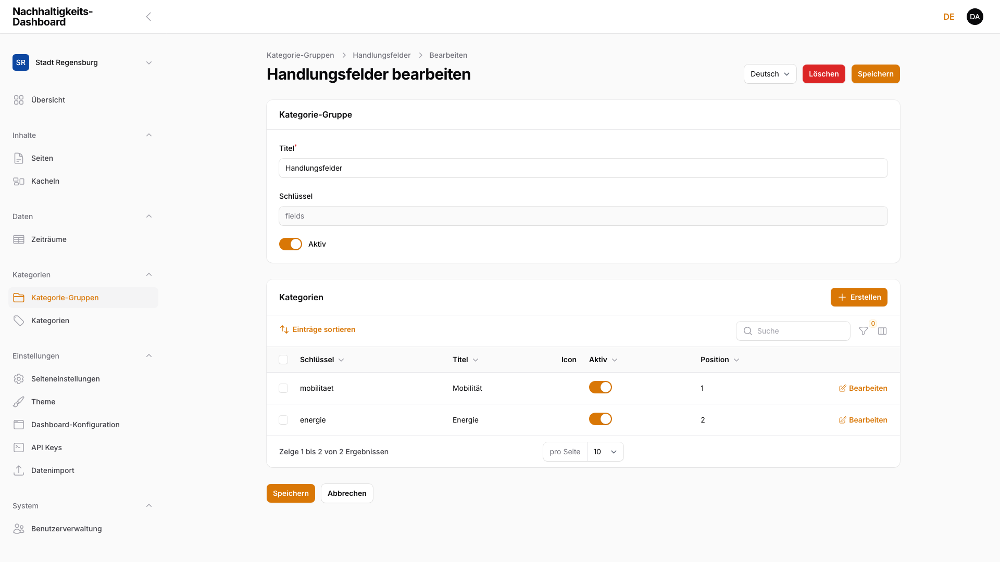
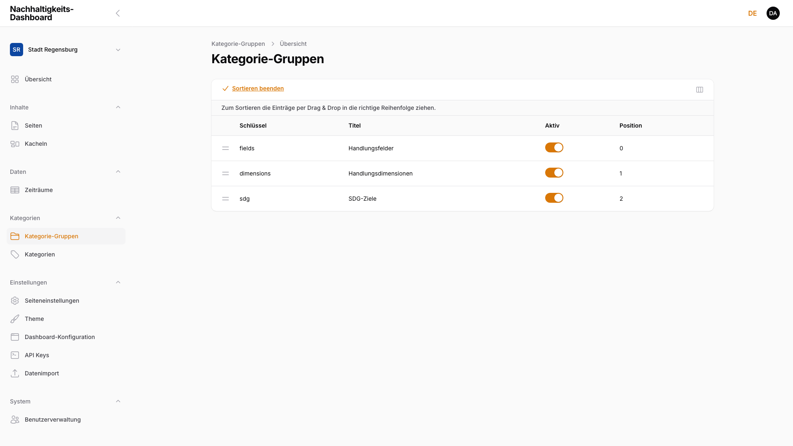
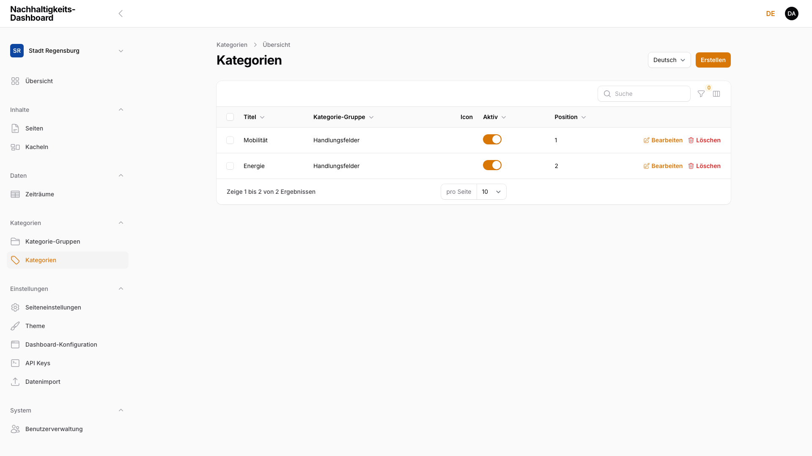
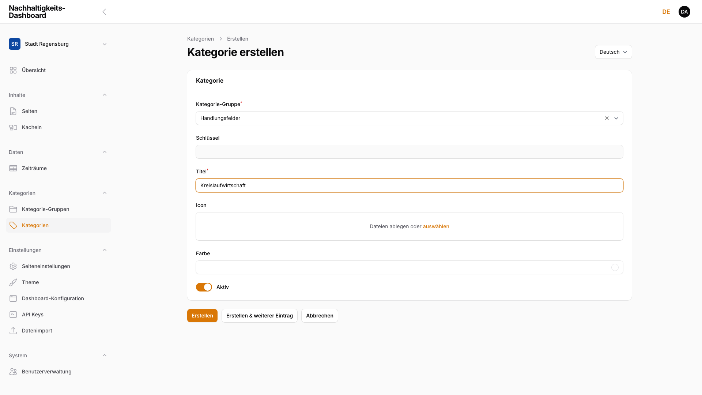
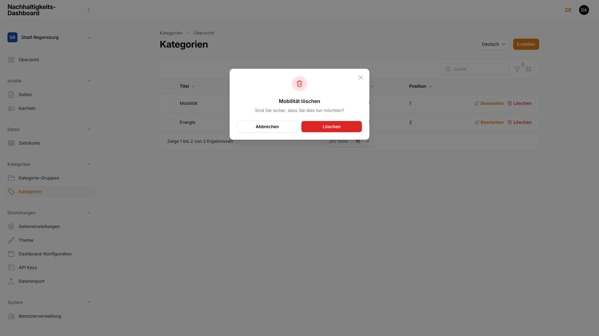

# 4. Kategorien und Filterstruktur

Taxonomien für Navigation und Filterlogik.

## 4.1 Kategorie-Gruppen (Strukturebene)

Kategorie-Gruppen bilden die strukturelle Ebene oberhalb der einzelnen Kategorien. Eine Kategorie-Gruppe (z. B. „Handlungsfelder", „Handlungsdimensionen" oder „SDG-Ziele") fasst inhaltlich zusammengehörige Kategorien zu einem Filterthema zusammen.

### 4.1.1 Übersicht

Die Kategorie-Gruppen sind über **Kategorien → Kategorie-Gruppen** erreichbar. Die Übersicht zeigt alle Gruppen des aktuellen Dashboards als Tabelle:

<!-- Screenshot: Kategorie-Gruppen-Übersicht mit drei Gruppen (Handlungsfelder, Handlungsdimensionen, SDG-Ziele), Spalten Schlüssel/Titel/Aktiv/Position -->

| Spalte | Beschreibung |
|--------|-------------|
| **Schlüssel** | Technischer Bezeichner (`group_key`), aus dem Titel abgeleitet |
| **Titel** | Name der Gruppe in der aktuell gewählten Sprache |
| **Aktiv** | Schalter — steuert, ob die Gruppe samt ihrer Kategorien im Frontend verfügbar ist |
| **Position** | Anzeigereihenfolge der Gruppe (siehe [Kapitel 4.1.6, Reihenfolge und Sichtbarkeit](04-kategorien.md#416-reihenfolge-und-sichtbarkeit)) |

### 4.1.2 Neue Kategorie-Gruppe anlegen

Mit **Erstellen** oben rechts eine neue Gruppe anlegen. Das Formular enthält folgende Felder:

<!-- Screenshot ausstehend (04-gruppe-erstellen.png): leeres Formular „Kategorie-Gruppe erstellen" mit Titel, Schlüssel und Aktiv-Schalter -->

> ### ⚠️ WIP — Work in progress
>
> **Screenshot wird noch ergänzt.**

| Feld | Beschreibung |
|------|-------------|
| **Titel** | Name der Gruppe, erscheint als Filterüberschrift im Frontend |
| **Schlüssel** | Wird beim Tippen des Titels automatisch vorgeschlagen (`group_key`), schreibgeschützt, je Dashboard eindeutig |
| **Aktiv** | Schalter für die Sichtbarkeit im Frontend |

Mit **Erstellen** speichern oder **Erstellen & weiterer Eintrag** direkt eine weitere Gruppe anlegen.

> **Hinweis:** Kategorien werden Kacheln pro Gruppe immer als Mehrfachauswahl zugeordnet (siehe [Kapitel 4.2.4, Kategorie zuordnen](04-kategorien.md#424-kategorie-zuordnen)). Ein Auswahltyp je Gruppe (Einzel- oder Mehrfachauswahl) lässt sich nicht einstellen.

### 4.1.3 Kategorie-Gruppe bearbeiten

Ein Klick auf eine Gruppe in der Übersicht öffnet das Bearbeiten-Formular. Neben Titel, Schlüssel und Aktiv-Schalter erscheint darin eine verschachtelte **Kategorien**-Tabelle mit allen zugehörigen Kategorien (Schlüssel, Titel, Icon, Aktiv, Position) sowie einer eigenen **Erstellen**-Aktion, die direkt eine neue Kategorie in dieser Gruppe anlegt:

<!-- Screenshot: Kategoriegruppe bearbeiten (Handlungsfelder) mit Titel/Schlüssel/Aktiv und verschachtelter Kategorien-Tabelle (Mobilität, Energie) -->

**Farbquelle:** Welche Kategorie-Gruppe ihre Kategorie-Farben zur farblichen Kennzeichnung der Kacheln beisteuert, wird **nicht** in der Gruppe selbst festgelegt, sondern zentral unter **Einstellungen → Theme → Konfiguration** im Feld „Farbquelle für Kacheln" (siehe [Kapitel 6.1.2, Theme / Branding](06-einstellungen.md#612-theme--branding)). Erst wenn eine Gruppe dort als Farbquelle hinterlegt ist, erscheint bei ihren Kategorien das Feld **Farbe** (siehe [Kapitel 4.2.2, Neue Kategorie anlegen](04-kategorien.md#422-neue-kategorie-anlegen)). Passend dazu legt „Kategorie-Gruppe für Hintergrundseite" fest, welche Kategorie-Icons auf der Kachel-Hintergrundseite als Overlay erscheinen.

### 4.1.4 Mehrsprachige Inhalte

Der **Titel** einer Kategorie-Gruppe wird pro Sprache getrennt gepflegt. Wie bei Seiten und Kacheln (siehe [Kapitel 2.7, Mehrsprachige Inhalte](02-seiten-verwalten.md#27-mehrsprachige-inhalte-locale-switcher)) wählt der **Sprache**-Umschalter im Formular, für welche Sprachversion der Titel gerade bearbeitet wird. Schlüssel, Aktiv-Schalter und Position gelten für alle Sprachversionen gleichermaßen.

> ### ⚠️ WIP — Work in progress
>
> **Screenshot wird noch ergänzt.**

### 4.1.5 Kategorie-Gruppe löschen

In der Kategorie-Gruppen-Übersicht steht rechts in jeder Zeile die rot markierte Aktion **Löschen**. Nach Klick öffnet sich eine Sicherheitsabfrage; erst nach Bestätigung mit **Löschen** wird die Gruppe endgültig entfernt. Mit **Abbrechen** bricht der Vorgang ohne Änderungen ab.

> **Hinweis:** Das Löschen einer Kategorie-Gruppe lässt sich nicht rückgängig machen. Ihre bisherigen Kategorien bleiben erhalten, verlieren aber die Gruppenzuordnung — sie erscheinen dann in keinem Filterabschnitt mehr, bis sie einer anderen Gruppe zugewiesen werden. Bei Unsicherheit die Gruppe über den **Aktiv**-Schalter deaktivieren, statt sie zu löschen.

> ### ⚠️ WIP — Work in progress
>
> **Screenshot wird noch ergänzt.**

### 4.1.6 Reihenfolge und Sichtbarkeit

Die Reihenfolge der Kategorie-Gruppen lässt sich in der Übersicht über **Einträge sortieren** per Drag & Drop ändern:

<!-- Screenshot: Kategorie-Gruppen-Übersicht im Sortiermodus mit Ziehgriffen vor jeder Zeile -->

Der **Aktiv**-Schalter blendet eine Gruppe im Frontend ein oder aus, ohne sie zu löschen.

> **Hinweis:** Eine deaktivierte Kategorie-Gruppe blendet automatisch auch alle ihre Kategorien im Frontend-Filter aus, unabhängig vom Aktiv-Status der einzelnen Kategorie.

**Wirkung im Frontend:** Aktive Kategorie-Gruppen erscheinen als eigener Filterabschnitt im Kachel-Raster der Dashboard-Übersicht; die Position bestimmt die Reihenfolge der Abschnitte. Eine deaktivierte Gruppe blendet sich samt aller Kategorien aus dem Filter aus.

## 4.2 Kategorien

Kategorien sind die einzelnen Filteroptionen innerhalb einer Kategorie-Gruppe (z. B. „Mobilität" oder „Energie" innerhalb von „Handlungsfelder").

### 4.2.1 Übersicht

Kategorien lassen sich auf zwei Wegen pflegen: verschachtelt innerhalb einer Kategorie-Gruppe (siehe [Kapitel 4.1.3, Kategorie-Gruppe bearbeiten](04-kategorien.md#413-kategorie-gruppe-bearbeiten)) oder zentral über **Kategorien → Kategorien** — dort erscheinen alle Kategorien aller Gruppen des Dashboards in einer Tabelle.

<!-- Screenshot: Kategorien-Übersicht mit Spalte Kategorie-Gruppe eingeblendet, zwei Einträgen (Mobilität, Energie unter Handlungsfelder) -->

Die Spalten **Kategorie-Gruppe**, **Schlüssel** und **Farbe** sind standardmäßig ausgeblendet und lassen sich über die Spaltenauswahl oberhalb der Tabelle einblenden. Über **Filtern** lässt sich die Liste nach Aktiv-Status und Kategorie-Gruppe eingrenzen.

### 4.2.2 Neue Kategorie anlegen

Mit **Erstellen** eine neue Kategorie anlegen (aus einer Kategorie-Gruppe heraus ist die Gruppe bereits vorausgewählt):

<!-- Screenshot: Formular „Kategorie erstellen" mit Kategorie-Gruppe (Handlungsfelder), Schlüssel, Titel, Icon-Upload, Farbe-Feld, Aktiv-Schalter -->

| Feld | Beschreibung |
|------|-------------|
| **Kategorie-Gruppe** | Pflichtfeld, durchsuchbare Auswahl — legt fest, zu welcher Gruppe (siehe [Kapitel 4.1, Kategorie-Gruppen](04-kategorien.md#41-kategorie-gruppen-strukturebene)) die Kategorie gehört |
| **Schlüssel** | Wird beim Tippen des Titels automatisch vorgeschlagen, schreibgeschützt |
| **Titel** | Name der Kategorie, erscheint im Frontend-Filter und bei der Kategorie-Auswahl an Kacheln (siehe [Kapitel 3.2, Neue Kachel anlegen](03-kacheln-verwalten.md#32-neue-kachel-anlegen)) |
| **Icon** | Bild-Upload (PNG, JPEG, GIF, WebP, SVG) für die Filterdarstellung |
| **Farbe** | Nur sichtbar, wenn die übergeordnete Gruppe als Farbquelle für Kacheln hinterlegt ist (siehe [Kapitel 4.1.3, Kategorie-Gruppe bearbeiten](04-kategorien.md#413-kategorie-gruppe-bearbeiten)); Hex-Farbwert über Farbwähler oder direkte Eingabe |
| **Aktiv** | Schalter für die Sichtbarkeit im Frontend |

Mit **Erstellen** speichern oder **Erstellen & weiterer Eintrag** direkt eine weitere Kategorie anlegen.

### 4.2.3 Kategorie bearbeiten

Ein Klick auf eine Kategorie — in der zentralen Übersicht oder in der verschachtelten Tabelle einer Gruppe — öffnet dasselbe Formular wie beim Anlegen. Dort lassen sich Titel, Icon, Farbe (sofern die Gruppe als Farbquelle hinterlegt ist) und der Aktiv-Schalter ändern. Der Schlüssel bleibt schreibgeschützt.

> ### ⚠️ WIP — Work in progress
>
> **Screenshot wird noch ergänzt.**

### 4.2.4 Kategorie zuordnen

Kategorien werden nicht in der Kategorienverwaltung selbst mit Kacheln verknüpft, sondern direkt am jeweiligen Kachel-Formular: Für jede Kategorie-Gruppe erscheint dort ein eigenes Auswahlfeld, über das sich die passenden Kategorien der Kachel zuordnen lassen (siehe [Kapitel 3.2, Neue Kachel anlegen](03-kacheln-verwalten.md#32-neue-kachel-anlegen)).

> **Hinweis:** Die Zuordnung erfolgt pro Gruppe immer als Mehrfachauswahl — einer Kachel lassen sich also mehrere Kategorien derselben Gruppe zuordnen.

> ### ⚠️ WIP — Work in progress
>
> **Screenshot wird noch ergänzt.**

### 4.2.5 Mehrsprachige Inhalte

Der **Titel** einer Kategorie wird pro Sprache getrennt gepflegt (siehe [Kapitel 2.7, Mehrsprachige Inhalte](02-seiten-verwalten.md#27-mehrsprachige-inhalte-locale-switcher)). Schlüssel, Icon, Farbe, Aktiv-Schalter und Gruppenzuordnung gelten für alle Sprachversionen gleichermaßen.

> ### ⚠️ WIP — Work in progress
>
> **Screenshot wird noch ergänzt.**

### 4.2.6 Kategorie löschen

In der Kategorienübersicht steht rechts in jeder Zeile die rot markierte Aktion **Löschen**. Nach Bestätigung wird die Kategorie inklusive aller Sprachversionen endgültig entfernt; bestehende Zuordnungen zu Kacheln entfallen dabei ebenfalls.

<!-- Screenshot: Löschen-Bestätigungsdialog für eine Kategorie mit Titel und Abbrechen/Löschen-Buttons -->

> **Hinweis:** Das Löschen einer Kategorie lässt sich nicht rückgängig machen. Bei Unsicherheit die Kategorie über den **Aktiv**-Schalter deaktivieren, statt sie zu löschen.

### 4.2.7 Reihenfolge und Sichtbarkeit

Auch Kategorien lassen sich über **Einträge sortieren** per Drag & Drop anordnen — sowohl in der verschachtelten Tabelle innerhalb einer Kategorie-Gruppe (siehe [Kapitel 4.1.3, Kategorie-Gruppe bearbeiten](04-kategorien.md#413-kategorie-gruppe-bearbeiten)) als auch in der zentralen Kategorien-Übersicht (siehe [Kapitel 4.2.1, Übersicht](04-kategorien.md#421-übersicht)). Der **Aktiv**-Schalter blendet eine Kategorie im Frontend ein oder aus, ohne sie zu löschen.

> **Hinweis:** Eine deaktivierte Kategorie bleibt bearbeitbar und mit bestehenden Kachel-Zuordnungen erhalten, taucht im Frontend aber nicht mehr als Filteroption auf. Ist die übergeordnete Gruppe deaktiviert, erscheinen ihre Kategorien unabhängig vom eigenen Aktiv-Status nicht im Filter.

**Wirkung im Frontend:** Die Position bestimmt die Reihenfolge der Filteroptionen (Kategorien) innerhalb ihres Filterabschnitts im Kachel-Raster der Dashboard-Übersicht. Ist die Gruppe als Farbquelle hinterlegt, färbt die Kategorie-Farbe die zugehörigen Kacheln ein.
