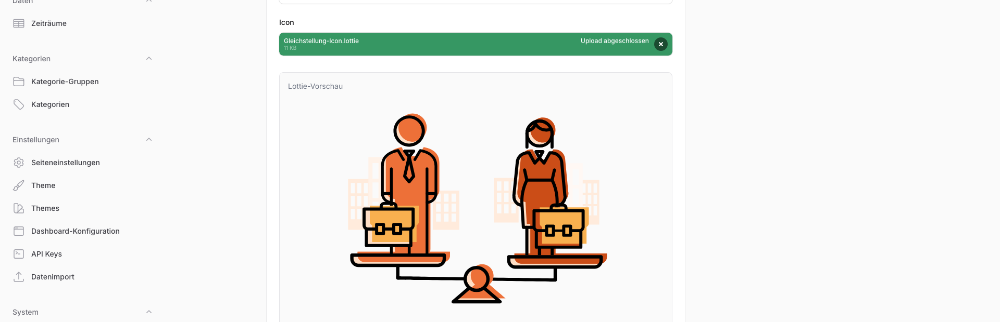
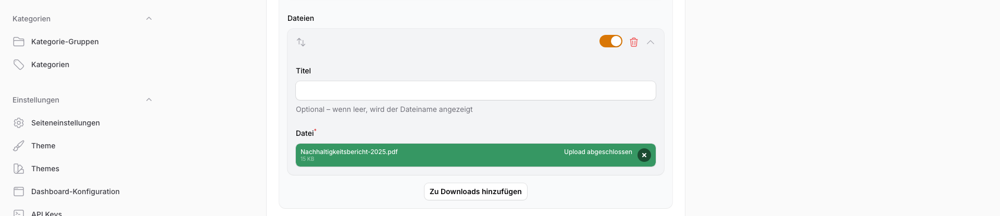

# 5. Bilder und Dateien

Medienhandling im Adminbereich.

## 5.1 Bilder hochladen und zuschneiden

Bild- und Datei-Uploads laufen im gesamten Adminbereich über dasselbe Upload-Feld: eine Fläche zum Ablegen einer Datei per Drag & Drop oder zum Auswählen über den Link **auswählen**. Nach dem Hochladen zeigt das Feld eine Vorschau (bei Bildern ein Thumbnail, bei anderen Dateien Dateiname und Größe) sowie eine Schaltfläche zum Entfernen. Eine neue Datei ersetzt die vorhandene automatisch — ein Zurückgreifen auf bereits hochgeladene Dateien aus einer zentralen Mediathek gibt es nicht, jedes Feld verwaltet seine eigene Datei unabhängig.

<!-- Screenshot: Icon-Upload-Feld einer Kachel mit hochgeladener Datei, Fortschrittsbalken "Upload abgeschlossen" -->

> **Hinweis:** Ein interaktives Zuschneiden-Werkzeug beim Hochladen gibt es nur für das Profilbild (siehe [Kapitel 1.4, Profil bearbeiten](01-erste-schritte.md)): Es wird automatisch auf ein quadratisches Format zugeschnitten und auf 256×256 Pixel skaliert, ohne dass ein Zuschnitt-Dialog erscheint. Alle anderen Bild-Felder (Kachel-Icons, Kategorie-Icons, Inhaltsbilder, Logo) übernehmen die hochgeladene Datei unverändert in Originalgröße.

## 5.2 Unterstützte Formate und Größen

Welche Dateiformate und Größenbeschränkungen gelten, hängt vom jeweiligen Feld ab:

| Bereich | Erlaubte Formate | Größenlimit |
|---------|-------------------|-------------|
| Profilbild (Avatar) | Bildformate | 2 MB |
| Kategorie-Icon | PNG, JPEG, GIF, WebP, SVG | kein Limit |
| Kachel-Icon | Bildformate, JSON (Lottie), .lottie (dotLottie) | kein Limit |
| Inhaltsbilder in Seiten-/Kachel-Blöcken (Intro-Text, Text & Bild, Slider) | Bildformate | kein Limit |
| SEO-Bild (Seiten und Kacheln) | Bildformate | kein Limit |
| Downloads (Download-Block) | PDF, Word, Excel, ZIP | kein Limit |
| Logo | Bildformate | kein Limit |
| Favicon | ICO, PNG, SVG | 512 KB |
| Eigene Schriftart-Datei | WOFF2, WOFF, TTF, OTF | 5 MB |
| Datenimport-Datei | JSON, Text | 20 MB |

<!-- Screenshot: Datei-Upload im Download-Block -->

> **Hinweis:** Große Bilddateien vor dem Hochladen sinnvoll komprimieren, um Ladezeiten im Frontend gering zu halten.

## 5.3 Alt-Texte und Barrierefreiheit

<!-- WIP: Dieser Abschnitt ist bewusst als Platzhalter angelegt. Die Dokumentation zu Alt-Texten und Barrierefreiheit wird überarbeitet und später ergänzt. -->

> ### ⚠️ WIP — Work in progress
>
> **Dieser Abschnitt wird derzeit überarbeitet.** Die Beschreibung von Alt-Texten und Barrierefreiheit ist noch nicht final und wird in einer späteren Version des Handbuchs ergänzt.

## 5.4 Sonderformate: Lottie-Animationen, SVG-Icons

Das Icon-Feld einer Kachel (siehe [Kapitel 3.2, Neue Kachel anlegen](03-kacheln-verwalten.md)) akzeptiert neben Bildformaten auch Lottie-Animationen: `.json`-Dateien im Bodymovin/Lottie-Format sowie `.lottie`-Dateien (dotLottie-Container). Nach dem Speichern einer Kachel mit einer solchen Datei zeigt das Formular eine **Lottie-Vorschau** mit abspielender Animation:

<!-- Screenshot entfernt (Runde 3): 05-icon-lottie-upload.png wird neu erstellt -->

> ### ⚠️ WIP — Work in progress
>
> **Screenshot wird noch ergänzt.**

> **Hinweis:** Die Lottie-Vorschau aktualisiert sich nicht live während des Hochladens — sie erscheint erst nach dem Speichern der Kachel und einem erneuten Laden der Seite. Wird keine Lottie-Datei erkannt (Dateiendung weder `.json` noch `.lottie`), zeigt das Formular stattdessen den Hinweis „Keine Lottie-Animation".

SVG-Icons lassen sich zusätzlich bei Kategorien hochladen (siehe [Kapitel 4.2, Kategorien anlegen und bearbeiten](04-kategorien.md)) — dort ist SVG neben PNG, JPEG, GIF und WebP eines von mehreren erlaubten Formaten für das Kategorie-Icon.
