# 6. Einstellungen (nur Admin)

Systemweite Konfiguration — erfordert die Admin-Rolle. Redaktionsmitglieder ohne Admin-Rolle sehen den Menüpunkt **Einstellungen** in der Seitenleiste nicht (siehe [Kapitel 7, Rollen und Berechtigungen](07-rollen-und-berechtigungen.md)).

Der Adminbereich fasst die Konfiguration in zwei Seitenleisten-Gruppen zusammen: Alles unter **Einstellungen** ([Abschnitt 6.1](#61-einstellungen)) ist **dashboard-bezogen**, alles unter **System** ([Abschnitt 6.2](#62-system)) sind **installationsweite** Einstellungen.

> **Hinweis:** Die Bezeichnung „Sprache" taucht im Adminbereich zweimal mit unterschiedlicher Bedeutung auf: Die **Backend-Sprache** im Profil (siehe [Kapitel 1.4, Profil bearbeiten](01-erste-schritte.md)) bestimmt die Oberflächensprache des Adminbereichs selbst (Menüs, Buttons, Labels). Der **Sprachumschalter** oben auf der Seiteneinstellungen-Seite (siehe [Kapitel 1.5, Sprache umschalten](01-erste-schritte.md)) wählt dagegen, für welche Inhaltssprache (Deutsch/Englisch) die gerade bearbeiteten Felder gelten — analog zum Locale-Switcher bei Seiten- und Kachel-Inhalten.

## 6.1 Einstellungen

Die Gruppe **Einstellungen** bündelt die dashboard-bezogenen Konfigurationsseiten: **Seiteneinstellungen**, **Theme**, **Dashboard-Konfiguration**, **API Keys** und **Datenimport**.

### 6.1.1 Seiteneinstellungen

Die Seite **Seiteneinstellungen** bündelt die Basisdaten der Installation sowie die Header- und Footer-Navigation.

#### 6.1.1.1 Name und Mehrsprachigkeit

Im Abschnitt **Basisinformationen** stehen die grundlegenden, sprachunabhängigen Einstellungen der Installation:

| Feld | Beschreibung |
|------|-------------|
| **Seitenname** | Name der gesamten Installation. Erscheint u. a. im Browser-Tab-Titel und in System-E-Mails. Gilt für alle Dashboards (Tenants) gemeinsam. |
| **Übersetzung Englisch** | Schalter. Bei Deaktivierung wird der Sprachumschalter im Frontend ausgeblendet, und englische Routen leiten automatisch auf Deutsch um. |

<!-- Screenshot entfernt (Runde 3): 06-seiteneinstellungen-allgemein.png wird neu erstellt -->

> ### ⚠️ WIP — Work in progress
>
> **Screenshot wird noch ergänzt.**

> **Hinweis:** Das Favicon wird abweichend vom Feldnamen **nicht** auf dieser Seite gepflegt, sondern auf der Seite **Theme** im Logo-Bereich (siehe [Abschnitt 6.1.2, Theme / Branding](#612-theme--branding)). Diese Aufteilung weicht vom ursprünglichen Struktur-Entwurf ab, entspricht aber dem aktuellen Stand der Live-Anwendung.

#### 6.1.1.2 Header

Das Header-Menü wird auf der Seite **Seiteneinstellungen** im Abschnitt **Header → Navigations-Elemente** gepflegt. Jedes Navigations-Element besitzt:

| Feld | Beschreibung |
|------|-------------|
| **Typ** | **Seite** (verlinkt auf eine öffentliche Seite, siehe [Kapitel 2, Seiten verwalten](02-seiten-verwalten.md)) oder **Externer Link** (freie URL). |
| **Seite** | Nur bei Typ „Seite": Auswahl aus allen öffentlichen Seiten. Bezeichnung und URL werden automatisch aus der gewählten Seite übernommen. |
| **Bezeichnung** / **URL** | Nur bei Typ „Externer Link": frei editierbarer Linktext und Ziel-URL. |
| **Untermenü-Elemente** | Pro Element lässt sich eine Ebene Unterpunkte hinzufügen (gleiches Schema: Typ, Seite bzw. Bezeichnung/URL). |
| **Aktiv** | Schalter zum vorübergehenden Ausblenden eines Elements, ohne es zu löschen. |

Elemente lassen sich per Drag-Handle (**Verschieben**) neu anordnen; die Reihenfolge im Formular entspricht der Reihenfolge im Frontend-Header.

<!-- Screenshot: Seiteneinstellungen — Header-Abschnitt mit einem Navigations-Element vom Typ Externer Link -->
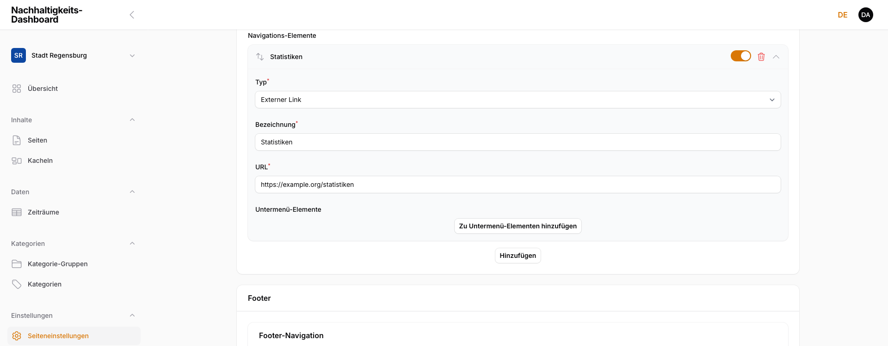

**Wirkung im Frontend:** Die Navigations-Elemente erscheinen in dieser Reihenfolge im Haupt-Header des öffentlichen Dashboards; Untermenü-Elemente werden als Dropdown unter ihrem übergeordneten Element angezeigt.

#### 6.1.1.3 Footer

Ebenfalls auf der Seite **Seiteneinstellungen**, im Abschnitt **Footer**, gegliedert in drei Unterbereiche:

**Footer-Navigation** — Gleiches Feld-Schema wie beim Header (Typ „Seite"/„Externer Link", siehe [Abschnitt 6.1.1.2, Header](#6112-header)), jedoch ohne Untermenü-Ebene. Zusätzlich:

| Feld | Beschreibung |
|------|-------------|
| **Spaltenanzahl** | 1 bis 5 Spalten für die Anordnung der Footer-Navigations-Elemente im Frontend. |

<!-- Screenshot: Seiteneinstellungen — Footer-Abschnitt mit Footer-Navigations-Element, Spaltenanzahl, Social-Media- und Förderer-Bereich -->
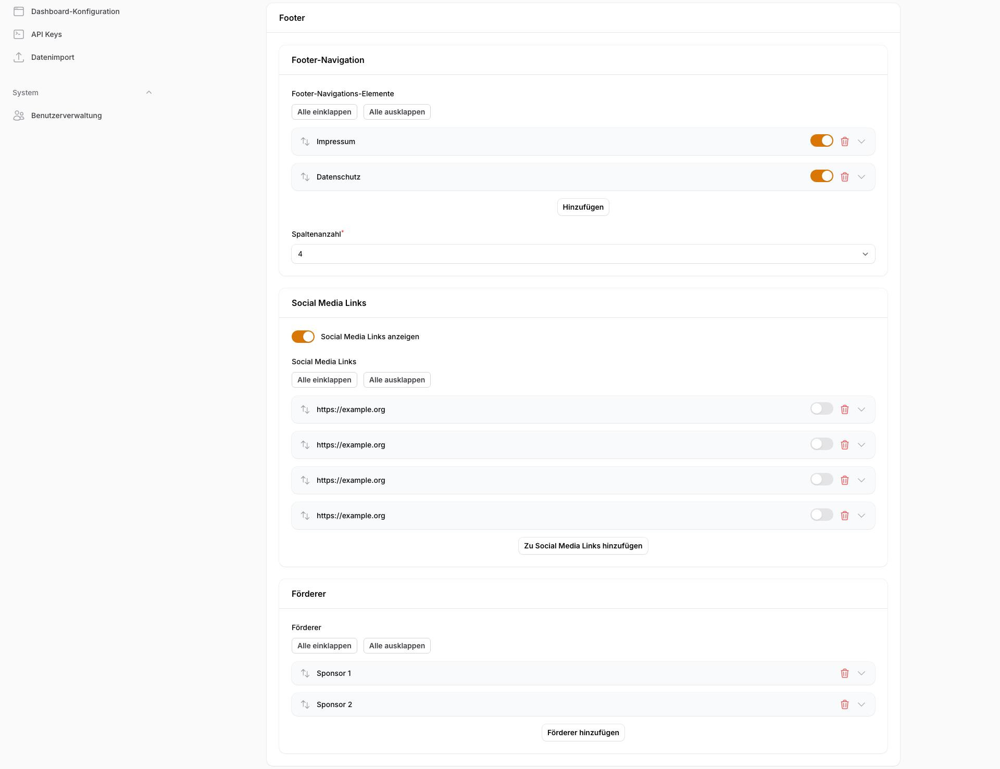

**Social Media Links**

| Feld | Beschreibung |
|------|-------------|
| **Social Media Links anzeigen** | Schalter, blendet den gesamten Social-Media-Bereich im Frontend-Footer ein oder aus. |
| **Icon** | Bild-Upload für das Plattform-Icon. |
| **Profil-URL** | Ziel-Link des Icons. |
| **Tooltip-Text** | Optionaler Text, der beim Überfahren des Icons angezeigt wird. |

**Förderer** — Liste für Sponsoren-Logos, zu der sich beliebig viele Einträge hinzufügen lassen: **Sponsor-Bild** (Upload, Pflichtfeld), **Sponsor-URL** (optional) und **Sponsor-Name** (optional, dient als Alt-Text-Ersatz in der Liste).

> **Hinweis:** Ein Feld für den Copyright-Text ist im Datenmodell vorhanden, taucht in der aktuellen Formularoberfläche jedoch nicht auf — der Copyright-Text lässt sich über dieses Formular derzeit nicht bearbeiten. Das weicht vom Struktur-Entwurf ab („Footer (Links, Social Media, **Copyright**, Layout)").

**Wirkung im Frontend:** Footer-Navigation, Social-Media-Icons und Förderer-Logos erscheinen im Footer des öffentlichen Dashboards, angeordnet in der gewählten Spaltenanzahl.

### 6.1.2 Theme / Branding

Die Seite **Theme** gliedert sich in vier Reiter: **Logo**, **Farben**, **Schrift** und **Konfiguration**.

#### 6.1.2.1 Logo

| Feld | Beschreibung |
|------|-------------|
| **Logo** | Bild-Upload, erscheint im Header des Frontends. |
| **Favicon** | Bild-Upload. Empfohlen: ICO, PNG oder SVG, max. 512 KB (siehe auch die Formatübersicht in [Kapitel 5.2, Unterstützte Formate und Größen](05-bilder-und-dateien.md)). |

<!-- Screenshot: Theme — Reiter Logo mit Logo- und Favicon-Upload-Feldern -->
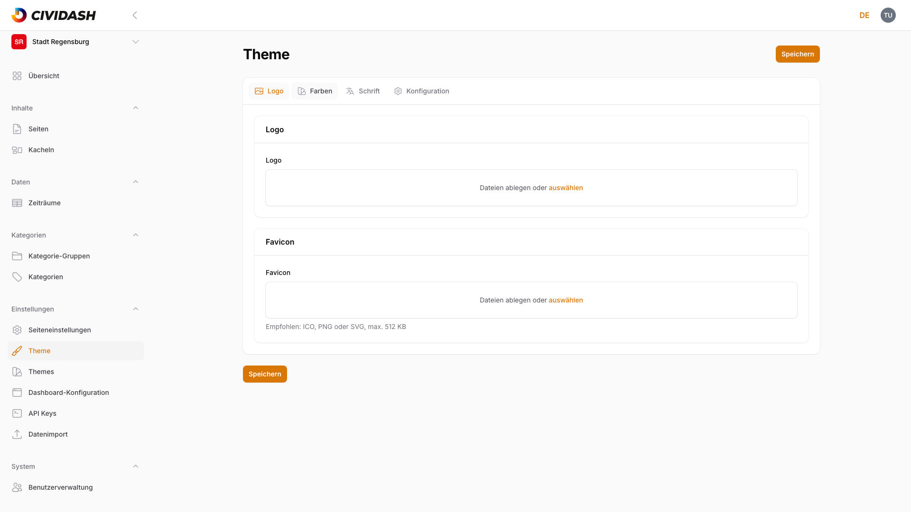

#### 6.1.2.2 Farben

Der Reiter **Farben** gliedert die Farbpalette in fünf Gruppen:

| Gruppe | Felder |
|--------|--------|
| **Farben** | Primärfarbe*, Sekundärfarbe*, Akzentfarbe (fällt auf Primärfarbe zurück, wenn leer) |
| **Hintergrund-Farben** | Haupt-, Karten-, Hero-Block-, Overlay-, Header- und Footer-Hintergrundfarbe |
| **Text-Farben** | Primäre, Sekundäre und Inverse Textfarbe, Link-Farbe, Link-Hover-Farbe |
| **Navigations-Farben** | Navigations-Textfarbe, Inaktive Navigations-Textfarbe (Sprach-Switcher), Navigations-Hover- & Aktiv-Farbe |
| **Rand- und Schatten-Farben** sowie **Slider-Farben** | Randfarbe, Trennlinienfarbe, Schattenfarbe; Slider-Schiene, -Griff und -Griffrand (jeweils Pflichtfeld) |

Mit `*` markierte Felder sind Pflichtfelder, alle übrigen Farbfelder sind optional und fallen auf einen sinnvollen Standardwert zurück.

<!-- Screenshot: Theme — Reiter Farben mit Farbwähler-Feldern -->
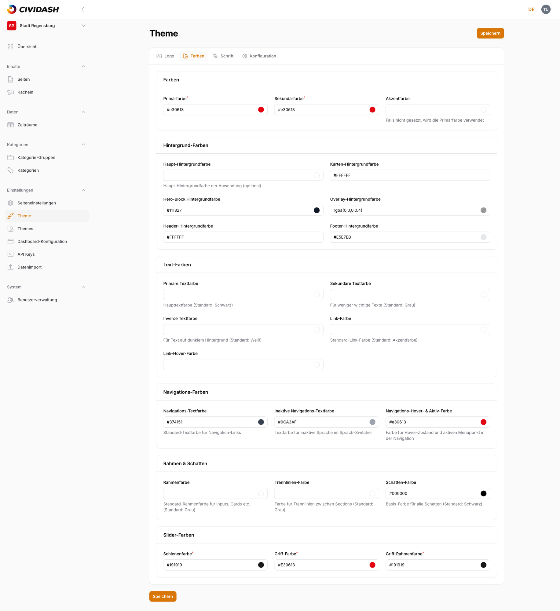

**Wirkung im Frontend:** Alle Farbwerte fließen direkt in die CSS-Variablen des öffentlichen Dashboards ein und wirken sich sofort nach dem Speichern auf Hintergründe, Texte, Links, Navigation und den Bereichs-Slider im Frontend aus.

#### 6.1.2.3 Schrift / Typografie

Der Reiter **Schrift** steuert die Typografie:

| Feld | Beschreibung |
|------|-------------|
| **Schriftfamilie** | Auswahl aus vordefinierten Web-Fonts (u. a. Open Sans, Roboto, Inter, Lato, Montserrat, Poppins, Source Sans Pro). Ausgeblendet, sobald eine eigene Schriftdatei hochgeladen ist. |
| **Schriftschnitte** | Liste zur Auswahl der geladenen Schriftstärken (100–900). Ebenfalls ausgeblendet bei eigener Schriftdatei. |
| **Eigene Schriftart-Datei** | Optionaler Upload (WOFF2, WOFF, TTF, OTF, max. 5 MB, siehe [Kapitel 5.2, Unterstützte Formate und Größen](05-bilder-und-dateien.md)). Ersetzt die vordefinierte Schriftfamilien-Auswahl. |
| **Name der eigenen Schriftart** | Pflichtfeld, sobald eine eigene Schriftdatei hochgeladen wurde. |
| **Schriftgrößen** | Freitextfelder (CSS-Werte wie `1rem`) für Basis-, Klein- und Großschrift sowie die Überschriften h1–h6. |

<!-- Screenshot: Theme — Reiter Schrift mit Schriftfamilie und Schriftgrößen -->
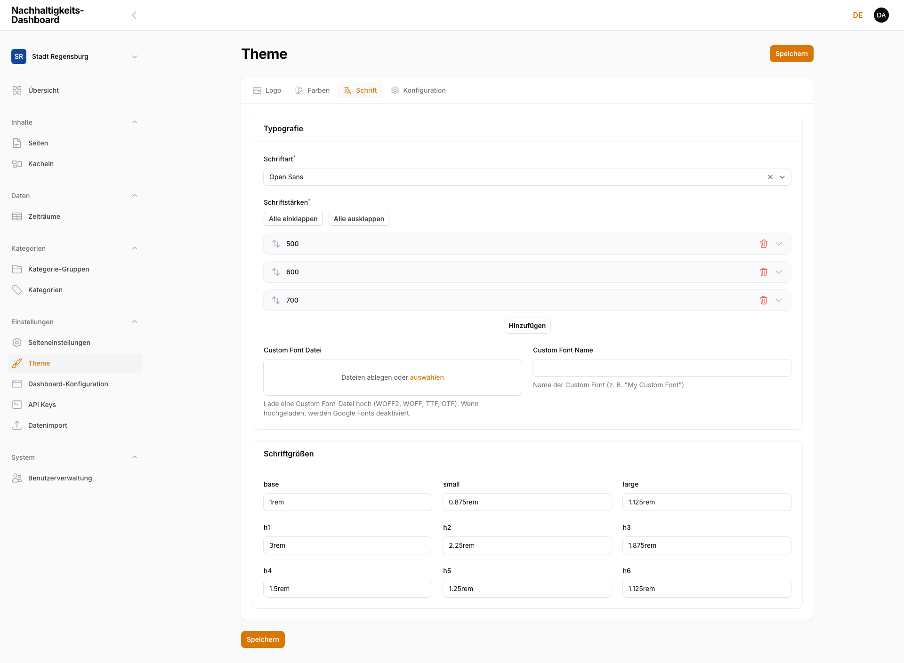

> **Hinweis:** Schriftfamilien-Auswahl und Schriftschnitte einerseits sowie eigene Schriftdatei andererseits schließen sich gegenseitig aus — sobald eine eigene Datei hochgeladen ist, verschwinden die vordefinierten Felder aus dem Formular.

#### 6.1.2.4 Konfiguration (Kacheln)

Der vierte Reiter **Konfiguration** ist im ursprünglichen Struktur-Entwurf nicht vorgesehen, existiert in der Live-Anwendung aber als Teil der Theme-Seite:

| Feld | Beschreibung |
|------|-------------|
| **Farbquelle für Kacheln** | Kategorie-Gruppe (siehe [Kapitel 4.1, Kategorie-Gruppen](04-kategorien.md#41-kategorie-gruppen-strukturebene)), deren Kategorie-Farben zur visuellen Einfärbung der Kacheln verwendet werden. |
| **Kategorie-Gruppe für Hintergrundseite** | Kategorie-Gruppe, deren Icons auf der Kachel-Hintergrundseite (Detail-Overlay) angezeigt werden. |

<!-- Screenshot: Theme — Reiter Konfiguration mit Kachel-Farbquelle und Kategorie-Gruppe für Hintergrundseite -->
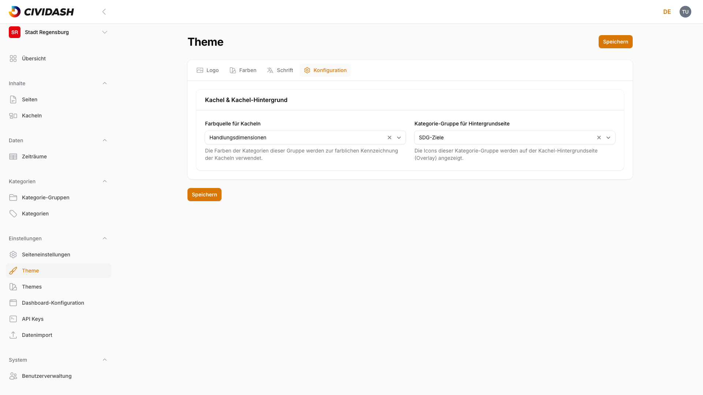

### 6.1.3 Dashboard-Konfiguration

Zusätzlich zur installationsweiten Seiteneinstellungen-Seite besitzt **jedes** Dashboard (Tenant) eine eigene Seite **Dashboard-Konfiguration** mit dashboard-spezifischen Basisdaten.

<!-- Screenshot: Dashboard-Konfiguration mit Name, Zusatzinfo, Slug, Domain, Frontend Base URL -->
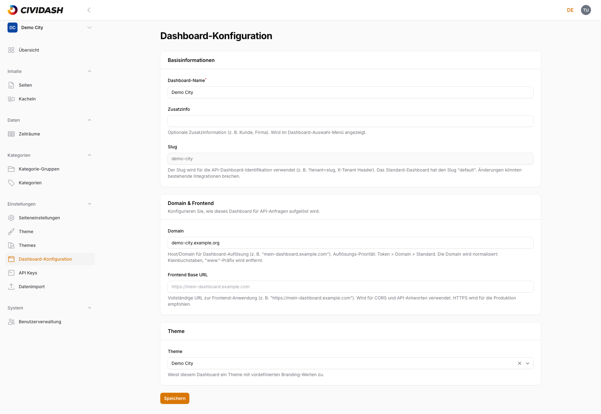

> **Hinweis:** Diese Seite ist im ursprünglichen Struktur-Entwurf nicht als eigener Punkt vorgesehen, existiert in der Live-Anwendung aber als eigenständige Einstellungsseite. Sie wurde hier ergänzt, weil sie inhaltlich zu den Basisdaten des Dashboards gehört.

#### 6.1.3.1 Name

| Feld | Beschreibung |
|------|-------------|
| **Dashboard-Name** | Name dieses einzelnen Dashboards (z. B. „Stadt Regensburg"). Erscheint im Dashboard-Auswahl-Menü (siehe [Kapitel 1.1, Anmeldung und Oberfläche](01-erste-schritte.md)). |
| **Zusatzinfo** | Optionale Zusatzinformation (z. B. Kunde, Firma), ebenfalls im Dashboard-Auswahl-Menü sichtbar. |
| **Slug** | Schreibgeschützt. Identifiziert das Dashboard eindeutig, u. a. für Domain-Zuordnung. Das Standard-Dashboard trägt den Slug `default`. |

#### 6.1.3.2 Domain

| Feld | Beschreibung |
|------|-------------|
| **Domain** | Host/Domain, über die dieses Dashboard aufgelöst wird. Wird normalisiert (Kleinbuchstaben, `www.`-Präfix entfernt). Auflösungs-Priorität: Token vor Domain vor Standard-Dashboard. |
| **Frontend Base URL** | Vollständige URL der Frontend-Anwendung. Wird für CORS und API-Antworten verwendet. |

### 6.1.4 API-Schlüssel verwalten

Die Seite **API Keys** verwaltet Zugriffstoken für die Dashboard-API dieses Tenants.

#### 6.1.4.1 API-Schlüssel Übersicht

Die Tabelle zeigt pro Token: Name, Besitzer, Berechtigungen (Badge), Aktiv-Status, Erstellungs- und letztes Nutzungsdatum sowie (ausblendbar) das letzte Aktualisierungsdatum. Filterbar nach Berechtigung und Aktiv-Status, durchsuchbar über das Suchfeld.

<!-- Screenshot: API Keys — Tabellenübersicht mit einem Beispiel-Token -->
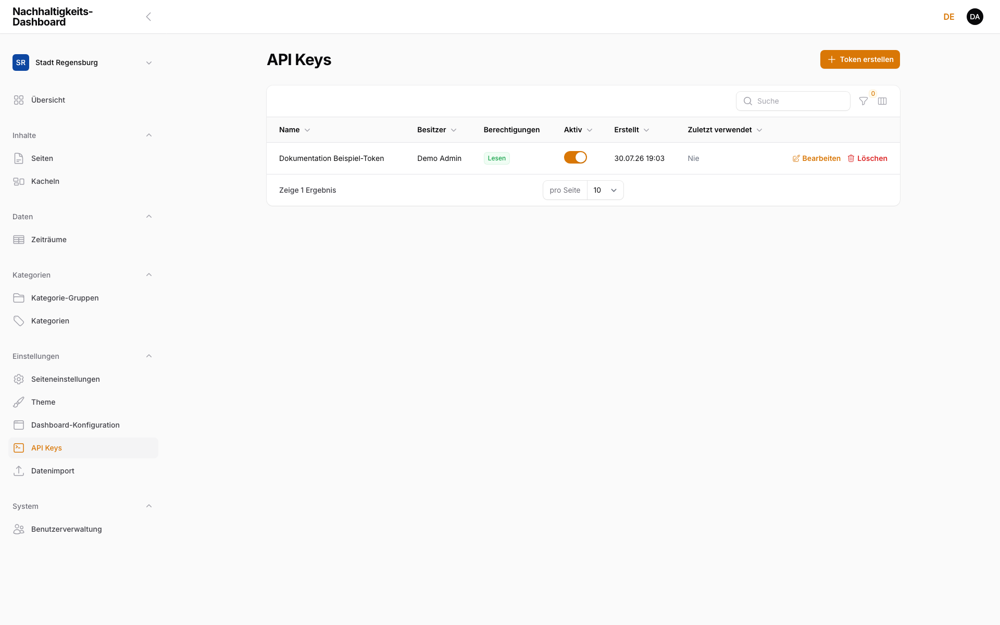

#### 6.1.4.2 Neuen Key erstellen

Über **Token erstellen** öffnet sich ein Dialog mit zwei Feldern:

| Feld | Beschreibung |
|------|-------------|
| **Token-Name** | Beschreibender Name zur späteren Identifikation (z. B. „Produktions-API"). |
| **Berechtigungen** | **Nur Lesen** (Lesezugriff auf öffentliche API-Endpunkte) oder **Lesen und Schreiben** (vollständiger CRUD-Zugriff auf Admin-Endpunkte). |

<!-- Screenshot: API Keys — Dialog "API Token erstellen" mit Token-Name und Berechtigungen -->
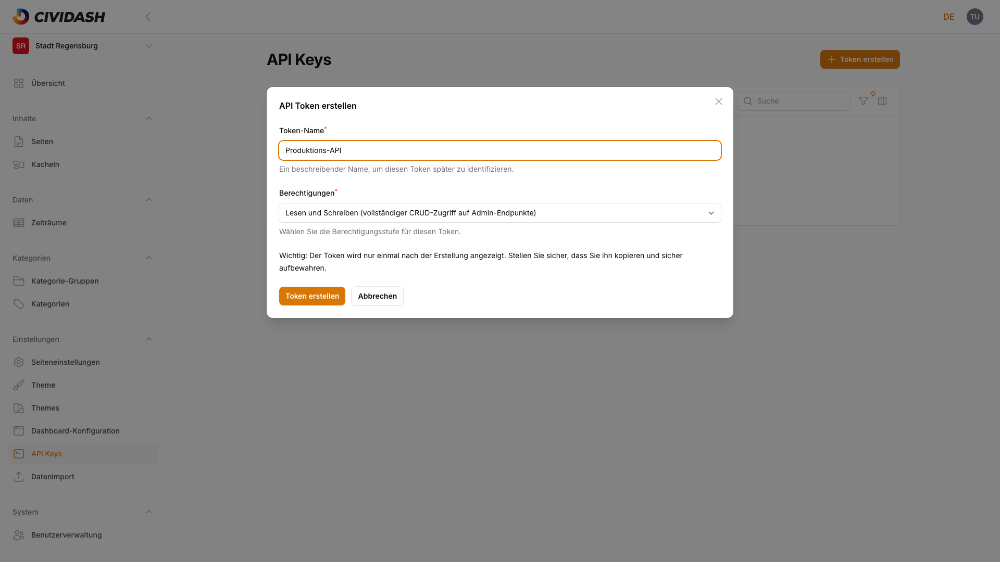

> **Hinweis:** Der erzeugte Token-Wert wird **nur einmal**, direkt nach der Erstellung, im Klartext angezeigt. Es gibt keine Möglichkeit, ihn später erneut einzusehen — bei Verlust muss ein neuer Token erstellt und der alte gelöscht werden. Den Token-Wert entsprechend sicher und außerhalb von Screenshots oder Tickets aufbewahren.

#### 6.1.4.3 Key bearbeiten

Über **Bearbeiten** lassen sich Name, Berechtigungen und Aktiv-Status eines bestehenden Tokens ändern (der Token-Wert selbst bleibt unverändert und wird nicht erneut angezeigt).

> ### ⚠️ WIP — Work in progress
>
> **Screenshot wird noch ergänzt.**

#### 6.1.4.4 Key löschen

Über **Löschen** (mit Sicherheitsabfrage) wird ein Token unwiderruflich entzogen — Anwendungen, die ihn verwenden, verlieren sofort den Zugriff.

> ### ⚠️ WIP — Work in progress
>
> **Screenshot wird noch ergänzt.**

### 6.1.5 Datenimport

Für den Bulk-Import von Kacheln, Kategorien, Kategorie-Gruppen und Kennzahlen per JSON-Bundle existiert eine eigene Seite **Datenimport**, ausführlich beschrieben in [Datenimport](../datenimport.de.md).

> ### ⚠️ WIP — Work in progress
>
> **Screenshot wird noch ergänzt.**

## 6.2 System

Die Gruppe **System** bündelt die installationsweiten Einstellungen, die unabhängig vom gerade gewählten Dashboard gelten.

> ### ⚠️ WIP — Work in progress
>
> **Screenshot wird noch ergänzt.**

### 6.2.1 Benutzerverwaltung

Nur Admin-Accounts sehen den Menüpunkt **Benutzerverwaltung** (Gruppe „System"). Dort werden alle Benutzerkonten angelegt und verwaltet, unabhängig vom aktuell gewählten Dashboard.

#### 6.2.1.1 Benutzer Übersicht

Die Übersicht zeigt jeden Account mit E-Mail-Adresse, Name, zugewiesenen Dashboards und Aktiv-Status.

<!-- Screenshot: Benutzerverwaltung — Tabellenübersicht mit Admin- und Redaktions-Accounts -->
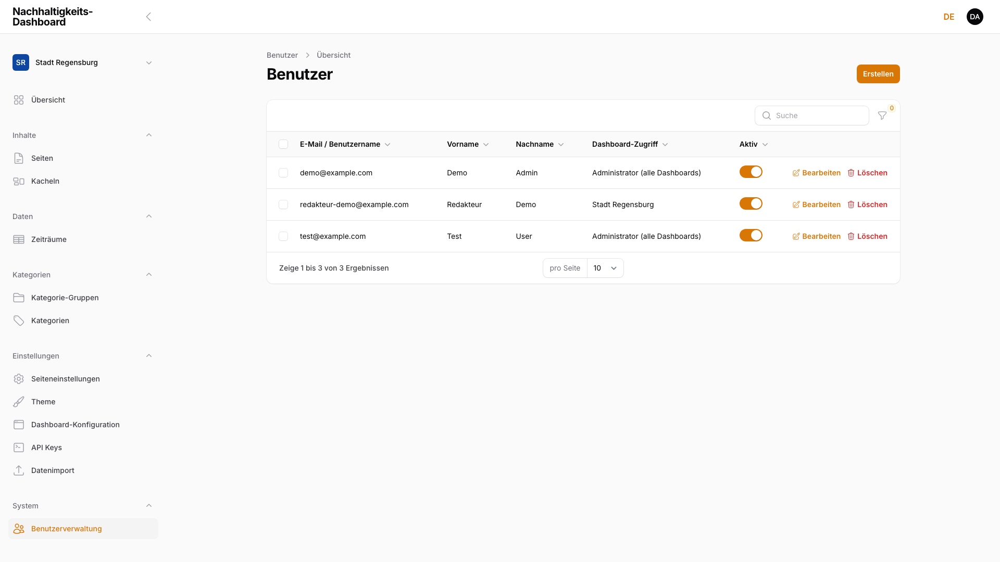

#### 6.2.1.2 Neuen Benutzer anlegen

Beim Anlegen eines Kontos legt das Feld **Rolle** fest, ob der Account **Admin** oder **Redaktion** ist. Bei Rolle **Redaktion** wird zusätzlich das Pflichtfeld **Dashboard-Freigaben** eingeblendet — eine Mehrfachauswahl der Dashboards, auf die dieser Account Zugriff erhält.

<!-- Screenshot: Formular "Benutzer erstellen" — Abschnitt Rolle & Dashboard-Freigaben mit Rolle Redakteur -->
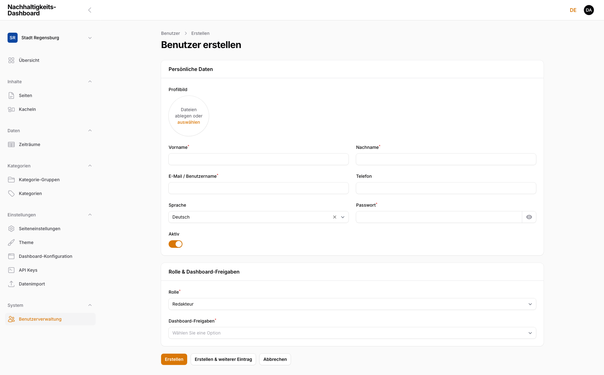

#### 6.2.1.3 Benutzer bearbeiten

Ein Klick auf einen Account öffnet dasselbe Formular wie beim Anlegen. Dort lassen sich Rolle, Dashboard-Freigaben und der Aktiv-Schalter ändern.

> **Hinweis:** Ein Konto kann nicht sich selbst deaktivieren — der entsprechende Schalter ist im eigenen Datensatz gesperrt.

> ### ⚠️ WIP — Work in progress
>
> **Screenshot wird noch ergänzt.**

#### 6.2.1.4 Benutzer löschen

Über die Zeilenaktion **Löschen** (mit Sicherheitsabfrage) wird ein Benutzerkonto endgültig entfernt.

> ### ⚠️ WIP — Work in progress
>
> **Screenshot wird noch ergänzt.**
