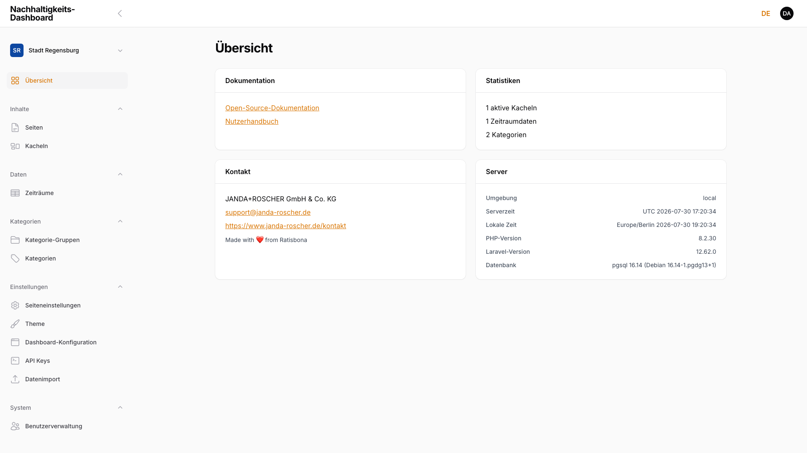
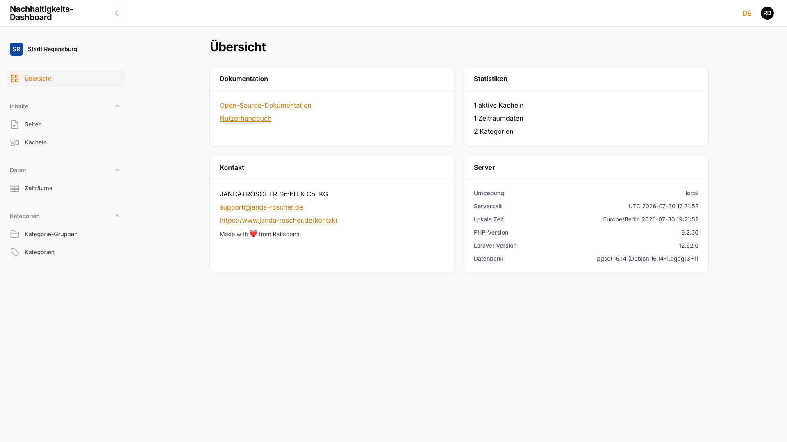

# 7. Rollen und Berechtigungen

Wer darf was — Übersicht der Zugriffsrechte. Jeder Account hat genau eine von zwei Rollen: **Admin** (Vollzugriff, systemweit) oder **Redaktion** (Inhalte pflegen, je Dashboard zugewiesen). Die Sidebar-Gruppen **Einstellungen** und **System** sind nur für Admin-Accounts sichtbar (siehe [Kapitel 1.1, Anmeldung und Oberfläche](01-erste-schritte.md)).

## 7.1 Rolle: Admin (Vollzugriff)

Ein Admin-Account hat systemweiten Vollzugriff — unabhängig vom gerade gewählten Dashboard:

- Zugriff auf **alle** Dashboards (Tenants) über die Dashboard-Auswahl in der Seitenleiste (siehe [Kapitel 1.1, Anmeldung und Oberfläche](01-erste-schritte.md)), nicht nur auf einzeln zugewiesene.
- Zugriff auf sämtliche Inhaltspflege-Bereiche: Seiten, Kacheln, Kategorien, Kategorie-Gruppen und Zeiträume (siehe [Kapitel 2, Seiten verwalten](02-seiten-verwalten.md), [Kapitel 3, Kacheln verwalten](03-kacheln-verwalten.md), [Kapitel 4, Kategorien](04-kategorien.md)).
- Zusätzlicher Zugriff auf die Bereiche **Einstellungen** ([Kapitel 6, Einstellungen](06-einstellungen.md)) und **Benutzerverwaltung** (siehe [Kapitel 6.2.1, Benutzerverwaltung](06-einstellungen.md#621-benutzerverwaltung)).

<!-- Screenshot: Sidebar eines Admin-Accounts mit sichtbaren Gruppen Einstellungen und System -->

> **Hinweis:** Mindestens ein aktiver Admin-Account muss immer bestehen. Der letzte verbleibende Admin-Account lässt sich weder deaktivieren noch löschen — das System verweigert die Aktion mit einer entsprechenden Meldung.

## 7.2 Rolle: Redaktion (Inhalte pflegen, kein Zugriff auf Einstellungen)

Ein Redaktions-Account ist einem oder mehreren Dashboards zugewiesen (siehe [Kapitel 6.2.1, Benutzerverwaltung](06-einstellungen.md#621-benutzerverwaltung)) und sieht in der Dashboard-Auswahl in der Seitenleiste ausschließlich diese. Innerhalb eines zugewiesenen Dashboards stehen dieselben Inhaltspflege-Bereiche wie einem Admin zur Verfügung: Seiten, Kacheln, Kategorien, Kategorie-Gruppen und Zeiträume — inklusive Anlegen, Bearbeiten und Löschen.

Nicht sichtbar sind die Gruppen **Einstellungen** und **Benutzerverwaltung**:

<!-- Screenshot: Sidebar eines Redaktions-Accounts ohne Gruppen Einstellungen und System -->

> **Hinweis:** Die Einschränkung gilt nicht nur für die Sidebar-Navigation, sondern serverseitig — ein Redaktions-Account, der eine Einstellungs- oder Benutzerverwaltungs-Seite direkt über die URL aufruft, erhält eine Fehlermeldung „Zugriff verweigert" statt der Seite selbst.

## 7.3 Berechtigungsmatrix

| Aktion | Admin | Redaktion |
|--------|:-----:|:---------:|
| Seiten anlegen/bearbeiten | Ja | Ja |
| Seiten löschen | Ja | Ja |
| Kacheln verwalten (inkl. Kennzahlen) | Ja | Ja |
| Kategorien und Kategorie-Gruppen verwalten | Ja | Ja |
| Zeiträume verwalten | Ja | Ja |
| Einstellungen ändern (Seiteneinstellungen, Theme, Dashboard-Konfiguration, API-Schlüssel, Datenimport) | Ja | Nein |
| Benutzer verwalten (Rollen, Dashboard-Freigaben) | Ja | Nein |
| Zugriff auf mehrere/alle Dashboards | Alle Dashboards | Nur zugewiesene |

> **Hinweis:** Ist die CIVITAS-Integration für ein Dashboard aktiviert (siehe [Kapitel 6, Einstellungen](06-einstellungen.md)), steht auf der Kachel-Bearbeitungsseite zusätzlich die Aktion **An CORE veröffentlichen** bereit. Diese Aktion ist unabhängig von der Dashboard-Zugehörigkeit ausschließlich Admin-Accounts vorbehalten.
