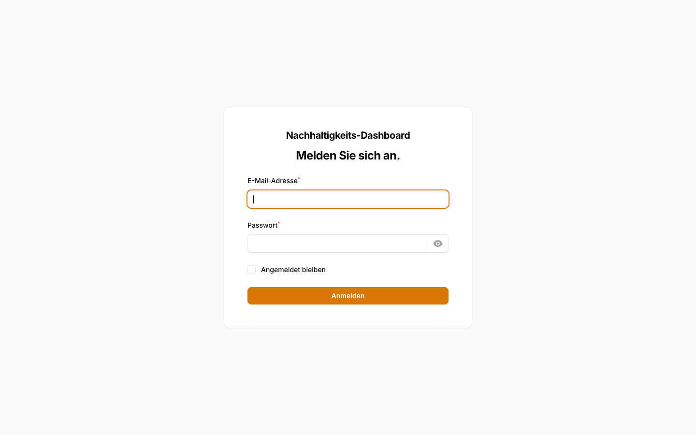
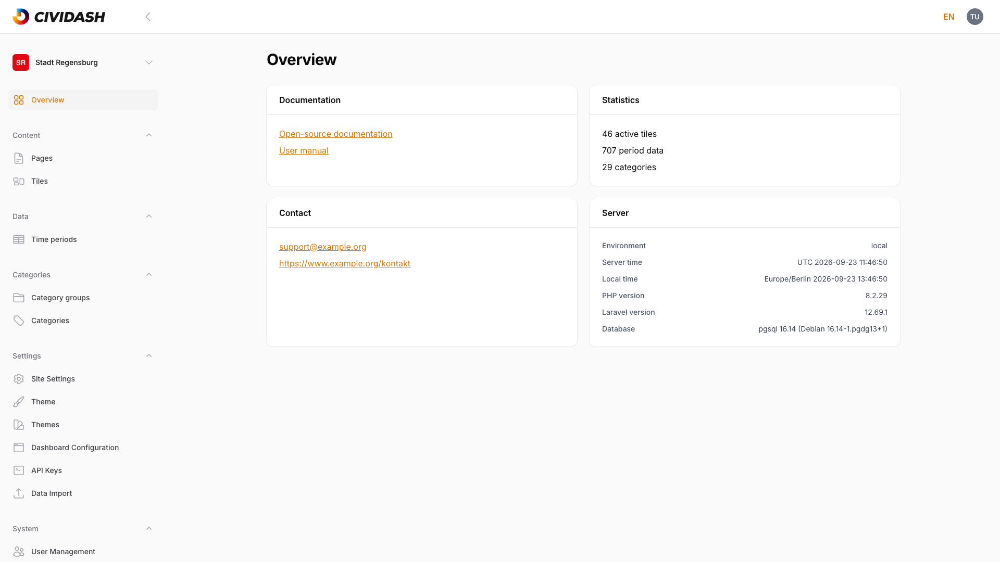
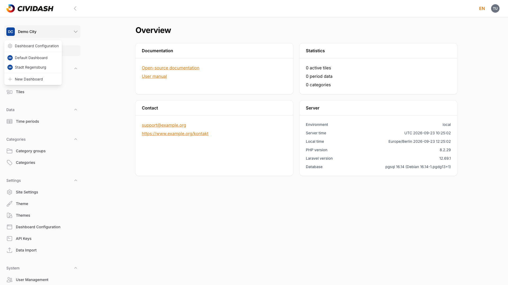
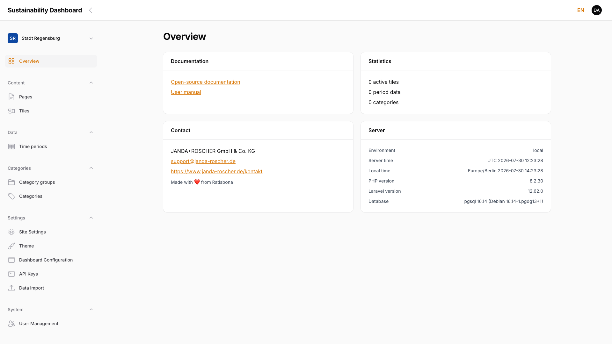
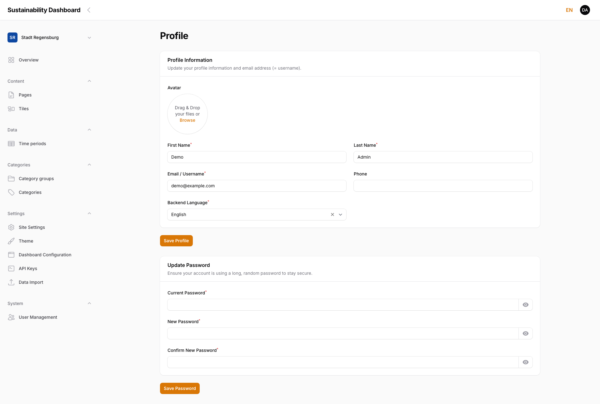
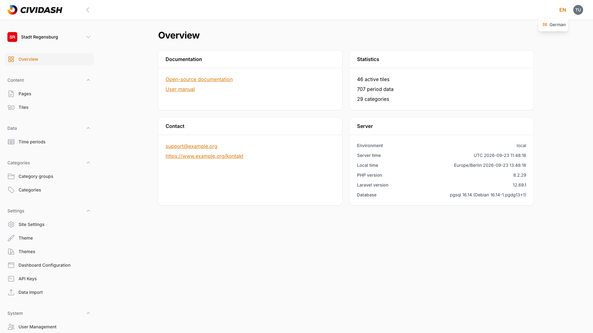

# 1. Getting Started

First-time setup — read once.

## 1.1 Login and Interface

### Login

The admin panel is accessible at `/admin`. Fill in the following fields on the login page:

| Field | Description |
|-------|-------------|
| **Email address** | The email associated with the user account |
| **Password** | The corresponding password |
| **Remember me** | Checkbox — keeps the session active beyond closing the browser |

Confirm with **Sign in**.

<!-- Screenshot: Login page with email, password field and "Remember me" checkbox -->

> **Note:** After five failed login attempts, access is temporarily locked. Wait one minute and try again.

### Interface layout

After logging in, the admin panel opens. The interface is divided into three areas:

<!-- Screenshot: Admin panel after login with labeled areas (sidebar, header, content area) -->

| Area | Position | Function |
|------|----------|----------|
| **Sidebar** | Left | Navigation to all management areas, grouped by topic; at the top, the **dashboard selector** to switch the active dashboard |
| **Header** | Top | **Language switcher** (the interface is available in German and English) and **profile menu** |
| **Content area** | Center | Displays the currently selected page or resource |

The sidebar can be collapsed on desktop devices via the arrow icon at the top to provide more space for the content area.

### Navigation groups in the sidebar

Above the group list sits the **Overview** entry — the admin panel's home screen (see [Chapter 1.2, Dashboard Overview](01-getting-started.md#12-dashboard-overview-home-screen-after-login)). Below it, the sidebar is divided into groups:

| Group | Contains | Access |
|-------|----------|--------|
| **Content** | Pages, Tiles | All |
| **Data** | Time periods | All |
| **Categories** | Category groups, Categories | All |
| **Settings** | Site settings, Theme, Dashboard configuration, API keys, Data import | Admin only |
| **System** | User management | Admin only |

Areas that require an admin role are not visible to editor accounts (see [Chapter 7, Roles and Permissions](07-roles-and-permissions.md)).

### Switch dashboard

The active dashboard is shown at the top of the sidebar (in the example, "Stadt Regensburg"). When multiple dashboards are available, clicking it opens a selection menu to switch between them; the menu also offers the **Dashboard configuration** and — for admins only — **Create new dashboard**. All content — pages, tiles, categories — is always displayed and edited in the context of the selected dashboard.

<!-- Screenshot: Dashboard selection menu at the top of the sidebar -->

> **Note:** A dashboard is an independent instance with its own pages, tiles, categories, and branding. See the term in the glossary ([Chapter 8, Glossary](08-glossary.md)).

## 1.2 Dashboard Overview (Home Screen After Login)

After signing in, the **Overview** opens — the admin panel's home screen. It summarizes the state of the active dashboard and serves as the starting point for all further tasks.

<!-- Screenshot: Overview home screen with the four info cards -->

The overview consists of four info cards:

| Card | Content |
|------|---------|
| **Documentation** | Links to the open-source documentation and the user guide |
| **Statistics** | Number of active tiles, recorded time-period entries, and categories in the current dashboard |
| **Contact** | Contact person and support address |
| **Server** | Technical facts about the installation (environment, server and local time, version numbers) |

The overview is reachable at any time via the **Overview** entry at the very top of the sidebar.

> **Note:** The numbers shown always refer to the currently selected dashboard. After switching dashboards (see [Chapter 1.1, Login and Interface](01-getting-started.md#switch-dashboard)), the values update accordingly.

## 1.3 Navigating the Admin Panel (Sidebar, Groups, Search)

Navigation runs entirely through the **sidebar** on the left. Each management area belongs to a thematic group; clicking an entry opens the corresponding area in the content area.

<!-- Screenshot: Sidebar with the navigation groups and the active "Overview" entry -->

- **Groups** bundle related areas (Content, Data, Categories, Settings, System — see the table in [Chapter 1.1, Login and Interface](01-getting-started.md#navigation-groups-in-the-sidebar)). Each group can be collapsed and expanded via the arrow icon.
- The **dashboard selector** at the top of the sidebar switches the active dashboard.
- The entire sidebar can be collapsed via the arrow icon in the header.

### Search

There is no cross-area global search. Instead, each overview table — such as the page or tile overview — has its own **search field** above the table, along with filters to search and narrow down that particular list (see [Chapter 2.1, Page Overview and Status](02-managing-pages.md)).

## 1.4 Edit Profile (Name, Avatar, Language, Password)

The own profile is reachable via the **profile menu** at the top right of the header (entry **Profile**). The page is divided into two sections.

<!-- Screenshot: Profile page with the "Profile information" and "Change password" sections -->

**Profile information:**

| Field | Description |
|-------|-------------|
| **Avatar** | Optional image. On upload it is automatically cropped to a square (256×256 pixels), see [Chapter 5.1, Upload and Crop Images](05-images-and-files.md) |
| **First name** / **Last name** | Required fields, form the displayed name |
| **Email / Username** | Required field — also serves as the username for signing in |
| **Phone** | Optional phone number |
| **Backend language** | Interface language (German/English); determines menus, buttons, and labels of the admin panel |

Confirm with **Save profile**.

> **Note:** The **backend language** controls only the admin panel's interface. Which language version of content is currently being edited is chosen separately (see [Chapter 1.5, Switching Languages](01-getting-started.md#15-switching-languages-editing-deen-content)).

**Change password:**

| Field | Description |
|-------|-------------|
| **Current password** | The currently valid password, for confirmation |
| **New password** | At least 12, at most 64 characters |
| **Repeat new password** | Repetition for verification — must match the new password |

Confirm with **Save password**. The eye icon reveals any password field for checking.

## 1.5 Switching Languages (Editing DE/EN Content)

The term "language" has two distinct meanings in the admin panel. Both are set independently of each other.

### Interface language

The interface language (menus, buttons, labels) can be switched at any time via the **language switcher** at the top right of the header — clicking the abbreviation (**DE**/**EN**) opens the selection.

<!-- Screenshot: Language switcher in the header with the DE/EN selection open -->

The selection is also saved as the **backend language** in the profile (see [Chapter 1.4, Edit Profile](01-getting-started.md#14-edit-profile-name-avatar-language-password)) and is thus retained at the next sign-in.

### Content language

Distinct from this is the **content language**: pages, tiles, and settings can be maintained separately in German and English. Which language version is currently being edited is controlled by a **locale switcher** directly within the respective form. Titles, text, blocks, and metadata are completely separate per language.

How this content switcher works is described in detail in [Chapter 2.7, Multilingual Content](02-managing-pages.md).

> **Note:** Switching the interface language does **not** change the content. Conversely, editing a content language does **not** change the interface language.
