# 2. Managing Pages

Core task: maintaining public web pages.

## 2.1 Page Overview and Status (Draft / Published)

The page overview is available under **Content → Pages**. It shows all pages of the current dashboard as a table with the columns **Title**, **Layout**, and **Active**.

<!-- Screenshot: Page overview with one page, columns Title/Layout/Active, actions Edit/View/Delete -->
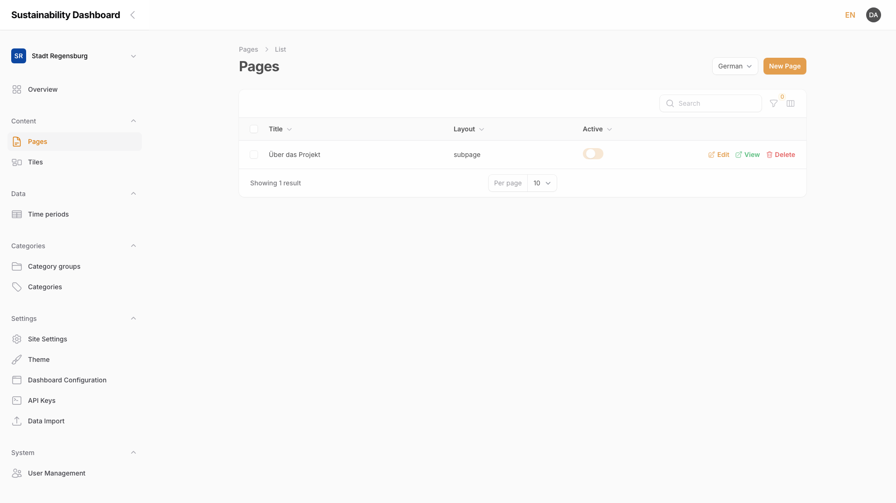

| Column | Description |
|--------|-------------|
| **Title** | Name of the page in the currently selected language |
| **Layout** | `Landingpage`, `Subpage`, or `default` — determines the URL structure (see [Chapter 2.2, Create a New Page](02-managing-pages.md#22-create-a-new-page)) |
| **Active** | Toggle — controls whether the page is visible on the frontend |

> **Note:** A page's status is controlled by the **Active** toggle (Yes/No), not by a separate draft workflow. An inactive page remains fully editable in the admin panel but is not reachable on the frontend — functionally equivalent to a draft state.

The row actions **Edit**, **View**, and **Delete** on the right of each row open the page directly, show it on the frontend, or remove it. Above the table: search, filters (by layout and active status), and a column selector.

## 2.2 Create a New Page

Use **New Page** at the top right to create a page. The form is split into the content area (title, blocks) on the left and **Page Properties** on the right.

<!-- Screenshot: "Create Page" form with title field, empty blocks area, and page properties sidebar -->
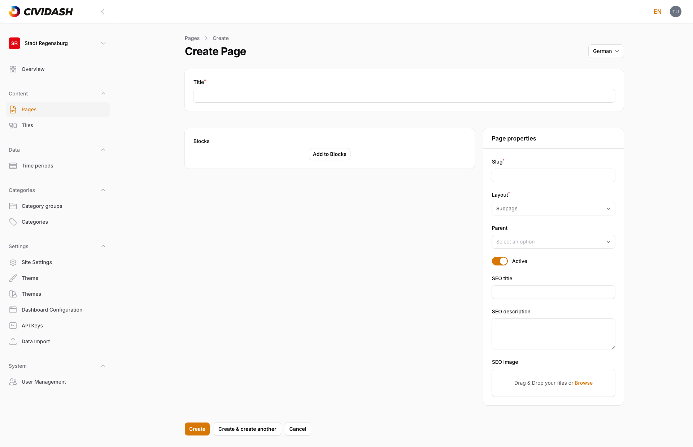

| Field | Description |
|-------|-------------|
| **Title** | Name of the page, also shown on the frontend |
| **URL Slug** | The page's address segment, auto-suggested while typing the title |
| **Layout** | `Landingpage`, `Subpage`, or `default` |
| **Parent Page** | Optional parent page for a hierarchical URL structure |
| **Active** | Toggle for frontend visibility |
| **SEO Title** / **SEO Description** / **SEO Image** | Metadata for search engines and for sharing on social media (see [Chapter 2.6, Manage Metadata](02-managing-pages.md#26-manage-metadata-seo-title-description-preview-image)) |

> **Note:** With the `Landingpage` layout, the page automatically becomes the dashboard's home page (URL slug `/`) — only one landing page per dashboard makes sense. The **URL Slug field is then greyed out and cannot be edited**, because the home page is always served from the base domain. For any other page, choose `Subpage` and set its own URL slug.

Use **Create** to save, or **Create & create another** to immediately start a new page.

## 2.3 Edit a Page

**Edit** in the page overview opens the same form used for creating a page, now with the saved values. Additionally, **Delete**, **View** (opens the page on the frontend in a new tab), and **Save** are available at the top right.

<!-- Screenshot: Edit view of an existing page with the blocks list and page properties -->
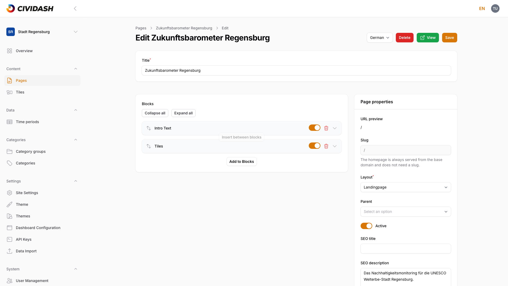

Changes only take effect after **Save**. Leaving the page without saving discards any changes.

## 2.4 Using Content Blocks

A page's content is made up of **blocks** — individual content elements that can be combined and arranged freely. **Add to Blocks** opens the block picker:

<!-- Screenshot: Block picker dialog with the 6 available block types -->
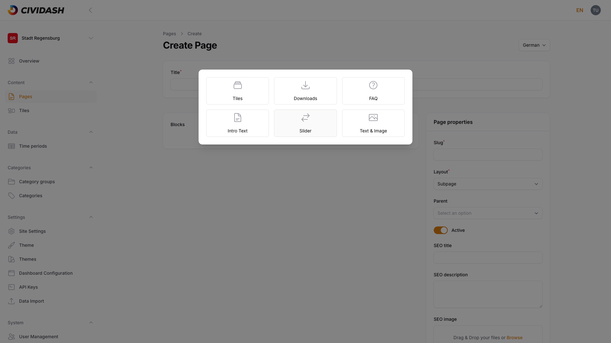

The following block types are available: **Tiles**, **Downloads**, **FAQ**, **Intro Text**, **Slider**, and **Text & Image**.

### 2.4.1 Intro Text (Heading, Text, Image)

An introductory text block with a **heading**, an optional **subheading**, formattable **text** (bold, italic, lists, links), an **image**, and an optional **second image** — each with its own alt text for accessibility.

<!-- Screenshot: Intro Text block fully filled with heading, text, and image fields -->
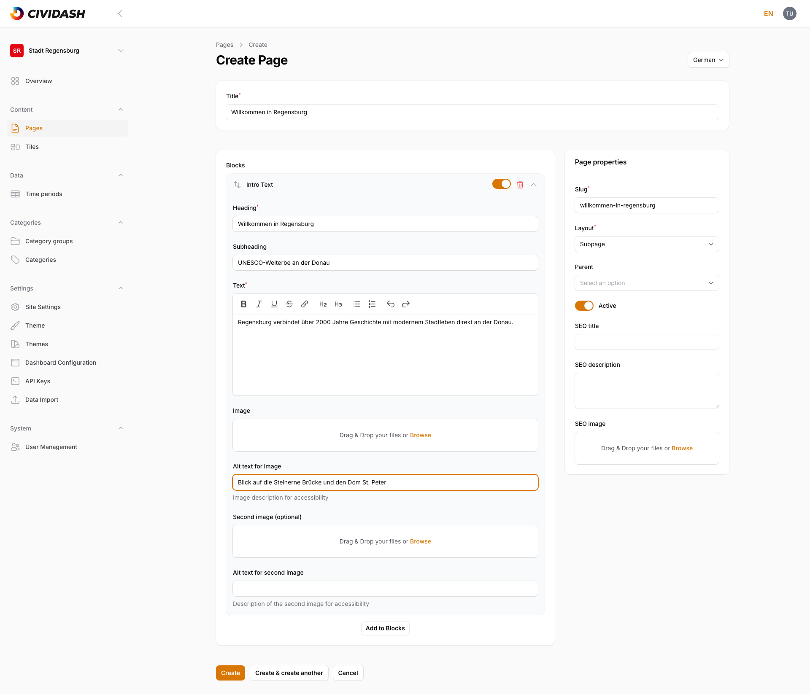

**Effect on the frontend:** Heading, subheading, and text appear as the page's header section. If no image is uploaded, the image area stays empty; the rest of the content is shown regardless.

### 2.4.2 Text-Image Block (Text with Positioned Image)

Combines a **heading**, formattable **text**, and an **image** with a selectable **image position** (left/right).

<!-- Screenshot: Text & Image block with heading, text, image upload, and image position selector -->
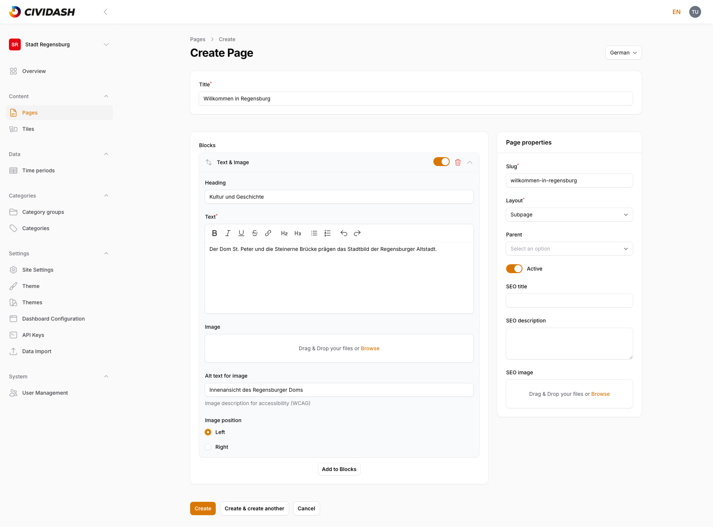

**Effect on the frontend:** The image appears to the left or right of the text depending on the chosen position. For details on image uploads, see [Chapter 5, Images and Files](05-images-and-files.md).

### 2.4.3 Slider (Image Carousel with Links)

A slider consists of an optional **heading** and any number of **slider items**. Each item has a **title**, **description**, **image**, **link URL**, and **link text**.

<!-- Screenshot: Slider block with one filled slider item (title, description, link) -->
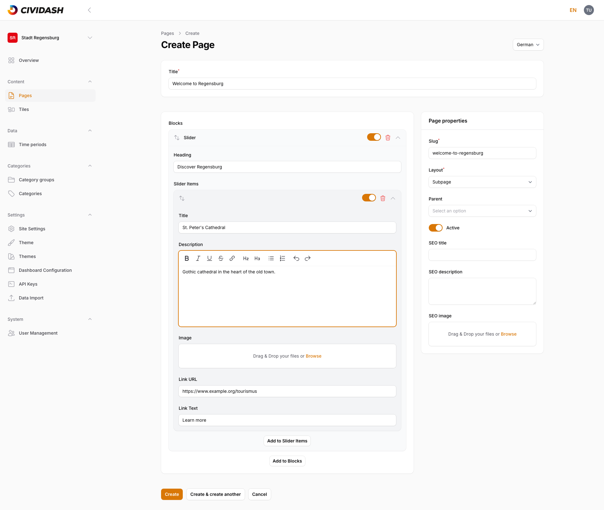

**Effect on the frontend:** Each slider item appears as its own card with an image, title, description, and a link button (labeled with **Link Text**).

### 2.4.4 FAQ Block (Question-Answer Pairs)

A collection of **FAQ entries**, each with a **question** and a formattable **answer**. Use **Add to FAQ Entries** to add more entries.

<!-- Screenshot: FAQ block with one filled entry (question and answer) -->
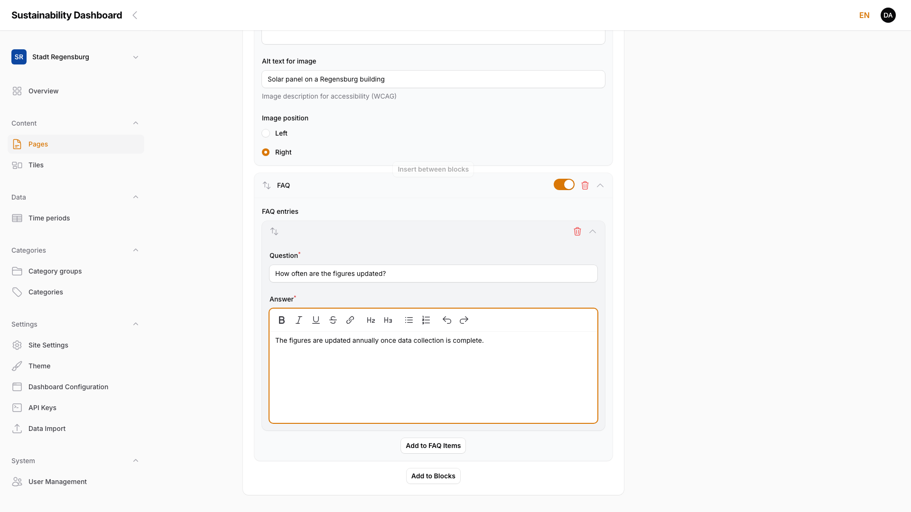

**Effect on the frontend:** Each entry appears as a collapsible element (accordion) — the answer is only visible after clicking the question.

### 2.4.5 Tiles (Embed Dashboard Tiles)

Embeds dashboard tiles (see [Chapter 3, Managing Tiles](03-managing-tiles.md)) directly into a page. An optional **heading** appears above the grid. The **Tiles** field lets you select specific tiles.

<!-- Screenshot: Tiles block with heading field and empty tile selection -->
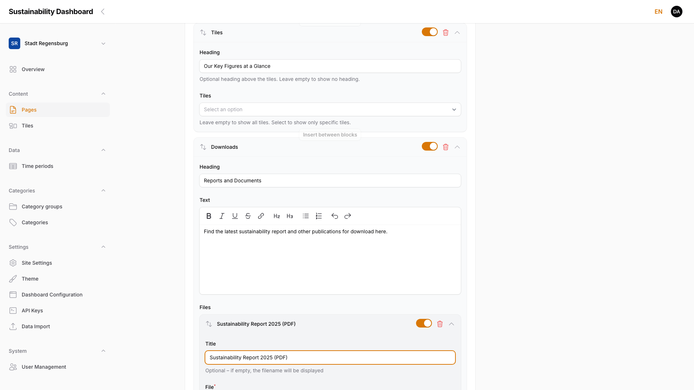

> **Note:** If the **Tiles** field is left empty, the block automatically shows **all** active tiles of the dashboard.

**Effect on the frontend:** The block renders a searchable tile grid with a search field. Without any tiles created, the grid stays empty but the search field is still shown.

### 2.4.6 Downloads (Offer Files for Download)

Provides files for download. A downloads block has an optional **heading**, formattable **text**, and any number of **file** entries with an optional **title** (the filename is shown if left empty) and a required **file**.

<!-- Screenshot: Downloads block with heading, text, and one filled file entry -->
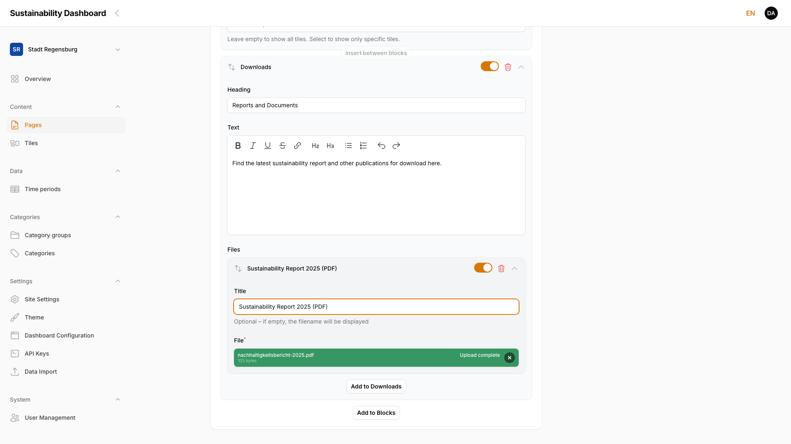

**Effect on the frontend:** Each file appears as a clickable download link with a file type label (e.g. "PDF").

## 2.5 Sort, Enable and Disable Blocks

Each block in the list has its own header row with four controls:

<!-- Screenshot: Block list with all 6 block types collapsed -->
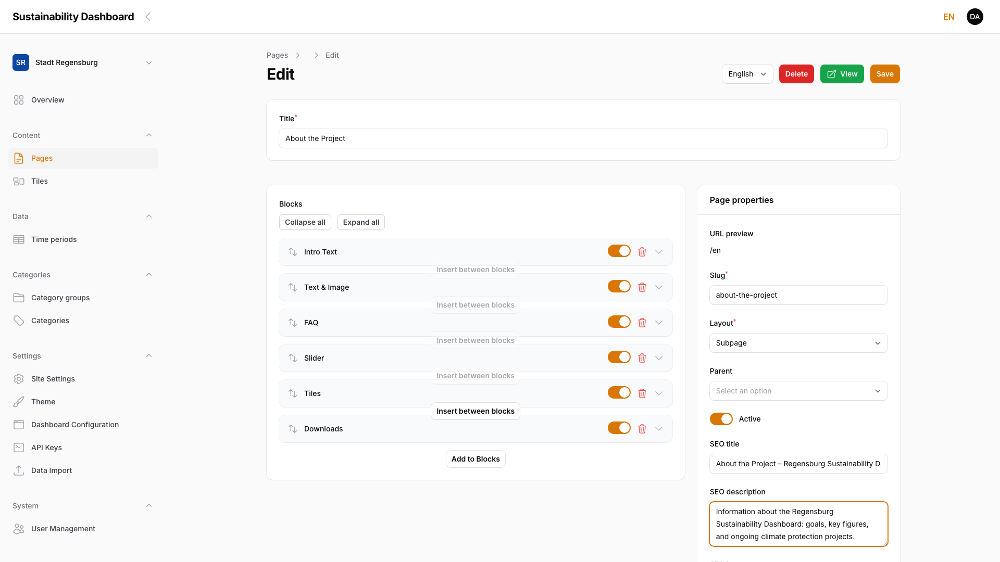

| Element | Function |
|---------|----------|
| **Move** | Drags the block to a different position |
| **Active toggle** | Shows or hides the block on the frontend without deleting it |
| **Delete** | Permanently removes the block from the page |
| **Collapse/Expand** | Shows or hides the block's fields in the edit form |

**Collapse all** / **Expand all** above the block list collapse or expand all blocks at once — useful on pages with many blocks.

> **Note:** A disabled block keeps all its content but does not appear on the frontend. This makes it possible to prepare content without publishing it immediately.

## 2.6 Manage Metadata (SEO Title, Description, Preview Image)

In the **Page Properties** panel on the right of the form:

<!-- Screenshot: Page properties sidebar with filled SEO fields -->

| Field | Description |
|-------|-------------|
| **SEO Title** | Title shown in search engine results and the browser tab |
| **SEO Description** | Short description used for search engine snippets |
| **SEO Image** | Preview image shown when the page is shared on social media; it does not appear in the search results themselves |

If left empty, sensible defaults apply (e.g. the page title).

## 2.7 Multilingual Content (Locale Switcher)

The **Locale** switcher at the top right of the form (German/English) selects which language version of the content is currently being edited.

> **Note:** Title, blocks, URL slug, and metadata are completely separate per language. Switching to a new language starts with an empty content area — title and blocks must be created independently for each language.

<!-- Screenshot: Empty content area right after switching to a language that has no translation yet -->
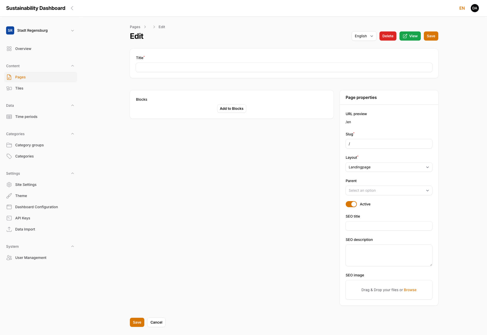

A page is only reachable on the frontend in the languages for which content has actually been created. Switching locales does not affect content already saved in other languages — each language version can be saved independently.

## 2.8 Delete a Page

The red-highlighted **Delete** button is available both in the page overview and in the edit view. Clicking it opens a confirmation dialog:

<!-- Screenshot: Delete confirmation dialog with the page title and Cancel/Delete buttons -->
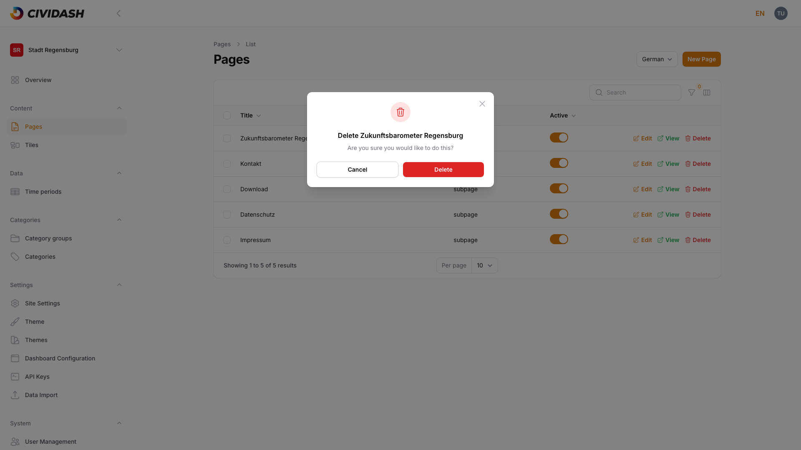

The page — including all its language versions, blocks, and metadata — is only permanently removed after confirming with **Delete**. **Cancel** aborts the process without any changes.

> **Note:** Deleting cannot be undone. If unsure, disable the block via the **Active** toggle (see [Chapter 2.5, Sort, Enable and Disable Blocks](02-managing-pages.md#25-sort-enable-and-disable-blocks)) instead of deleting the entire page.
