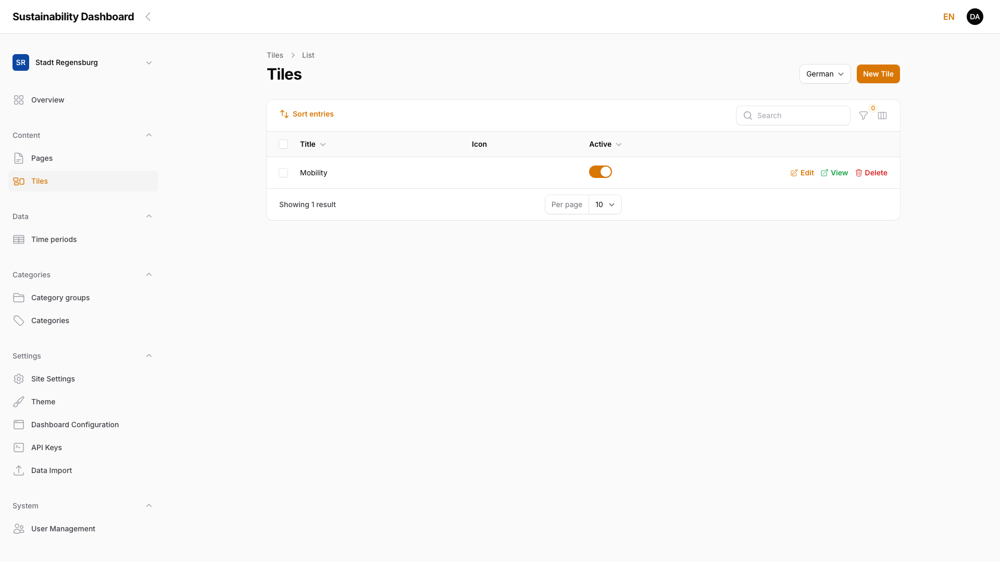
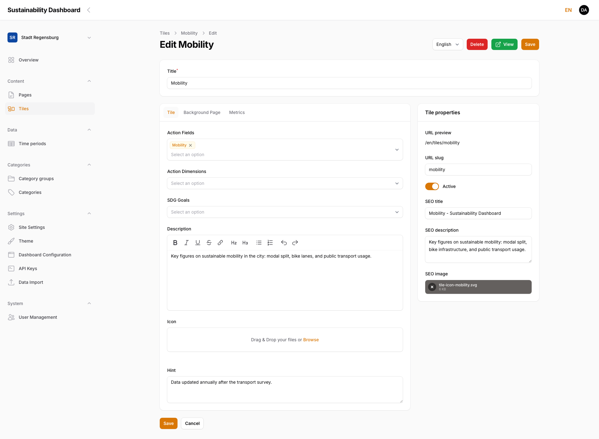
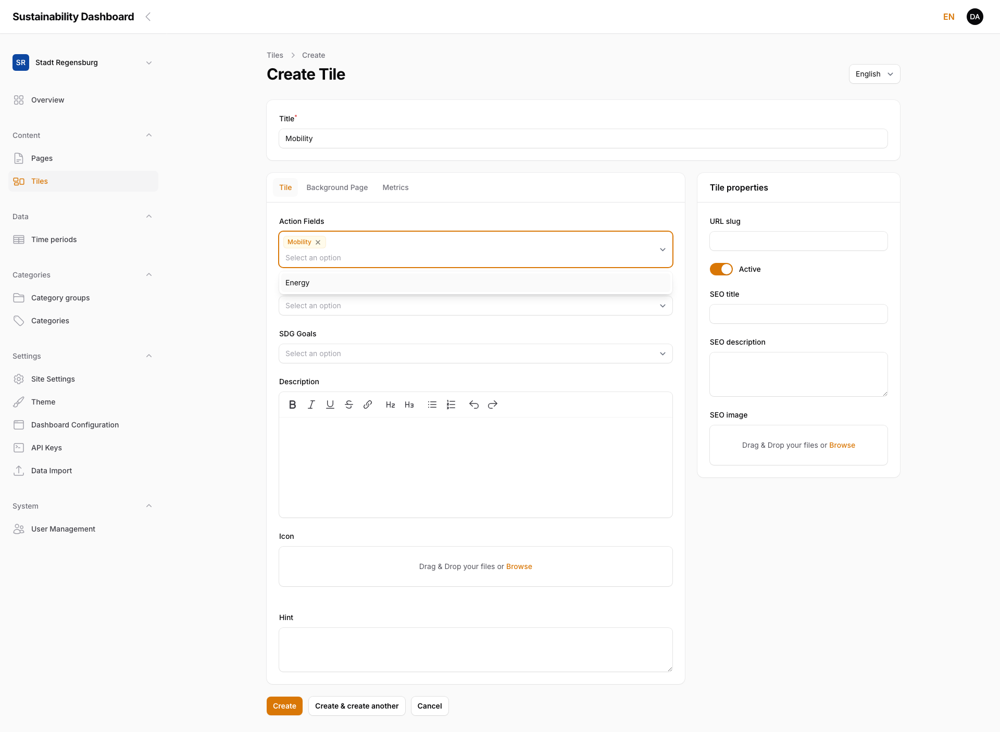
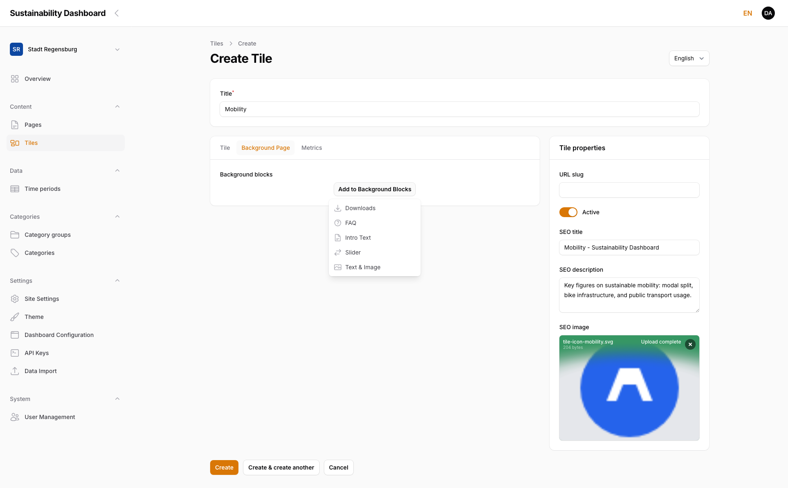
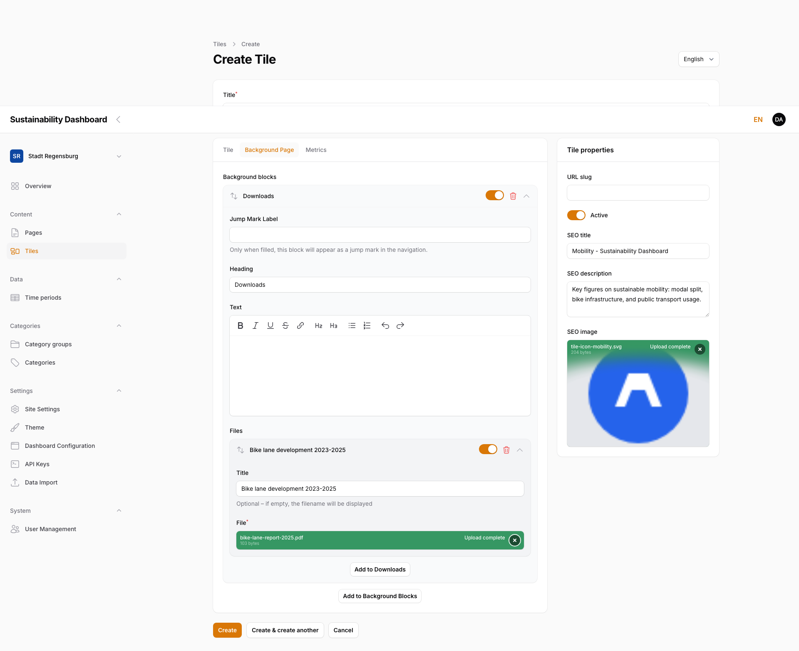
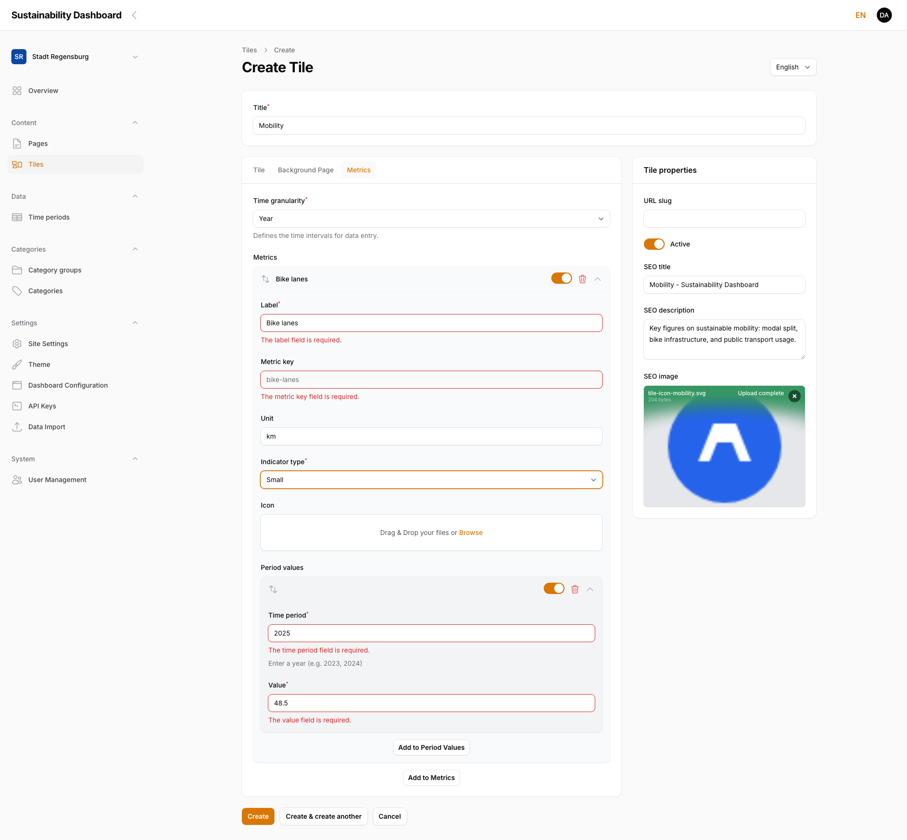
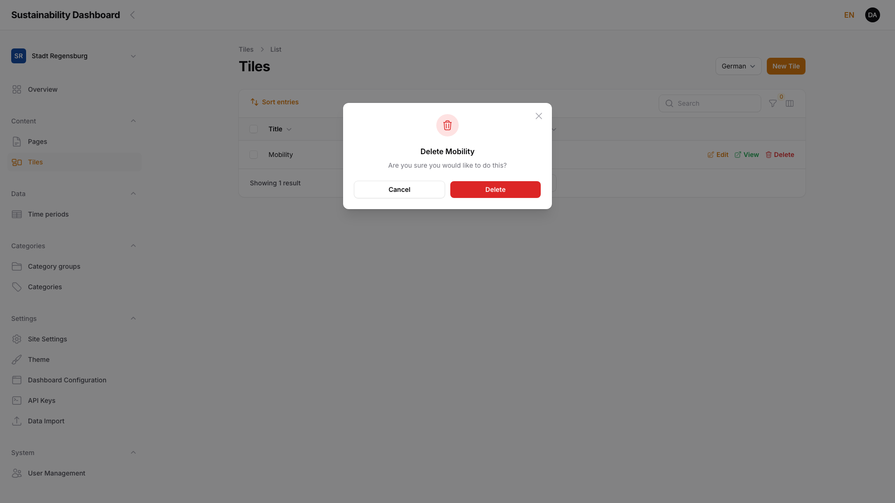

# 3. Managing Tiles

Dashboard content with key figures.

## 3.1 Tile Overview

The tile overview is available under **Content → Tiles**. It shows all tiles of the current dashboard as a table with the columns **Title**, **Icon**, and **Active**.

A tile is a content element on the dashboard overview: a clickable box with a title, icon, and key figures that leads to its own detail page (background page).

<!-- Screenshot: Tile overview with one tile, columns Title/Icon/Active, actions Edit/View/Delete -->

| Column | Description |
|--------|-------------|
| **Title** | Name of the tile in the currently selected language |
| **Icon** | Preview of the assigned icon (image or Lottie animation) |
| **Active** | Toggle — controls whether the tile is visible on the frontend |

The row actions **Edit**, **View**, and **Delete** on the right of each row open the tile directly, show it on the frontend, or remove it. Above the table: search, filters (by category and active status), and a column selector. **Sort entries** above the table changes the display order of tiles via drag and drop (see [Chapter 3.5, Tile Order and Status](03-managing-tiles.md#35-tile-order-and-status)).

> **Note:** A tile's status is controlled by the **Active** toggle, just like pages — not by a separate draft workflow. An inactive tile remains fully editable in the admin panel but is not reachable on the frontend.

**Effect on the frontend:** Active tiles appear in the searchable tile grid of the dashboard overview (see also [Chapter 2.4.5, Tiles](02-managing-pages.md)).

## 3.2 Create a New Tile

Use **Create** at the top right to create a tile. The form is split into the content area on the left (three tabs: **Tile**, **Background Page**, **Metrics**) and **Tile properties** on the right. **Title** is its own field above the tabs.

<!-- Screenshot: "Edit Tile" form with Tile tab, action-fields category selection, description, icon, hint, tile properties sidebar -->

The **Tile** tab contains the following fields:

| Field | Description |
|-------|-------------|
| **Title** | Name of the tile, also shown on the frontend (above the tabs) |
| **Category selection** (per category group) | A multi-select for each existing category group (e.g. "Action Fields", "Action Dimensions", "SDG Goals" — see [Chapter 4, Categories](04-categories.md)) |
| **Description** | Formattable text (bold, italic, lists, links) |
| **Icon** | Image or Lottie animation upload for the tile's visual |
| **Hint** | Free text, internal to the editorial team (not required) |

Every existing category group gets its own select field with the group's categories as a multi-select:

<!-- Screenshot: Category selection open with one category selected and another option in the dropdown list -->

> **Note:** Category selection fields only appear once at least one category group with assigned categories exists. If no category has been created, the **Tile** tab shows no category fields at all — it starts directly with **Description**. Categories themselves are managed in [Chapter 4, Categories](04-categories.md).

On the right, in **Tile properties**:

| Field | Description |
|-------|-------------|
| **URL preview** | Computed frontend address of the tile (only visible for existing tiles) |
| **URL slug** | The tile's address segment, auto-suggested while typing the title |
| **Active** | Toggle for frontend visibility |
| **SEO title** / **SEO description** / **SEO image** | Metadata for search engines and for sharing on social media (see [Chapter 3.6, SEO Metadata for Tiles](03-managing-tiles.md#36-seo-metadata-for-tiles)) |

Use **Create** to save, or **Create & create another** to immediately start a new tile.

**Effect on the frontend:** A newly created, active tile appears in the tile grid of the dashboard overview and is reachable via its background page (see [Chapter 3.3, Edit Background Page](03-managing-tiles.md#33-edit-background-page)).

## 3.3 Edit Background Page

The **Background Page** tab holds the content blocks of the detail view that opens when the tile is clicked on the frontend. **Add to Background Blocks** opens the block picker:

<!-- Screenshot: Block picker dialog for background blocks with the 5 available block types -->

The following block types are available: **Downloads**, **FAQ**, **Intro Text**, **Slider**, and **Text & Image** — the same block types used for pages (see [Chapter 2.4, Using Content Blocks](02-managing-pages.md)), with the same fields and the same effect on the frontend.

> **Note:** The **Tiles** block (tile grid, see [Chapter 2.4.5, Tiles](02-managing-pages.md)) is **not** available on a tile's background page — a tile cannot embed further tiles.

Every block additionally has a **Jump Mark Label** field: only when filled in does the block appear as a jump mark in the background page's navigation.

Each block type brings the same fields and the same frontend effect as on a page (see [Chapter 2.4, Using Content Blocks](02-managing-pages.md)) — depending on the type, for example a heading, formattable text, images, or file entries. After adding a block, fill in its fields:

<!-- Screenshot: Filled tile background page with one content block (heading, text, content) -->

Sorting, enabling, and disabling blocks works identically to pages (see [Chapter 2.5, Sort, Enable and Disable Blocks](02-managing-pages.md)): drag-and-drop move, a per-block active toggle, delete, collapse/expand, plus **Collapse all** / **Expand all** above the block list.

**Effect on the frontend:** The background page opens when the tile is clicked in the tile grid and shows the configured blocks in the set order.

## 3.4 Define Key Figures

The **Metrics** tab defines which measurements are shown on the tile and its background page.

### Time granularity

First choose the **time granularity**: `Year`, `Quarter`, `Month`, `Week`, or `Day`. It determines the input format for time periods across all metrics of this tile.

> **Note:** Time granularity can **no longer be changed** once at least one period value exists. All period values would first have to be deleted. Choose carefully before entering the first value.

### Metrics

Use **Add to Metrics** to create a new metric:

| Field | Description |
|-------|-------------|
| **Label** | Name of the metric, shown on the frontend |
| **Metric key** | Technical key, automatically derived from the label (read-only) |
| **Unit** | Free text, e.g. "km", "t CO2", "%" |
| **Indicator type** | `Small` or `Big` — controls the display size of the metric on the tile |
| **Icon** | Optional image upload for the metric |

Inside each metric follows a second level, **Metric values**: the actual measurements per period. Use **Add to Period Values** to add a value:

| Field | Description |
|-------|-------------|
| **Time period** | Input matching the chosen time granularity (e.g. "2023", "2024" for year granularity) |
| **Value** | Numeric measurement for that period |

<!-- Screenshot: Metrics tab with time granularity, one metric, and one period value entry -->

> **Note:** Each time period may only occur once per metric — a duplicate period (e.g. "2024" entered twice) is rejected on input.

**Effect on the frontend:** The most recent (or selected) metric value appears directly on the tile in the tile grid; the full time series across all periods is available on the background page.

## 3.5 Tile Order and Status

The order of tiles in the frontend grid can be changed in the tile overview via **Sort entries** with drag and drop — identical to sorting pages. The **Active** toggle in the overview table (column "Active") shows or hides a tile on the frontend without deleting it.

> **Note:** A disabled tile keeps all its content, metrics, and blocks. This makes it possible to prepare new tiles without publishing them immediately.

## 3.6 SEO Metadata for Tiles

In the **Tile properties** panel on the right of the form, below the URL slug and Active toggle:

| Field | Description |
|-------|-------------|
| **SEO title** | Title shown in search engine results and the browser tab |
| **SEO description** | Short description used for search engine snippets |
| **SEO image** | Preview image shown when the tile is shared on social media; it does not appear in the search results themselves |

If left empty, sensible defaults apply (e.g. the tile title) — identical to the behavior for pages (see [Chapter 2.6, Manage Metadata](02-managing-pages.md#26-manage-metadata-seo-title-description-preview-image)).

## 3.7 Multilingual Content

As with pages (see [Chapter 2.7, Multilingual Content](02-managing-pages.md#27-multilingual-content-locale-switcher)), the **Locale** switcher at the top right of the form selects which language version of title, description, hint, background blocks, and metadata is currently being edited. Category assignment, icon, the Active toggle, and metric values are **not** language-dependent — they apply to all language versions of the tile equally.

## 3.8 Delete a Tile

The red-highlighted **Delete** action is available on the right of every row in the tile overview. Clicking it opens a confirmation dialog:

<!-- Screenshot: Delete confirmation dialog with the tile title and Cancel/Delete buttons -->

The tile — including all its language versions, category assignments, blocks, and metrics — is only permanently removed after confirming with **Delete**. **Cancel** aborts the process without any changes.

> **Note:** Deleting cannot be undone. If unsure, disable the tile via the **Active** toggle (see [Chapter 3.5, Tile Order and Status](03-managing-tiles.md#35-tile-order-and-status)) instead of deleting it.
