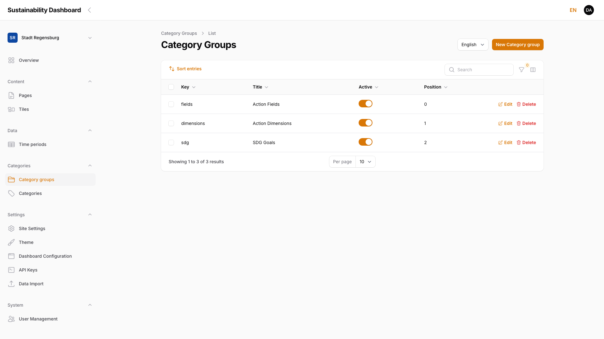
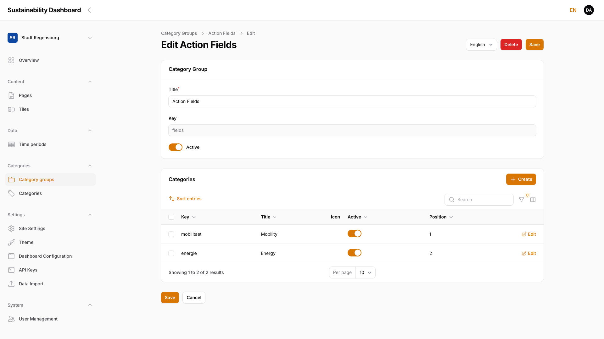
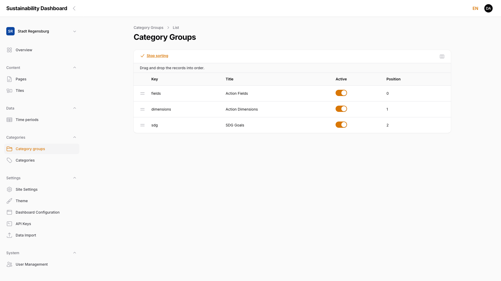
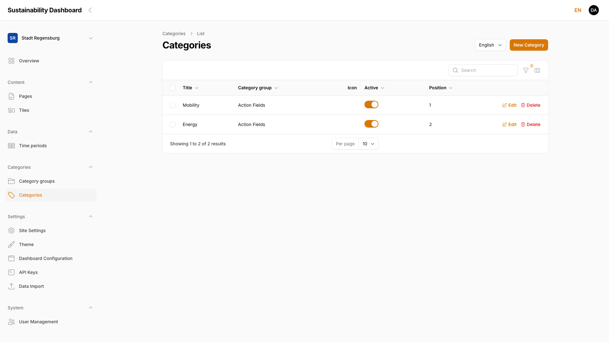
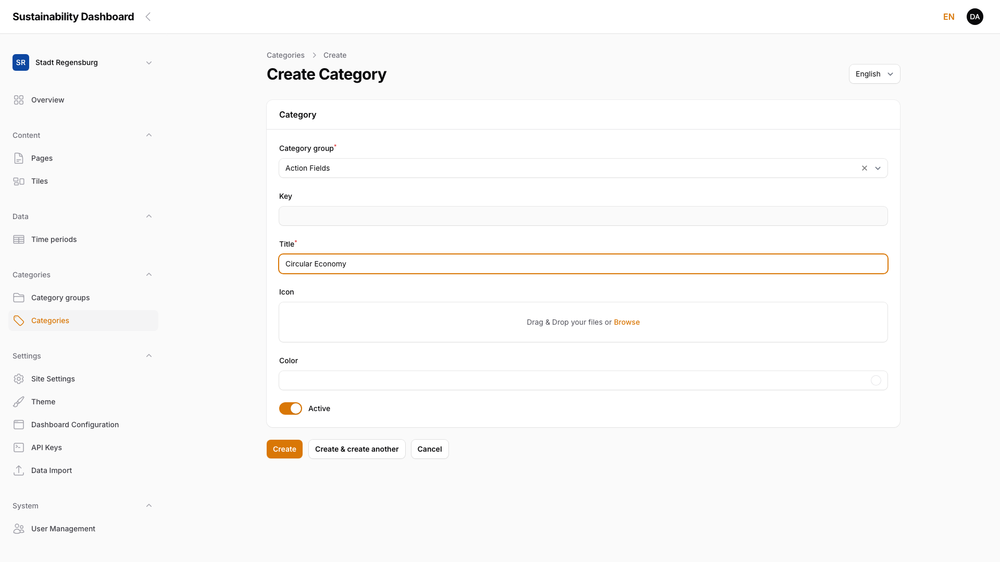
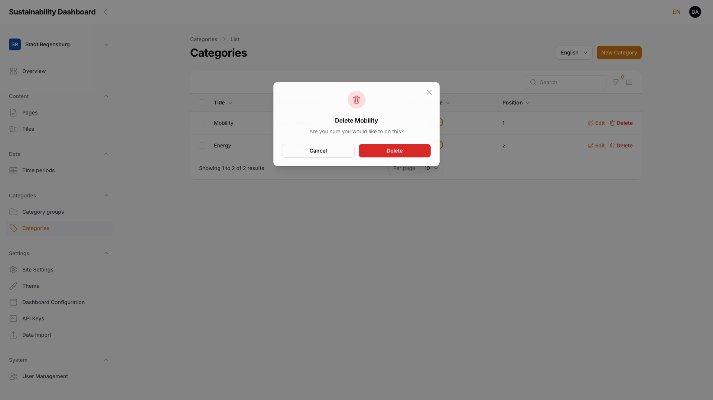

# 4. Categories and Filter Structure

Taxonomies for navigation and filter logic.

## 4.1 Category Groups (Structural Level)

Category groups form the structural level above individual categories. A category group (e.g. "Action Fields", "Action Dimensions", or "SDG Goals") bundles categories that belong to the same filter topic.

### 4.1.1 Overview

Category groups are available under **Categories → Category Groups**. The overview lists all groups of the current dashboard in a table:

<!-- Screenshot: Category groups overview with three groups (Action Fields, Action Dimensions, SDG Goals), columns Key/Title/Active/Position -->

| Column | Description |
|--------|-------------|
| **Key** | Technical identifier (`group_key`), derived from the title |
| **Title** | Name of the group in the currently selected language |
| **Active** | Toggle — controls whether the group and its categories are available on the frontend |
| **Position** | Display order of the group (see [Chapter 4.1.6, Order and Visibility](04-categories.md#416-order-and-visibility)) |

### 4.1.2 Create a New Category Group

Use **Create** at the top right to create a new group. The form contains the following fields:

<!-- Screenshot pending (04-group-create.png): empty "Create Category Group" form with Title, Key, and Active toggle -->

> ### ⚠️ WIP — Work in progress
>
> **Screenshot to be added.**

| Field | Description |
|-------|-------------|
| **Title** | Name of the group, shown as the filter heading on the frontend |
| **Key** | Suggested automatically while typing the title (`group_key`), read-only, unique per dashboard |
| **Active** | Toggle for frontend visibility |

Use **Create** to save, or **Create & create another** to immediately add another group.

> **Note:** Categories are always assigned to tiles per group as a multi-select (see [Chapter 4.2.4, Assign a Category](04-categories.md#424-assign-a-category)). A selection type per group (single or multi-select) cannot be configured.

### 4.1.3 Edit a Category Group

Clicking a group in the overview opens the edit form. Alongside title, key, and the Active toggle, it shows a nested **Categories** table with all its categories (key, title, icon, active, position) and its own **Create** action that creates a new category directly in this group:

<!-- Screenshot: Edit category group (Action Fields) with title/key/active and nested categories table (Mobility, Energy) -->

**Color source:** Which category group contributes its category colors to color-code the tiles is **not** set on the group itself, but centrally under **Settings → Theme → Configuration** in the "Tile color source" field (see [Chapter 6.1.2, Theme / Branding](06-settings.md#612-theme--branding)). Only once a group is set there as the color source does the **Color** field appear on its categories (see [Chapter 4.2.2, Create a New Category](04-categories.md#422-create-a-new-category)). Alongside it, "Category group for background page" defines which category icons appear as an overlay on the tile background page.

### 4.1.4 Multilingual Content

The **title** of a category group is maintained separately per language. As with pages and tiles (see [Chapter 2.7, Multilingual Content](02-managing-pages.md#27-multilingual-content-locale-switcher)), the **Locale** switcher in the form selects which language version of the title is currently being edited. Key, the Active toggle, and position apply to all language versions equally.

> ### ⚠️ WIP — Work in progress
>
> **Screenshot to be added.**

### 4.1.5 Delete a Category Group

The categories groups overview shows the red-marked **Delete** action on the right of every row. Clicking it opens a confirmation dialog; only after confirming with **Delete** is the group permanently removed. **Cancel** aborts the process without changes.

> **Note:** Deleting a category group cannot be undone. Its existing categories are kept but lose their group assignment — they then no longer appear in any filter section until assigned to another group. If unsure, deactivate the group via the **Active** toggle instead of deleting it.

> ### ⚠️ WIP — Work in progress
>
> **Screenshot to be added.**

### 4.1.6 Order and Visibility

The order of category groups can be changed in the overview via **Sort entries** with drag and drop:

<!-- Screenshot: Category groups overview in sort mode with drag handles in front of each row -->

The **Active** toggle shows or hides a group on the frontend without deleting it.

> **Note:** A deactivated category group automatically hides all its categories from the frontend filter as well, regardless of each category's own active status.

**Effect on the frontend:** Active category groups appear as their own filter section in the tile grid of the dashboard overview; position determines the order of the sections. A deactivated group hides itself and all its categories from the filter.

## 4.2 Categories

Categories are the individual filter options within a category group (e.g. "Mobility" or "Energy" within "Action Fields").

### 4.2.1 Overview

Categories can be maintained in two ways: nested within a category group (see [Chapter 4.1.3, Edit a Category Group](04-categories.md#413-edit-a-category-group)), or centrally via **Categories → Categories** — this lists all categories from all groups of the dashboard in one table.

<!-- Screenshot: Categories overview with the Category group column enabled, two entries (Mobility, Energy under Action Fields) -->

The **Category group**, **Key**, and **Color** columns are hidden by default and can be enabled via the column selector above the table. **Filter** narrows the list by active status and category group.

### 4.2.2 Create a New Category

Use **Create** to add a new category (when created from within a category group, the group is already preselected):

<!-- Screenshot: "Create Category" form with Category group (Action Fields), Key, Title, icon upload, Color field, Active toggle -->

| Field | Description |
|-------|-------------|
| **Category group** | Required field, searchable select — determines which group (see [Chapter 4.1, Category Groups](04-categories.md#41-category-groups-structural-level)) the category belongs to |
| **Key** | Suggested automatically while typing the title, read-only |
| **Title** | Name of the category, shown in the frontend filter and in the category selection on tiles (see [Chapter 3.2, Create a New Tile](03-managing-tiles.md#32-create-a-new-tile)) |
| **Icon** | Image upload (PNG, JPEG, GIF, WebP, SVG) for the filter display |
| **Color** | Only visible if the parent group is set as the tile color source (see [Chapter 4.1.3, Edit a Category Group](04-categories.md#413-edit-a-category-group)); hex color value via color picker or direct input |
| **Active** | Toggle for frontend visibility |

Use **Create** to save, or **Create & create another** to immediately add another category.

### 4.2.3 Edit a Category

Clicking a category — in the central overview or in the nested table of a group — opens the same form as when creating it. There, title, icon, color (if the group is set as the color source), and the Active toggle can be changed. The key stays read-only.

> ### ⚠️ WIP — Work in progress
>
> **Screenshot to be added.**

### 4.2.4 Assign a Category

Categories are not linked to tiles from the category management itself, but directly on the respective tile form: for each category group, a dedicated selection field appears there, through which the matching categories can be assigned to the tile (see [Chapter 3.2, Create a New Tile](03-managing-tiles.md#32-create-a-new-tile)).

> **Note:** The assignment is always a multi-select per group — several categories from the same group can be assigned to a single tile.

> ### ⚠️ WIP — Work in progress
>
> **Screenshot to be added.**

### 4.2.5 Multilingual Content

The **title** of a category is maintained separately per language (see [Chapter 2.7, Multilingual Content](02-managing-pages.md#27-multilingual-content-locale-switcher)). Key, icon, color, the Active toggle, and the group assignment apply to all language versions equally.

> ### ⚠️ WIP — Work in progress
>
> **Screenshot to be added.**

### 4.2.6 Delete a Category

The categories overview shows the red-marked **Delete** action on the right of every row. After confirmation, the category — including all language versions — is permanently removed; existing tile assignments are removed as well.

<!-- Screenshot: Delete confirmation dialog for a category with its title and Cancel/Delete buttons -->

> **Note:** Deleting a category cannot be undone. If unsure, deactivate the category via the **Active** toggle instead of deleting it.

### 4.2.7 Order and Visibility

Categories can be reordered via **Sort entries** with drag and drop as well — both in the nested table within a category group (see [Chapter 4.1.3, Edit a Category Group](04-categories.md#413-edit-a-category-group)) and in the central categories overview (see [Chapter 4.2.1, Overview](04-categories.md#421-overview)). The **Active** toggle shows or hides a category on the frontend without deleting it.

> **Note:** A deactivated category remains editable and keeps its existing tile assignments, but no longer appears as a filter option on the frontend. If the parent group is deactivated, its categories do not appear in the filter regardless of their own active status.

**Effect on the frontend:** Position determines the order of the filter options (categories) within their filter section in the tile grid of the dashboard overview. If the group is set as the color source, the category color tints the associated tiles.
