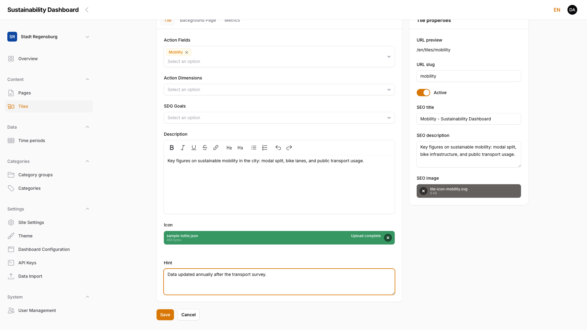

# 5. Images and Files

Media handling in the admin panel.

## 5.1 Upload and Crop Images

Image and file uploads work the same way throughout the admin panel: an area to drop a file via drag and drop, or to pick one via the **Browse** link. After uploading, the field shows a preview (a thumbnail for images, the file name and size for other files) plus a button to remove it. A new file automatically replaces the existing one — there is no way to reuse a previously uploaded file from a central media library; each field manages its own file independently.

<!-- Screenshot: Tile icon upload field with an uploaded file, "Upload complete" progress bar -->

> **Note:** An interactive cropping tool on upload exists only for the avatar (see [Chapter 1.4, Edit Profile](01-getting-started.md)): it is automatically cropped to a square and resized to 256×256 pixels, with no crop dialog shown. All other image fields (tile icons, category icons, content images, logo) keep the uploaded file unchanged at its original size.

## 5.2 Supported Formats and Sizes

Which file formats and size limits apply depends on the specific field:

| Area | Allowed formats | Size limit |
|------|------------------|------------|
| Avatar | Image formats | 2 MB |
| Category icon | PNG, JPEG, GIF, WebP, SVG | 1 MB |
| Tile icon | Image formats, JSON (Lottie), .lottie (dotLottie) | 2 MB |
| Metric icon | Image formats | 2 MB |
| Content images in page/tile blocks (Intro Text, Text & Image, Slider) | Image formats | 5 MB |
| Image blocks in "Manage Content" | Image formats | 5 MB |
| SEO image (pages and tiles) | Image formats | 5 MB |
| Downloads (Download block) | PDF, Word, Excel, ZIP | 25 MB |
| Logo | Image formats | 2 MB |
| Favicon | ICO, PNG, SVG | 512 KB |
| Social media icon (footer) | Image formats | 1 MB |
| Sponsor logo (footer) | Image formats | 5 MB |
| Custom font file | WOFF2, WOFF, TTF, OTF | 5 MB |
| Data import file | JSON, Text | 20 MB |

<!-- Screenshot removed (round 3): 05-download-file-type.png to be recreated -->

> ### ⚠️ WIP — Work in progress
>
> **Screenshot to be added.**

> **Note:** Compress large image files before uploading, to keep frontend load times low.

## 5.3 Alt Text and Accessibility

<!-- WIP: This section is intentionally a placeholder. The documentation on alt text and accessibility is being reworked and will be added later. -->

> ### ⚠️ WIP — Work in progress
>
> **This section is currently being revised.** The description of alt text and accessibility is not yet final and will be added in a later version of the manual.

## 5.4 Special Formats: Lottie Animations, SVG Icons

The icon field of a tile (see [Chapter 3.2, Create a New Tile](03-managing-tiles.md)) accepts Lottie animations in addition to image formats: `.json` files in Bodymovin/Lottie format, and `.lottie` files (dotLottie container). After saving a tile with such a file, the form shows a **Lottie preview** with the animation playing:

<!-- Screenshot removed (round 3): 05-icon-lottie-upload.png to be recreated -->

> ### ⚠️ WIP — Work in progress
>
> **Screenshot to be added.**

> **Note:** The Lottie preview does not update live during upload — it only appears after saving the tile and reloading the page. If no Lottie file is detected (file extension is neither `.json` nor `.lottie`), the form shows "No Lottie animation" instead.

SVG icons can also be uploaded for categories (see [Chapter 4.2, Create and Edit Categories](04-categories.md)) — there, SVG is one of several allowed formats for the category icon, alongside PNG, JPEG, GIF, and WebP.
