# 6. Settings (Admin Only)

System-wide configuration — requires the admin role. Editors without the admin role do not see the **Settings** menu entry in the sidebar (see [Chapter 7, Roles and Permissions](07-roles-and-permissions.md)).

The admin area groups configuration into two sidebar groups: everything under **Settings** ([Section 6.1](#61-settings)) is **dashboard-related**, everything under **System** ([Section 6.2](#62-system)) is an **installation-wide** setting.

> **Note:** The term "language" appears twice in the backend with different meanings. The **backend language** in the profile (see [Chapter 1.4, Edit Profile](01-getting-started.md)) sets the interface language of the admin area itself (menus, buttons, labels). The **locale switcher** at the top of the Site Settings page (see [Chapter 1.5, Switching Languages](01-getting-started.md)) instead selects which content language (German/English) the fields being edited apply to — the same pattern used for page and tile content.

## 6.1 Settings

The **Settings** group bundles the dashboard-related configuration pages: **Site Settings**, **Theme**, **Dashboard Configuration**, **API Keys**, and **Data Import**.

### 6.1.1 Site Settings

The **Site Settings** page bundles the installation basics as well as the header and footer navigation.

#### 6.1.1.1 Name and Multilingualism

The **Basic Information** section contains the installation-wide, language-independent basics:

| Field | Description |
|------|-------------|
| **Site name** | Name of the entire installation. Appears in the browser tab title and in system emails, among other places. Shared across all dashboards (tenants). |
| **English Translation** | Toggle. When disabled, the language switcher is hidden in the frontend and English routes redirect to German. |

<!-- Screenshot removed (round 3): 06-general-settings.png to be recreated -->

> ### ⚠️ WIP — Work in progress
>
> **Screenshot to be added.**

> **Note:** Despite the field name, the favicon is **not** managed on this page — it lives on the **Theme** page, in the Logo area (see [Section 6.1.2, Theme / Branding](#612-theme--branding)). This split differs from the original structure proposal but matches the current state of the live application.

#### 6.1.1.2 Header

The header menu is managed on the **Site Settings** page, in the **Header → Navigation Items** section. Each navigation item has:

| Field | Description |
|------|-------------|
| **Type** | **Page** (links to a public page, see [Chapter 2, Managing Pages](02-managing-pages.md)) or **External Link** (free-form URL). |
| **Page** | Only for type "Page": choice from all public pages. Label and URL are taken automatically from the selected page. |
| **Label** / **URL** | Only for type "External Link": freely editable link text and target URL. |
| **Submenu Items** | Each item can have one level of sub-items added (same schema: type, page, or label/URL). |
| **Active** | Toggle to temporarily hide an item without deleting it. |

Items can be reordered via the drag handle (**Move**); the order in the form matches the order in the frontend header.

<!-- Screenshot: Site Settings — Header section with one navigation item of type External Link -->
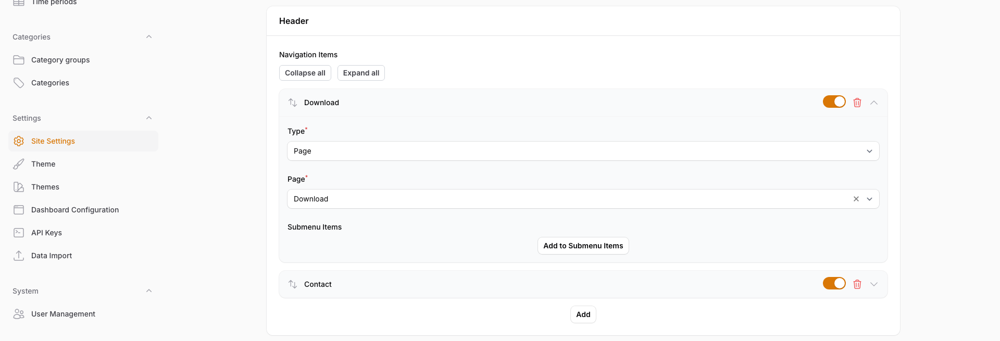

**Effect in the frontend:** Navigation items appear in this order in the main header of the public dashboard; submenu items appear as a dropdown below their parent item.

#### 6.1.1.3 Footer

Also on the **Site Settings** page, in the **Footer** section, organized into three sub-areas:

**Footer navigation** — Same field schema as the header (type "Page"/"External Link", see [Section 6.1.1.2, Header](#6112-header)), but without a submenu level. Additionally:

| Field | Description |
|------|-------------|
| **Column count** | 1 to 5 columns for arranging the footer navigation items in the frontend. |

<!-- Screenshot: Site Settings — Footer section with footer navigation item, column count, social media and sponsors area -->
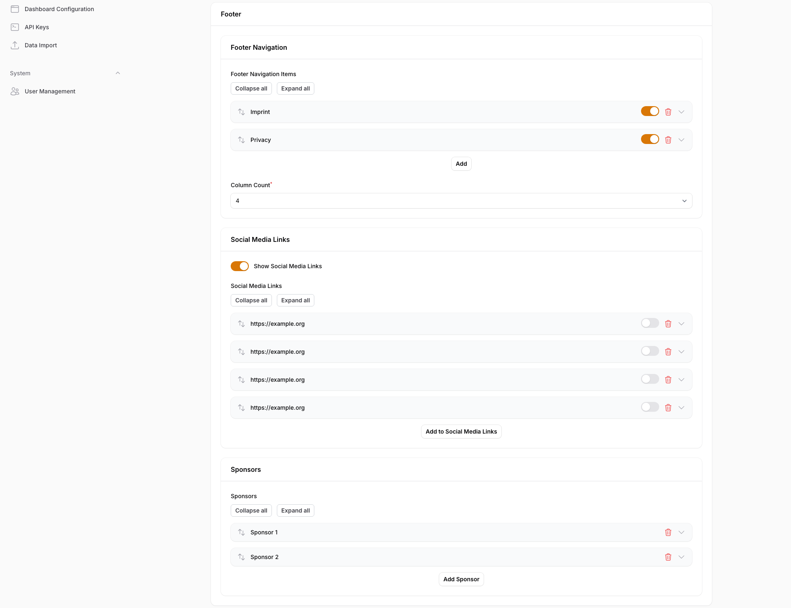

**Social Media Links**

| Field | Description |
|------|-------------|
| **Show Social Media Links** | Toggle that shows or hides the entire social media area in the frontend footer. |
| **Icon** | Image upload for the platform icon. |
| **Profile URL** | Target link for the icon. |
| **Tooltip text** | Optional text shown when hovering over the icon. |

**Sponsors** — List for sponsor logos, to which any number of entries can be added: **sponsor image** (upload, required), **sponsor URL** (optional), and **sponsor name** (optional, serves as an alt-text substitute in the list).

> **Note:** A copyright text field exists in the data model but does not appear in the current form UI — the copyright text cannot currently be edited through this form. This differs from the structure proposal ("Footer (Links, Social Media, **Copyright**, Layout)").

**Effect in the frontend:** Footer navigation, social media icons, and sponsor logos appear in the public dashboard's footer, arranged in the selected column count.

### 6.1.2 Theme / Branding

The **Theme** page is organized into four tabs: **Logo**, **Colors**, **Typography**, and **Configuration**.

#### 6.1.2.1 Logo

| Field | Description |
|------|-------------|
| **Logo** | Image upload, appears in the frontend header. |
| **Favicon** | Image upload. Recommended: ICO, PNG, or SVG, max 512 KB (see also the format overview in [Chapter 5.2, Supported Formats and Sizes](05-images-and-files.md)). |

<!-- Screenshot: Theme — Logo tab with logo and favicon upload fields -->
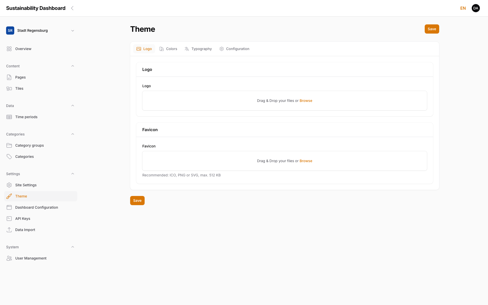

#### 6.1.2.2 Colors

The **Colors** tab organizes the color palette into five groups:

| Group | Fields |
|--------|--------|
| **Colors** | Primary color*, secondary color*, accent color (falls back to primary color if empty) |
| **Background colors** | Main, card, hero block, overlay, header, and footer background color |
| **Text colors** | Primary, secondary, and inverse text color, link color, link hover color |
| **Navigation colors** | Navigation text color, inactive navigation text color (language switcher), navigation hover & active color |
| **Border/shadow colors** and **slider colors** | Border color, divider color, shadow color; slider rail, handle, and handle border (each required) |

Fields marked `*` are required; all other color fields are optional and fall back to a sensible default.

<!-- Screenshot: Theme — Colors tab with color picker fields -->
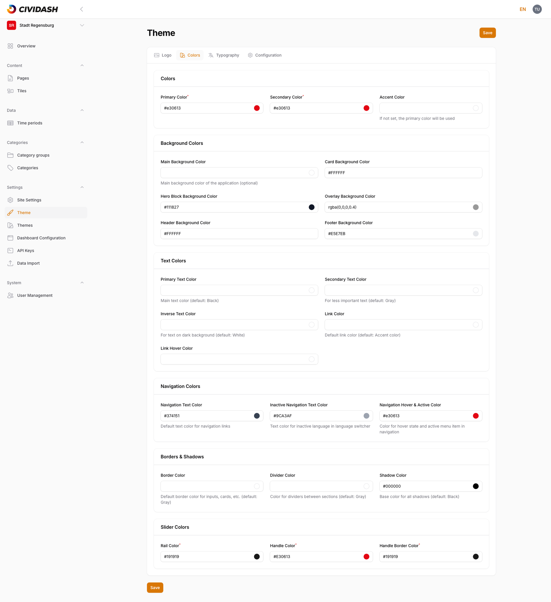

**Effect in the frontend:** All color values flow directly into the public dashboard's CSS variables and take effect immediately after saving — on backgrounds, text, links, navigation, and the time-period slider in the frontend.

#### 6.1.2.3 Font / Typography

The **Typography** tab controls type settings:

| Field | Description |
|------|-------------|
| **Font family** | Choice of predefined web fonts (including Open Sans, Roboto, Inter, Lato, Montserrat, Poppins, Source Sans Pro). Hidden once a custom font file is uploaded. |
| **Font weights** | List to select the loaded font weights (100–900). Also hidden when a custom font file is uploaded. |
| **Custom font file** | Optional upload (WOFF2, WOFF, TTF, OTF, max 5 MB, see [Chapter 5.2, Supported Formats and Sizes](05-images-and-files.md)). Replaces the predefined font family choice. |
| **Custom font name** | Required once a custom font file has been uploaded. |
| **Font sizes** | Free-text fields (CSS values like `1rem`) for base, small, and large text, plus headings h1–h6. |

<!-- Screenshot: Theme — Typography tab with font family and font sizes -->
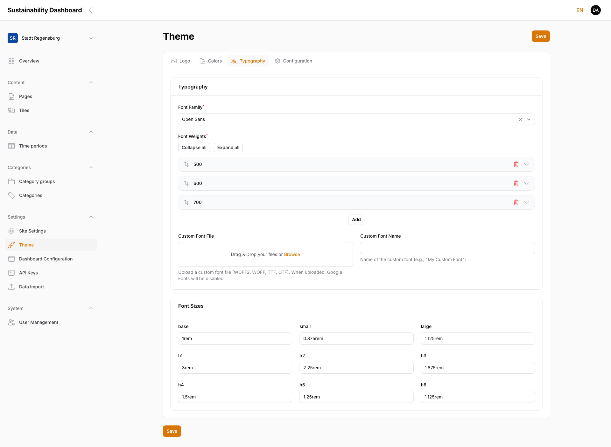

> **Note:** Font family/font weights on one hand and a custom font file on the other are mutually exclusive — once a custom file is uploaded, the predefined fields disappear from the form.

> **Note (privacy):** For privacy reasons the predefined font families are not loaded from Google Fonts. Without a custom font file, the dashboard falls back to the visitor's device's matching system font stack (e.g. for "Open Sans" the device's default sans-serif font). Upload a custom font file for pixel-exact typography.

#### 6.1.2.4 Configuration (Tiles)

The fourth tab, **Configuration**, is not part of the original structure proposal but exists as part of the Theme page in the live application:

| Field | Description |
|------|-------------|
| **Color source for tiles** | Category group (see [Chapter 4.1, Category Groups](04-categories.md#41-category-groups-structural-level)) whose category colors are used to visually tint tiles. |
| **Category group for background page** | Category group whose icons are shown on the tile background page (detail overlay). |

<!-- Screenshot: Theme — Configuration tab with tile color source and category group for background page -->
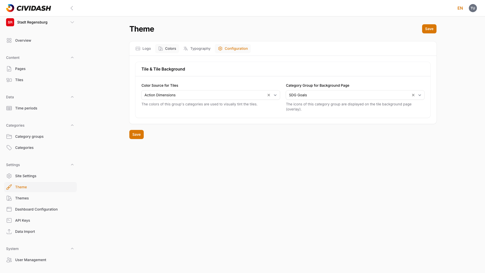

### 6.1.3 Dashboard Configuration

In addition to the installation-wide Site Settings page, **every** dashboard (tenant) has its own **Dashboard Configuration** page with dashboard-specific basics.

<!-- Screenshot: Dashboard Configuration with name, additional info, slug, domain, frontend base URL -->
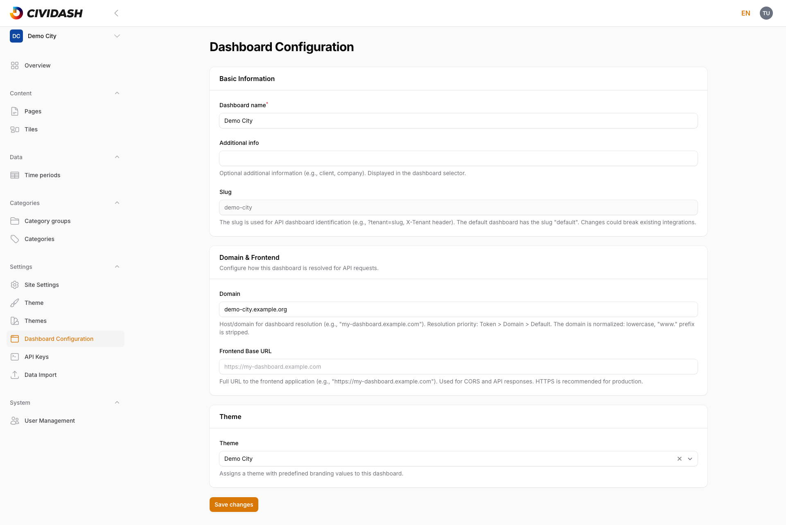

> **Note:** This page is not a separate point in the original structure proposal, but exists as its own settings page in the live application. It is added here because it belongs content-wise with the dashboard basics.

#### 6.1.3.1 Name

| Field | Description |
|------|-------------|
| **Dashboard name** | Name of this individual dashboard (e.g. "City of Regensburg"). Appears in the dashboard selection menu (see [Chapter 1.1, Login and Interface](01-getting-started.md)). |
| **Additional info** | Optional extra information (e.g. client, company), also shown in the dashboard selection menu. |
| **Slug** | Read-only. Uniquely identifies the dashboard, e.g. for domain mapping. The default dashboard uses the slug `default`. |

#### 6.1.3.2 Domain

| Field | Description |
|------|-------------|
| **Domain** | Host/domain used to resolve this dashboard. Normalized (lowercased, `www.` prefix removed). Resolution priority: token, then domain, then default dashboard. |
| **Frontend Base URL** | Full URL of the frontend application. Used for CORS and API responses. |

### 6.1.4 Manage API Keys

The **API Keys** page manages access tokens for this tenant's dashboard API.

#### 6.1.4.1 API Keys Overview

The table shows, per token: name, owner, abilities (badge), active status, created and last-used date, and (hideable) the last updated date. Filterable by ability and active status, searchable via the search field.

<!-- Screenshot: API Keys — table overview with one example token -->
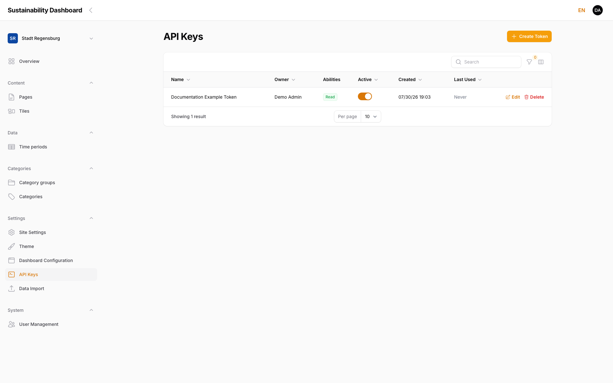

#### 6.1.4.2 Create a New Key

**Create Token** opens a dialog with two fields:

| Field | Description |
|------|-------------|
| **Token name** | Descriptive name for later identification (e.g. "Production API"). |
| **Abilities** | **Read Only** (read-only access to public API endpoints) or **Read and Write** (full CRUD access to admin endpoints). |

<!-- Screenshot: API Keys — "Create API Token" dialog with token name and abilities -->
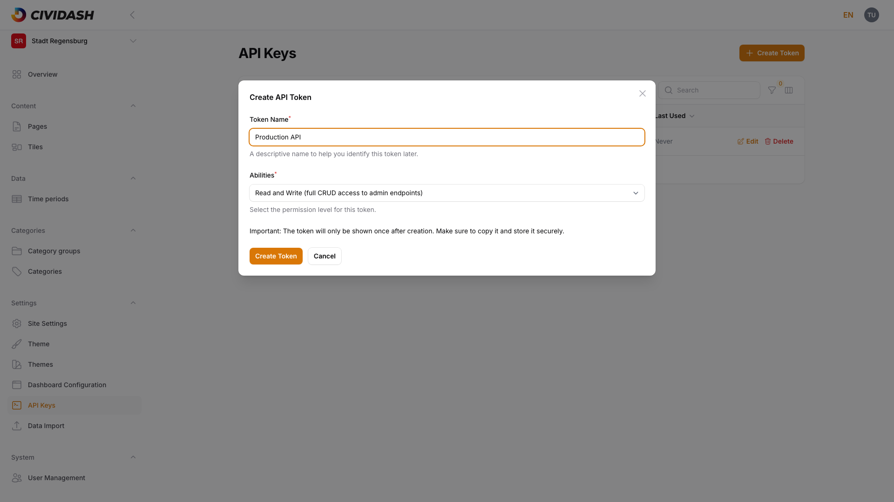

> **Note:** The generated token value is shown in plain text **only once**, immediately after creation. There is no way to view it again later — if lost, a new token must be created and the old one deleted. Keep the token value secure and out of screenshots or tickets.

#### 6.1.4.3 Edit a Key

**Edit** lets you change the name, abilities, and active status of an existing token (the token value itself is unchanged and is not shown again).

> ### ⚠️ WIP — Work in progress
>
> **Screenshot to be added.**

#### 6.1.4.4 Delete a Key

**Delete** (with a confirmation prompt) permanently revokes a token — applications using it immediately lose access.

> ### ⚠️ WIP — Work in progress
>
> **Screenshot to be added.**

### 6.1.5 Data Import

For bulk import of tiles, categories, category groups, and metrics via JSON bundle, there is a dedicated **Data Import** page, described in detail in [Data Import](../datenimport.en.md).

> ### ⚠️ WIP — Work in progress
>
> **Screenshot to be added.**

## 6.2 System

The **System** group bundles the installation-wide settings that apply regardless of the currently selected dashboard.

> ### ⚠️ WIP — Work in progress
>
> **Screenshot to be added.**

### 6.2.1 User Management

Only admin accounts see the **User Management** menu entry (in the "System" group). All user accounts are created and managed there, independent of the currently selected dashboard.

#### 6.2.1.1 Users Overview

The overview shows each account with email address, name, assigned dashboards, and active status.

<!-- Screenshot: User Management — table overview with admin and editor accounts -->
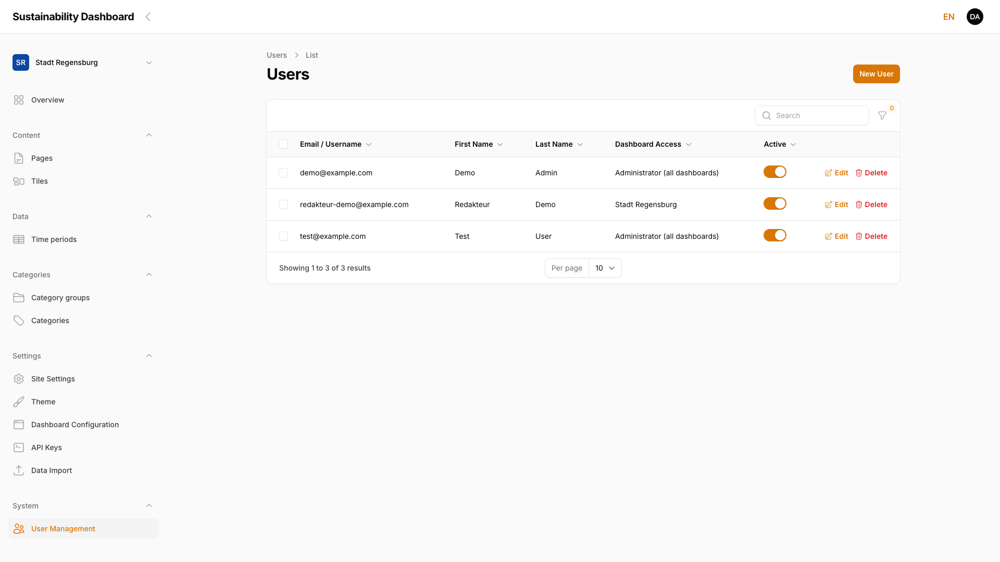

#### 6.2.1.2 Create a New User

When creating an account, the **Role** field determines whether it is an **Admin** or an **Editor**. For role **Editor**, the required **Dashboard Assignments** field is additionally shown — a multi-select of the dashboards this account gets access to.

<!-- Screenshot: "Create User" form — Role & Dashboard Access section with role Editor -->
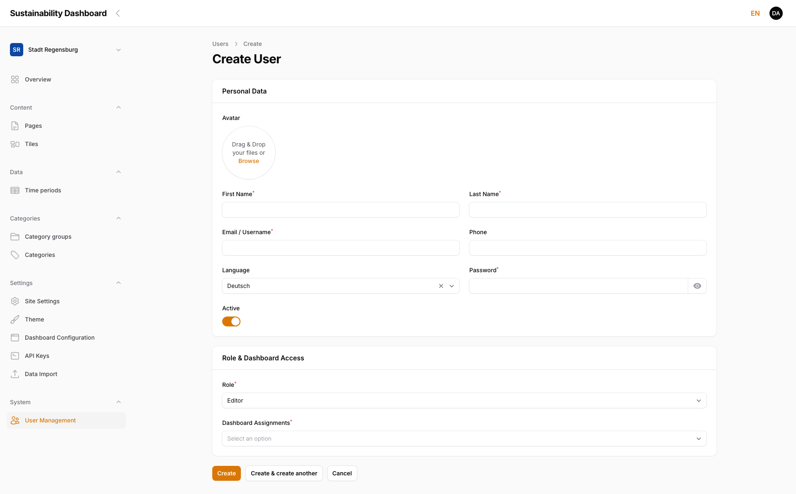

#### 6.2.1.3 Edit a User

Clicking an account opens the same form as when creating it. There, the role, dashboard assignments, and the Active toggle can be changed.

> **Note:** An account cannot deactivate itself — the corresponding toggle is disabled on its own record.

> ### ⚠️ WIP — Work in progress
>
> **Screenshot to be added.**

#### 6.2.1.4 Delete a User

The row action **Delete** (with a confirmation prompt) permanently removes a user account.

> ### ⚠️ WIP — Work in progress
>
> **Screenshot to be added.**
