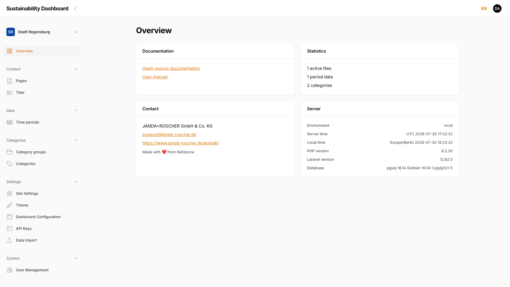
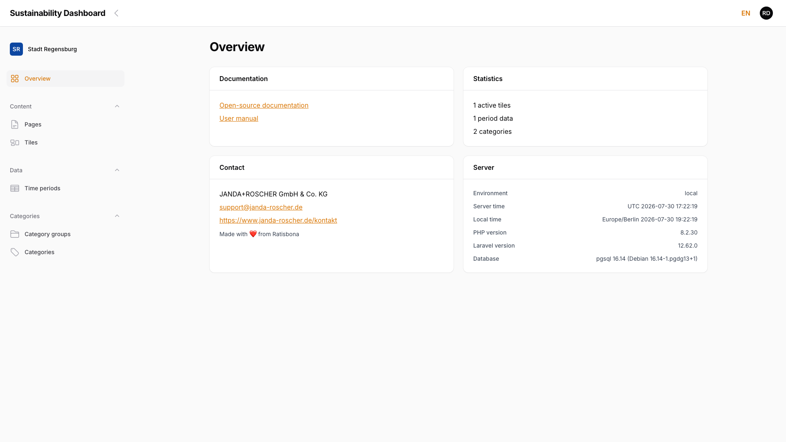

# 7. Roles and Permissions

Who can do what — access rights overview. Every account has exactly one of two roles: **Admin** (full access, system-wide) or **Editor** (manages content, assigned per dashboard). The **Settings** and **System** sidebar groups are visible only to admin accounts (see [Chapter 1.1, Login and Interface](01-getting-started.md)).

## 7.1 Role: Admin (Full Access)

An admin account has system-wide full access, regardless of the currently selected dashboard:

- Access to **all** dashboards (tenants) via the dashboard selector in the sidebar (see [Chapter 1.1, Login and Interface](01-getting-started.md)), not just individually assigned ones.
- Access to every content-management area: pages, tiles, categories, category groups, and time periods (see [Chapter 2, Managing Pages](02-managing-pages.md), [Chapter 3, Managing Tiles](03-managing-tiles.md), [Chapter 4, Categories](04-categories.md)).
- Additional access to the **Settings** area ([Chapter 6, Settings](06-settings.md)) and **User Management** (see [Chapter 6.2.1, User Management](06-settings.md#621-user-management)).

<!-- Screenshot: Sidebar of an admin account with visible Settings and System groups -->

> **Note:** At least one active admin account must always exist. The last remaining admin account can be neither deactivated nor deleted — the system refuses the action with a corresponding message.

## 7.2 Role: Editor (Manage Content, No Access to Settings)

An editor account is assigned to one or more dashboards (see [Chapter 6.2.1, User Management](06-settings.md#621-user-management)) and sees only those in the dashboard selector in the sidebar. Within an assigned dashboard, the same content-management areas are available as for an admin: pages, tiles, categories, category groups, and time periods — including creating, editing, and deleting.

Not visible are the **Settings** and **User Management** groups:

<!-- Screenshot: Sidebar of an editor account without the Settings and System groups -->

> **Note:** The restriction applies not only to sidebar navigation but server-side — an editor account that calls a settings or user management page directly via its URL receives an "access denied" error instead of the page itself.

## 7.3 Permission Matrix

| Action | Admin | Editor |
|--------|:-----:|:------:|
| Create/edit pages | Yes | Yes |
| Delete pages | Yes | Yes |
| Manage tiles (incl. metrics) | Yes | Yes |
| Manage categories and category groups | Yes | Yes |
| Manage time periods | Yes | Yes |
| Change settings (site settings, theme, dashboard configuration, API keys, data import) | Yes | No |
| Manage users (roles, dashboard assignments) | Yes | No |
| Access to multiple/all dashboards | All dashboards | Assigned only |

> **Note:** If the CIVITAS integration is enabled for a dashboard (see [Chapter 6, Settings](06-settings.md)), the tile editing page additionally offers the **Publish to CORE** action. This action is reserved for admin accounts only, regardless of dashboard membership.
